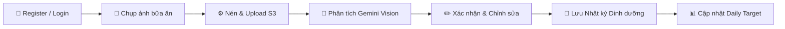
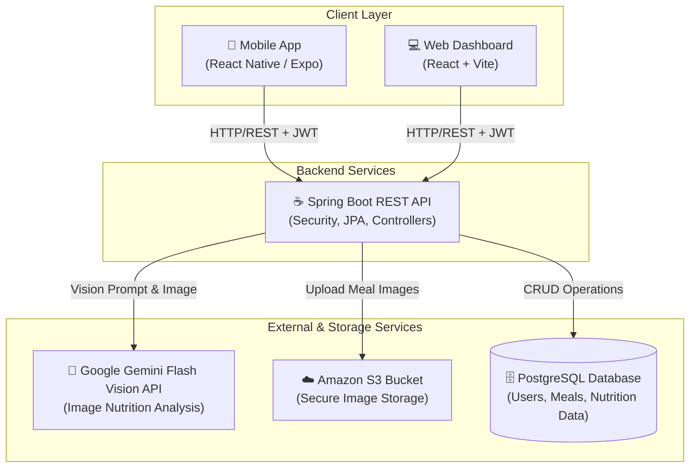
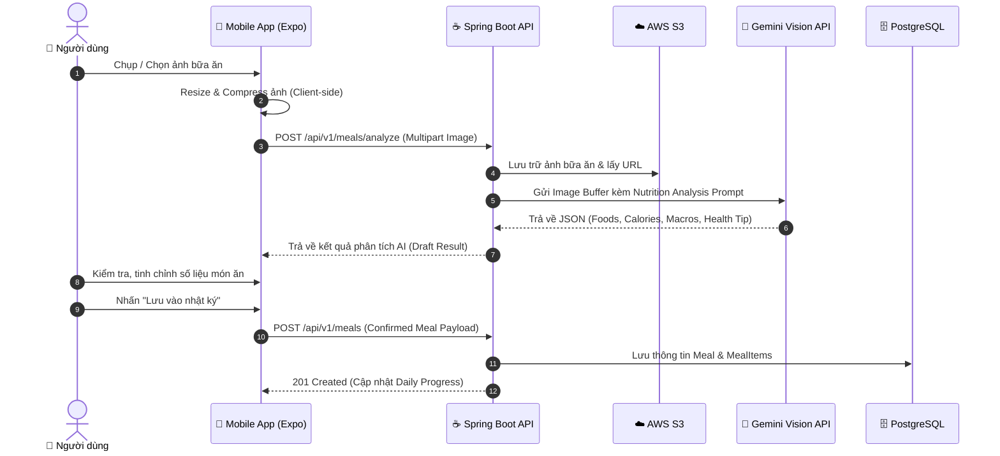

# 🥗 AI Calorie & Meal Tracker

[](https://spring.io/projects/spring-boot)
[](https://reactnative.dev/)
[](https://vitejs.dev/)
[](https://www.postgresql.org/)
[](https://ai.google.dev/)
[](https://aws.amazon.com/s3/)
[](https://opensource.org/licenses/MIT)

> **Hệ thống theo dõi dinh dưỡng thông minh đa nền tảng (Mobile & Web Dashboard) ứng dụng thị giác máy tính AI (Gemini Flash Vision) giúp nhận diện món ăn, ước tính calories và macros tức thì chỉ từ một bức ảnh.**

---

## 📌 1. Giới thiệu tổng quan (Overview)

Việc ghi chép nhật ký ăn uống thủ công thường tốn nhiều thời gian, phức tạp và khiến phần lớn người dùng dễ nản lòng sau một vài ngày. **AI Calorie & Meal Tracker** được phát triển nhằm tự động hóa và đơn giản hóa quy trình theo dõi dinh dưỡng hằng ngày:

* 📸 **Chụp ảnh bữa ăn**: Người dùng chỉ cần chụp ảnh món ăn qua ứng dụng di động.
* ⚡ **Phân tích AI tức thì**: Backend tích hợp **Gemini Flash Vision API** tự động phân tích thành phần món ăn, khối lượng ước tính, lượng Calories, phân rã Macronutrients (Carbohydrate, Protein, Fat) và gợi ý lời khuyên sức khỏe (Health Tips).
* ✏️ **Kiểm soát & Tùy chỉnh**: Người dùng có toàn quyền kiểm tra, tinh chỉnh định lượng hoặc nguyên liệu trước khi lưu vào nhật ký.
* 📊 **Đồng bộ đa nền tảng**: Dữ liệu dinh dưỡng được đồng bộ tức thời giữa **Mobile App** (dành cho việc ghi nhận nhanh hàng ngày) và **Web Dashboard** (dành cho việc theo dõi biểu đồ thống kê chuyên sâu và xuất báo cáo).

### 🎯 Đối tượng mục tiêu (Target Users)
* 🏋️ **Người tập luyện thể thao / Fitness**: Cần kiểm soát chặt chẽ tỷ lệ Macros (Protein/Carb/Fat) để tăng cơ, giảm mỡ.
* ⚖️ **Người có nhu cầu quản lý cân nặng**: Giảm cân, tăng cân an toàn hoặc duy trì vóc dáng thon gọn.
* 🥗 **Người quan tâm lối sống lành mạnh (Healthy Lifestyle)**: Muốn hiểu rõ thói quen ăn uống và cân bằng dinh dưỡng mỗi ngày.

---

## ✨ 2. Các tính năng nổi bật (Core Features)

### 🔐 1. Xác thực & Hồ sơ sức khỏe cá nhân (Auth & Health Profile)
- Đăng ký / Đăng nhập an toàn qua **Email & Password** hoặc **Google OAuth 2.0**.
- Bảo mật xác thực qua cơ chế **JWT (JSON Web Token)** với Access Token & Refresh Token.
- Thiết lập hồ sơ thể trạng: Chiều cao, cân nặng, độ tuổi, giới tính, mức độ vận động.
- Tự động tính toán chỉ số **BMR** (Basal Metabolic Rate), **TDEE** (Total Daily Energy Expenditure) và gợi ý **Daily Calorie & Macro Target** phù hợp theo mục tiêu (giảm cân/tăng cơ/giữ cân).

### 🤖 2. Ghi nhận món ăn thông minh với AI (Smart AI Meal Logging)
- **Tối ưu ảnh tại Client**: Tự động nén và resize ảnh trước khi upload để tiết kiệm băng thông và tăng tốc độ xử lý.
- **AI Vision Analysis**: Tích hợp Google Gemini Flash Vision API phân tích:
  - Danh sách món ăn / thành phần nguyên liệu nhận diện được.
  - Ước lượng khối lượng (gram/khẩu phần).
  - Tổng calories và hàm lượng Carbohydrate, Protein, Fat chi tiết.
  - Lời khuyên sức khỏe (Health tip) phù hợp với bữa ăn.
- **Xác nhận & Chỉnh sửa (Review & Edit)**: Cho phép người dùng dễ dàng chỉnh sửa tên món, số lượng, calories hoặc thêm bớt món trước khi lưu.
- **Tìm kiếm thủ công (Fallback Search)**: Cho phép tìm kiếm món ăn từ cơ sở dữ liệu khi không có ảnh hoặc trong điều kiện mạng yếu.
- **Quản lý Bữa ăn (CRUD)**: Dễ dàng xem lại, chỉnh sửa thành phần hoặc xóa bữa ăn trong ngày (Bữa sáng, trưa, tối, ăn nhẹ).

### 📈 3. Nhật ký & Thống kê tiến độ (Daily Progress & Analytics)
- **Daily Progress Bar**: Thanh đo tiến độ tiêu thụ calories & macros trực quan so với mục tiêu hàng ngày.
- **Biểu đồ xu hướng**: Thống kê calories nạp vào theo 7 ngày gần nhất, theo tuần hoặc theo tháng.
- Phân tích xu hướng cân đối các nhóm chất (Carb/Protein/Fat distribution).

### 🖥️ 4. Web Dashboard & Báo cáo (Web Dashboard & Export)
- Giao diện Dashboard trực quan trên máy tính giúp xem tổng quan sức khỏe toàn diện.
- **Đồng bộ thời gian thực**: Cập nhật tức thì dữ liệu từ Mobile App lên Web Dashboard qua RESTful API.
- **Xuất báo cáo (Export)**: Xuất dữ liệu nhật ký dinh dưỡng và thống kê dưới định dạng **PDF** hoặc **CSV** để theo dõi dài hạn hoặc chia sẻ với PT/Bác sĩ dinh dưỡng.

---

## 🔁 3. Luồng trải nghiệm cốt lõi (Core MVP Flow)



---

## 🏗️ 4. Kiến trúc hệ thống (System Architecture)

Hệ thống được thiết kế theo kiến trúc hướng dịch vụ nhiều tầng (Layered Client-Server Architecture), đảm bảo tính module hóa, bảo mật và khả năng mở rộng:



### 🔄 Chi tiết luồng xử lý nhận diện bữa ăn (Sequence Diagram)



---

## 🛠️ 5. Công nghệ sử dụng (Technology Stack)

| Thành phần | Công nghệ / Thư viện | Vai trò |
| :--- | :--- | :--- |
| **Backend Core** | Java 17+, **Spring Boot 3** | Xây dựng RESTful API, quản lý logic nghiệp vụ |
| **Security & Auth** | Spring Security 6, **JWT**, OAuth2 Client | Xác thực tài khoản, phân quyền và bảo mật API |
| **Database** | **PostgreSQL**, Spring Data JPA, Hibernate | Quản lý dữ liệu quan hệ người dùng, bữa ăn, thống kê |
| **AI Vision Engine** | **Google Gemini Flash Vision API** | Phân tích thị giác máy tính, bóc tách món ăn và ước lượng calories |
| **Cloud Storage** | **AWS S3** / Cloudflare R2 | Lưu trữ hình ảnh món ăn bảo mật, CDN phân phối ảnh nhanh |
| **Mobile App** | **React Native**, **Expo**, Axios, React Navigation | Ứng dụng di động trên iOS & Android |
| **Web Dashboard** | **React**, **Vite**, Tailwind CSS, Chart.js / Recharts | Giao diện quản trị, xem biểu đồ dinh dưỡng & xuất báo cáo |
| **Export Engine** | iText / OpenPDF, Apache Commons CSV | Tạo file báo cáo dinh dưỡng PDF / CSV |

---

## 📂 6. Cấu trúc thư mục dự án (Project Structure)

```text
AI-Calorie-Meal-Tracker/
├── backend/                       # Spring Boot Application
│   ├── src/main/java/com/calorie/tracker/
│   │   ├── config/                # Security, S3, Gemini, Cors configs
│   │   ├── controller/            # REST Controllers (Auth, Meal, User, Analytics)
│   │   ├── dto/                   # Request & Response Data Transfer Objects
│   │   ├── entity/                # JPA Database Entities (User, Meal, MealItem, Profile)
│   │   ├── repository/            # Spring Data JPA Repositories
│   │   └── service/               # Business Logic & AI Vision Integration Services
│   └── src/main/resources/
│       ├── application.yml        # Configurations & Environment variables
│       └── db/migration/          # Database migrations (Flyway / Liquibase)
│
├── mobile/                        # React Native / Expo Mobile App
│   ├── src/
│   │   ├── assets/                # Icons, local images, fonts
│   │   ├── components/            # Reusable UI components (ProgressBar, MealCard, etc.)
│   │   ├── navigation/            # App Navigation (AuthStack, AppTabs)
│   │   ├── screens/               # CameraScreen, ReviewScreen, DiaryScreen, ProfileScreen
│   │   ├── services/              # API Client, Image compressor, Auth storage
│   │   └── utils/                 # BMR/TDEE helper functions, formatters
│   └── App.tsx
│
├── web-dashboard/                 # React + Vite Web Dashboard
│   ├── src/
│   │   ├── components/            # Charts, Header, Sidebar, ExportModal
│   │   ├── pages/                 # Dashboard, AnalyticsPage, MealHistoryPage, Settings
│   │   ├── services/              # API Integration & Auth context
│   │   └── styles/                # CSS / Styling definitions
│   └── vite.config.ts
│
└── README.md                      # Project documentation
```

---

## 🚀 7. Hướng dẫn cài đặt & Chạy cục bộ (Getting Started)

### 📋 Yêu cầu tiên quyết (Prerequisites)
- **Java**: JDK 17 hoặc mới hơn
- **Node.js**: Phiên bản 18.x trở lên & **npm** / **yarn**
- **PostgreSQL**: Cài đặt máy cục bộ hoặc dùng Docker
- **Tài khoản API**:
  - Google AI Studio API Key ([Get Gemini API Key](https://aistudio.google.com/))
  - AWS Account với S3 Bucket & IAM Credentials

---

### ⚙️ 1. Cấu hình Backend (Spring Boot)

1. **Clone repository:**
   ```bash
   git clone https://github.com/AnBinh05/AI-Calorie-Meal-Tracker.git
   cd AI-Calorie-Meal-Tracker/backend
   ```

2. **Cấu hình biến môi trường (`application.yml` hoặc file `.env`):**
   ```yaml
   spring:
     datasource:
       url: jdbc:postgresql://localhost:5432/calorie_tracker_db
       username: postgres
       password: your_password
     jpa:
       hibernate:
         ddl-auto: update

   jwt:
     secret: your_jwt_super_secret_key_here
     expiration-ms: 86400000

   gemini:
     api-key: your_gemini_flash_api_key

   aws:
     s3:
       bucket-name: your-s3-bucket-name
       access-key: your_aws_access_key
       secret-key: your_aws_secret_key
       region: ap-southeast-1
   ```

3. **Chạy ứng dụng Backend:**
   ```bash
   ./mvnw spring-boot:run
   ```
   > API server sẽ khởi chạy tại: `http://localhost:8080`

---

### 📱 2. Cài đặt Mobile App (React Native / Expo)

1. **Di chuyển vào thư mục mobile:**
   ```bash
   cd ../mobile
   npm install
   ```

2. **Khởi chạy ứng dụng với Expo CLI:**
   ```bash
   npx expo start
   ```
   > Sử dụng ứng dụng **Expo Go** trên thiết bị Android/iOS hoặc Simulator để quét mã QR và trải nghiệm.

---

### 💻 3. Cài đặt Web Dashboard (React + Vite)

1. **Di chuyển vào thư mục web-dashboard:**
   ```bash
   cd ../web-dashboard
   npm install
   ```

2. **Khởi chạy môi trường Development:**
   ```bash
   npm run dev
   ```
   > Truy cập Web Dashboard tại: `http://localhost:5173`

---

---

## 📚 8. Tài liệu dự án & Thiết kế (Documentation & Figma Design)

* 🎨 **Thiết kế UI/UX (Figma Canvas):** [Figma Design - AI Calorie Meal Tracker](https://www.figma.com/design/9EWSQ8wvef3FiUdsTeDv7P/AI-Calorie-Meal-Tracker?node-id=0-1&p=f&t=svMPikBiSviLB8xj-0)
* 📋 **Tài liệu đặc tả thiết kế:** [`docs/designs/figma-design.md`](docs/designs/figma-design.md)
* 📄 **Product Requirements Document (PRD):** [`docs/prd/prd-ai-calorie-meal-tracker.md`](docs/prd/prd-ai-calorie-meal-tracker.md)
* 📱 **Mobile Functional Requirements (FRD):** [`docs/prd/frd-mobile-app.md`](docs/prd/frd-mobile-app.md)
* 💡 **Product Discovery:** [`docs/discovery/product-discovery.md`](docs/discovery/product-discovery.md)
* ⚙️ **Chi tiết các tính năng:** [`docs/features/feature-specifications.md`](docs/features/feature-specifications.md)

---

## 🗺️ 9. Lộ trình phát triển (Roadmap)

- [x] Thiết kế kiến trúc hệ thống và xây dựng Database Schema
- [x] Tích hợp Authentication (JWT, Google OAuth2) & BMR/TDEE Calculation
- [x] Kết nối Gemini Flash Vision API phân tích món ăn & tính toán Macros
- [x] Xây dựng luồng Mobile App (Camera -> AI Review -> Confirm -> Diary)
- [x] Xây dựng Web Dashboard thống kê tiến độ 7 ngày / tháng
- [ ] Tích hợp gợi ý thực đơn thông minh dựa trên lượng calories còn lại trong ngày (AI Meal Recommendation)
- [ ] Hỗ trợ quét mã vạch sản phẩm đóng gói (Barcode Scanner)
- [ ] Tích hợp đồng bộ dữ liệu sức khỏe với Apple HealthKit & Google Fit

---

## 🤝 Đóng góp (Contributing)

Mọi đóng góp nhằm cải thiện dự án đều được hoan nghênh! Vui lòng thực hiện theo các bước sau:
1. **Fork** dự án
2. Tạo nhánh tính năng mới (`git checkout -b feature/AmazingFeature`)
3. Commit các thay đổi (`git commit -m 'Add some AmazingFeature'`)
4. Push lên nhánh của bạn (`git push origin feature/AmazingFeature`)
5. Mở một **Pull Request**

---

## 📄 Giấy phép (License)

Dự án được phân phối dưới giấy phép **MIT License**. Xem file [LICENSE](LICENSE) để biết thêm chi tiết.

---

<div align="center">
  <sub>Developed with ❤️ by <a href="https://github.com/AnBinh05">AnBinh05</a></sub>
</div>
