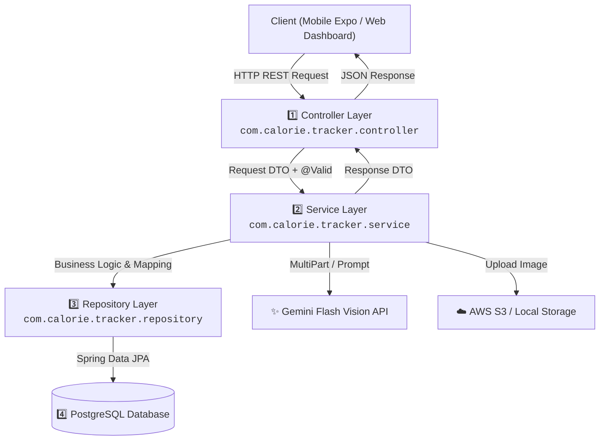
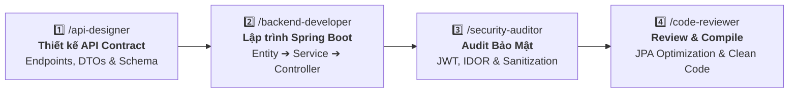
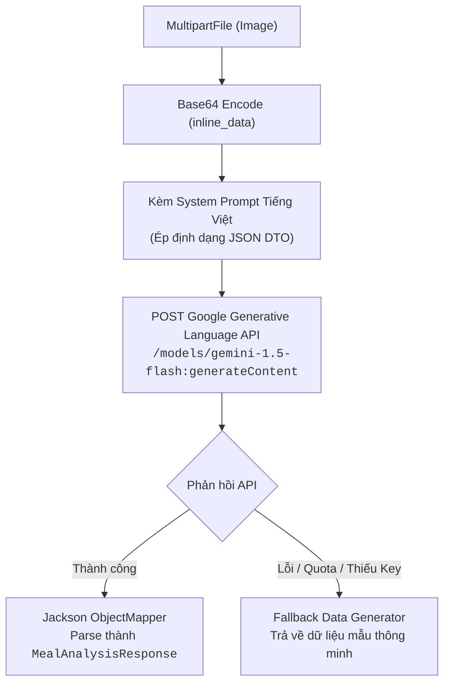
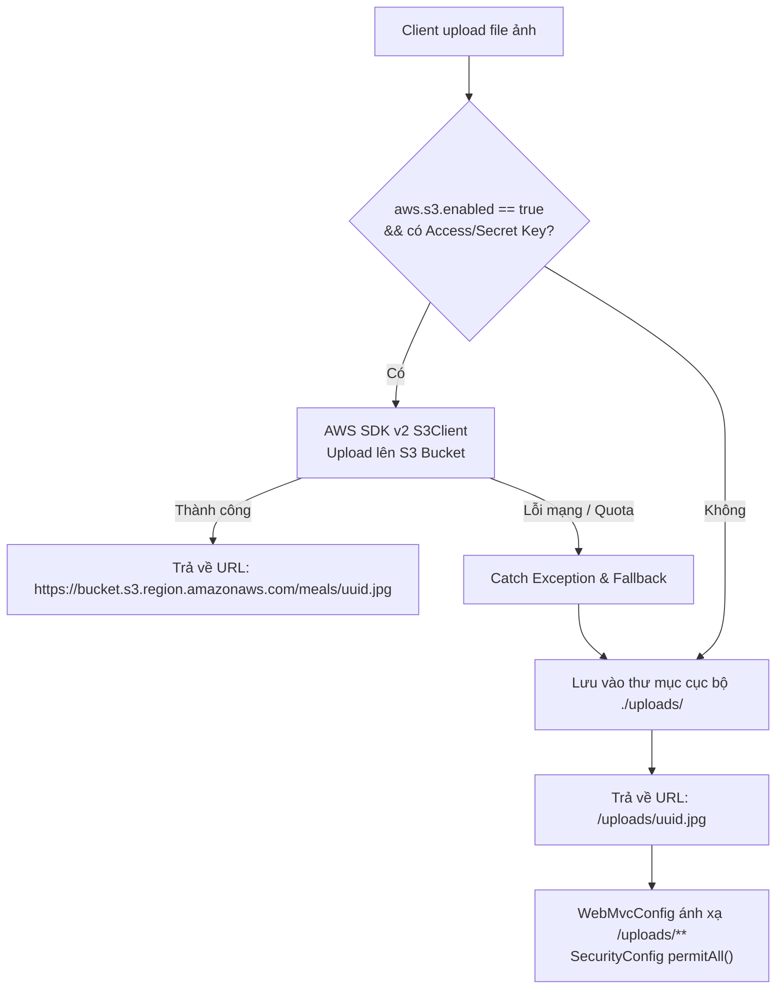
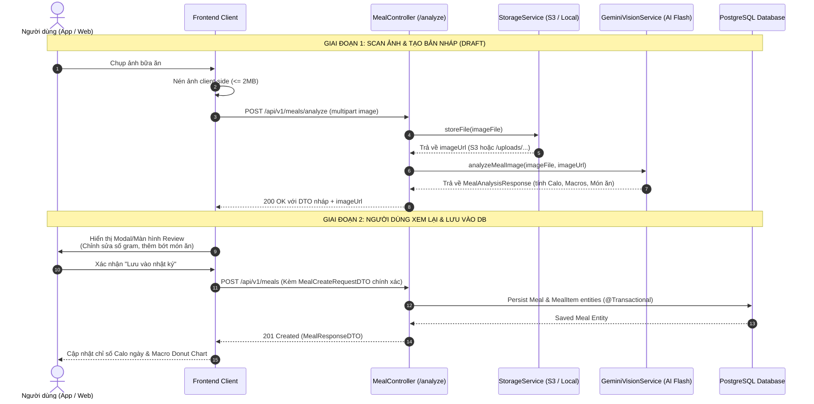

# ☕ HƯỚNG DẪN PHÁT TRIỂN BACKEND (SPRING BOOT 3 & JAVA 17)
## DÀNH CHO THÀNH VIÊN NHÓM DỰ ÁN & AI CODING AGENTS (BACKEND ONBOARDING & EXECUTION GUIDE)

> **Dự án:** NutriAI – AI Calorie & Meal Tracker  
> **Thư mục mã nguồn:** [`backend/`](file:///d:/AI-Calorie-Meal-Tracker/backend)  
> **Nhánh Git làm việc:** `develop`  
> **Áp dụng cho:** Backend Developers, API Engineers, DevOps, Reviewers & AI Agents  
> **Cập nhật lần cuối:** 2026-10-01  

---

## 📌 1. Tổng Quan Kiến Trúc & Công Nghệ (Tech Stack & Architecture)

Hệ thống Backend của **NutriAI** được xây dựng trên nền tảng **Spring Boot 3.2.5** với ngôn ngữ **Java 17**, tuân thủ nghiêm ngặt mô hình kiến trúc phân lớp (Layered Architecture) chuẩn doanh nghiệp.

### 🛠️ Ngăn Xếp Công Nghệ (Technology Stack)

| Thành phần | Công nghệ / Thư viện | Phiên bản | Mục đích sử dụng |
| :--- | :--- | :--- | :--- |
| **Runtime & Core** | Java JDK & Spring Boot | Java 17 / Boot 3.2.5 | Nền tảng thực thi ứng dụng backend |
| **Security & Auth** | Spring Security 6 & JJWT | JJWT 0.12.5 | Xác thực JWT stateless, bảo vệ endpoint, phân quyền |
| **Database & ORM** | PostgreSQL & Spring Data JPA | Hibernate 6.x | Quản trị CSDL quan hệ, quản lý entities & transactions |
| **Dev Database** | H2 In-Memory Database | 2.x | Môi trường test local / mock độc lập |
| **AI Vision API** | Google Gemini Flash Vision | `gemini-1.5-flash` | Nhận diện món ăn, ước tính khối lượng, tính Calories/Macros |
| **Object Storage** | AWS S3 SDK v2 / Local Storage | AWS SDK 2.25.35 | Lưu trữ ảnh món ăn của người dùng |
| **API Documentation**| SpringDoc OpenAPI 3 | Swagger UI 2.5.0 | Tài liệu hóa RESTful API tương tác trực quan |
| **Export Service** | Apache Commons CSV & OpenPDF | 1.10.0 / 1.3.39 | Xuất báo cáo dinh dưỡng định dạng CSV & PDF |
| **Boilerplate** | Project Lombok | - | Tự động sinh Getter, Setter, Builder, Slf4j logs |

---

## 🏗️ 2. Mô Hình Phân Lớp (Layered Architecture Standard)

Mọi luồng dữ liệu trong backend **NutriAI** bắt buộc phải tuân theo sơ đồ phân tầng một chiều dưới đây:



### 📋 Quy Tắc Bất Di Bất Dịch Giữa Các Tầng:
1. **Controller Layer:**
   * Chỉ nhận `@RequestBody` dạng **DTO**, luôn kiểm tra tính hợp lệ bằng `@Valid`.
   * **Tuyệt đối KHÔNG trả trực tiếp JPA Entity ra ngoài.** Luôn map sang `ResponseDTO` hoặc `ApiResponse<T>`.
   * Không chứa logic tính toán nghiệp vụ hoặc truy vấn DB trực tiếp.
2. **Service Layer:**
   * Mặc định gắn `@Service` và `@Transactional(readOnly = true)`.
   * Các hàm thêm/sửa/xóa gắn `@Transactional`.
   * Toàn bộ ngoại lệ nghiệp vụ phải ném ra `CustomException` (ví dụ `ResourceNotFoundException`, `UnauthorizedException`).
3. **Repository Layer:**
   * Kế thừa `JpaRepository<Entity, UUID/Long>`.
   * Ưu tiên truy vấn derived methods (`findByUserIdAndDateBetween`).
   * Tránh viết Native Query trừ khi cần tổng hợp Analytics đa chiều phức tạp.
4. **Exception Handling:**
   * Được đón tập trung tại [`GlobalExceptionHandler`](file:///d:/AI-Calorie-Meal-Tracker/backend/src/main/java/com/calorie/tracker/exception) với `@RestControllerAdvice`.
   * Đảm bảo trả về cấu trúc lỗi chuẩn: `status`, `message`, `timestamp`, `errors` (nếu có lỗi validation).

---

## ⚡ 3. Hướng Dẫn Cài Đặt & Khởi Chạy Local (Quick Start)

### 1️⃣ Yêu cầu tiên quyết:
* **Java 17 JDK** (Khuyên dùng Temurin 17 hoặc Oracle JDK 17).
* **PostgreSQL 14+** (đã tạo database `calorie_tracker_db`) hoặc sử dụng profile H2 in-memory.
* **Maven 3.8+** (hoặc dùng trực tiếp `./mvnw` / `mvn.cmd`).

### 2️⃣ Cấu hình biến môi trường (`application.yml`):
Vị trí file: [`backend/src/main/resources/application.yml`](file:///d:/AI-Calorie-Meal-Tracker/backend/src/main/resources/application.yml). Bạn có thể cấu hình thông qua biến môi trường hệ thống hoặc file `.env`:

```bash
# Database PostgreSQL
SPRING_DATASOURCE_URL=jdbc:postgresql://localhost:5432/calorie_tracker_db
SPRING_DATASOURCE_USERNAME=postgres
SPRING_DATASOURCE_PASSWORD=postgres

# Bảo mật JWT
JWT_SECRET=404E635266556A586E3272357538782F413F4428472B4B6250645367566B5970

# Google Gemini Flash Vision API
GEMINI_API_KEY=your_gemini_api_key_here
GEMINI_MODEL=gemini-1.5-flash

# Lưu trữ ảnh (AWS S3 hoặc fallback Local Storage)
AWS_S3_ENABLED=false
LOCAL_STORAGE_DIR=./uploads
```

### 3️⃣ Các lệnh thao tác thường dùng:

> ⚠️ **LƯU Ý:** Luôn đứng tại thư mục `backend/` trước khi chạy các lệnh Maven.

```powershell
# Chuyển vào thư mục backend
cd backend

# Chạy server ở chế độ Development (Hot Reloading / Spring Boot DevTools)
./mvnw spring-boot:run
# (Trên Windows PowerShell nếu ./mvnw bị chặn chính sách script, dùng: mvn.cmd spring-boot:run)

# Kiểm tra biên dịch mã nguồn (Không chạy test tốn thời gian)
./mvnw clean compile -DskipTests

# Chạy toàn bộ Unit / Integration Tests
./mvnw test
```

### 4️⃣ Địa chỉ kiểm tra ứng dụng:
* **API Base URL:** `http://localhost:8080/api/v1`
* **Swagger UI Docs:** [http://localhost:8080/swagger-ui.html](http://localhost:8080/swagger-ui.html)
* **OpenAPI JSON:** `http://localhost:8080/v3/api-docs`

---

## 🧠 4. Bộ 4 AI Skills Chuyên Dụng Cho Backend & Quy Trình Phối Hợp

Để phát triển một tính năng backend nhanh, chuẩn và không xảy ra xung đột với Mobile/Web, hãy sử dụng **Bộ tứ Skills** trong [`.agents/skills/`](file:///d:/AI-Calorie-Meal-Tracker/.agents/skills/) theo chuỗi:



---

### 🟢 Bước 1: `/api-designer` — Thiết kế hợp đồng API chuẩn mực
* **Khi nào dùng:** Bắt đầu tính năng mới, cần thống nhất Request/Response format trước khi code.
* **Mục tiêu:** Tránh việc Mobile hoặc Web bị gãy interface khi tích hợp dữ liệu.
* **Prompt mẫu:**
  ```text
  /api-designer
  Hãy thiết kế tài liệu API contract và các DTOs cho chức năng: Quản lý danh sách thực phẩm yêu thích (Favorite Meals).
  Bao gồm: URL RESTful (/api/v1/meals/favorites), Request DTO, Response DTO, HTTP Status và mã lỗi.
  ```

---

### 🟢 Bước 2: `/backend-developer` — Triển khai mã nguồn Spring Boot
* **Khi nào dùng:** Viết Entity JPA, Repository, Service logic, xử lý gọi Gemini Vision, Controller endpoint.
* **Mục tiêu:** Sinh mã nguồn Java 17 sạch, đúng layer, đầy đủ validation annotations.
* **Prompt mẫu:**
  ```text
  /backend-developer
  Hãy tạo lớp FavoriteMealEntity, FavoriteMealRepository, FavoriteMealService và FavoriteMealController 
  theo contract đã thiết kế ở bước trên. Đảm bảo hỗ trợ phân trang Pageable và lọc theo userId.
  ```

---

### 🟢 Bước 3: `/security-auditor` — Kiểm tra an toàn thông tin & Chống IDOR
* **Khi nào dùng:** Rà soát controller và service vừa tạo để đảm bảo quyền riêng tư người dùng.
* **Các lỗ hổng phải ngăn chặn:**
  - **Lỗi IDOR (Insecure Direct Object References):** User A không được phép đọc/sửa/xóa bữa ăn của User B bằng cách đổi `mealId` trên URL.
  - **Token Injection / Missing Auth:** Endpoint riêng tư phải có `@AuthenticationPrincipal UserPrincipal user`.
* **Prompt mẫu:**
  ```text
  /security-auditor
  Hãy audit lại lớp MealController và MealService để đảm bảo người dùng chỉ có thể xem và chỉnh sửa 
  bữa ăn thuộc sở hữu của chính họ (tránh lỗ hổng IDOR).
  ```

---

### 🟢 Bước 4: `/code-reviewer` — Kiểm tra kiến trúc, tối ưu JPA & Biên dịch
* **Khi nào dùng:** Trước khi tạo commit Git và push lên nhánh `develop`.
* **Nội dung kiểm tra:**
  - Không bị lỗi **N+1 Query** trong JPA (sử dụng `@EntityGraph` hoặc `join fetch`).
  - Dọn dẹp imports thừa, không dùng hardcoded string/magic numbers.
  - Chạy `./mvnw clean compile -DskipTests` đảm bảo mã nguồn build thành công 100%.
* **Prompt mẫu:**
  ```text
  /code-reviewer
  Hãy review toàn bộ các file mới viết trong backend/src/main/java/com/calorie/tracker/... 
  Kiểm tra cú pháp, lỗi tiềm ẩn N+1 query và biên dịch thử bằng Maven.
  ```

---

## 🤖 5. Hướng Dẫn Tích Hợp Chi Tiết Google Gemini Flash Vision API

Module xử lý ảnh với **Google Gemini Flash Vision** là tính năng cốt lõi tạo nên sự thông minh vượt trội của **NutriAI**. Dịch vụ này phân tích ảnh món ăn người dùng chụp hoặc tải lên, tự động nhận dạng các món ăn thành phần, ước lượng khối lượng (gram), tính toán chỉ số Calories & Macros (Protein, Carbs, Fat) và đưa ra lời khuyên dinh dưỡng hữu ích.

### 5.1. Kiến Trúc & Cơ Chế Hoạt Động (`GeminiVisionService`)
Mã nguồn triển khai tại: [`backend/src/main/java/com/calorie/tracker/service/GeminiVisionService.java`](file:///d:/AI-Calorie-Meal-Tracker/backend/src/main/java/com/calorie/tracker/service/GeminiVisionService.java).



* **Model sử dụng:** `gemini-1.5-flash` — Dòng model tối ưu tốc độ phản hồi nhanh (< 1.5 giây), chi phí thấp và hỗ trợ thị giác máy tính đa phương thức (Multimodal Vision).
* **Truyền tải hình ảnh:** Ảnh nhị phân được mã hóa `Base64` và gửi qua payload `inline_data` với MIME type tự động phát hiện (`image/jpeg`, `image/png`, `image/webp`).

### 5.2. Cách Lấy Google Gemini API Key Miễn Phí
1. Truy cập **Google AI Studio**: [https://aistudio.google.com/](https://aistudio.google.com/)
2. Đăng nhập bằng tài khoản Google của bạn.
3. Bấm nút **Get API key** ở thanh menu bên trái.
4. Chọn **Create API key in new project** (hoặc chọn project Google Cloud sẵn có).
5. Copy chuỗi API Key được cấp (có tiền tố `AIzaSy...`).

### 5.3. Cấu Hình Ứng Dụng (`application.yml`)
Trong file [`backend/src/main/resources/application.yml`](file:///d:/AI-Calorie-Meal-Tracker/backend/src/main/resources/application.yml):

```yaml
gemini:
  api-key: ${GEMINI_API_KEY:demo_gemini_api_key}
  model: ${GEMINI_MODEL:gemini-1.5-flash}
  api-url: https://generativelanguage.googleapis.com/v1beta/models
```

> 💡 **Khuyến nghị:** Khai báo biến môi trường trên máy tính hoặc file `.env`:
> ```bash
> export GEMINI_API_KEY="AIzaSyYourSecretKeyHere"
> ```

### 5.4. Kỹ Thuật Prompt Engineering Cho Ẩm Thực Việt Nam
Để đảm bảo Gemini nhận dạng chính xác các món ăn đặc thù Việt Nam (Cơm tấm sườn bì chả, Phở bò tái nạm, Bún chả, Bánh mì kẹp thịt...) và trả về dữ liệu số học ổn định:

1. **System Prompt Tiếng Việt Chuyên Gia:** Ép model đóng vai trò chuyên gia dinh dưỡng và thị giác máy tính.
2. **Ép Định Dạng JSON Tuyệt Đối:** Yêu cầu Gemini **DUY NHẤT** trả về chuỗi JSON hợp lệ, không bọc các thẻ markdown như ````json ```` hay ghi thêm lời chào dẫn.
3. **Cấu Trúc JSON Yêu Cầu:**
   ```json
   {
     "suggestedMealName": "Cơm tấm sườn nướng trứng ốp la",
     "estimatedTotalCalories": 680.0,
     "estimatedTotalProtein": 32.0,
     "estimatedTotalCarbs": 75.0,
     "estimatedTotalFat": 24.0,
     "healthTip": "Bữa ăn giàu đạm nhưng hơi nhiều dầu mỡ từ mỡ hành và trứng rán. Nên bổ sung thêm dưa leo, cà chua để tăng cường chất xơ!",
     "recognizedItems": [
       {
         "name": "Cơm tấm",
         "estimatedWeightGrams": 180.0,
         "servingSize": "1 bát vừa",
         "calories": 234.0,
         "protein": 4.5,
         "carbs": 50.4,
         "fat": 0.6,
         "fiber": 1.2,
         "confidenceScore": 0.96
       },
       {
         "name": "Sườn heo nướng",
         "estimatedWeightGrams": 120.0,
         "servingSize": "1 miếng lớn",
         "calories": 310.0,
         "protein": 22.0,
         "carbs": 4.0,
         "fat": 18.0,
         "fiber": 0.0,
         "confidenceScore": 0.92
       }
     ]
   }
   ```
4. **Siêu tham số tối ưu (Generation Config):**
   * `temperature: 0.2`: Giữ nhiệt độ thấp để số liệu Calo/Macros ít bị biến động ngẫu nhiên qua các lần gọi.
   * `topK: 32`, `topP: 1.0`: Giới hạn không gian lấy mẫu từ ngữ chính xác.
   * `maxOutputTokens: 2048`: Đảm bảo đủ độ dài cho danh sách nhiều món ăn phức tạp.

### 5.5. Cơ Chế Mock Fallback Thông Minh
Khi biến `GEMINI_API_KEY` chưa được gán hoặc khi mạng ngoại tuyến/hết hạn mức API:
* `GeminiVisionService` **không ném Exception làm sập luồng**.
* Hệ thống tự động kích hoạt `getFallbackAnalysis(imageUrl)` trả về dữ liệu mẫu bữa ăn giàu dinh dưỡng (Cơm gạo lứt, Ức gà áp chảo, Bông cải xanh luộc).
* Điều này giúp đội ngũ Frontend (React Web & React Native) luôn có dữ liệu sống để phát triển giao diện liên tục mà không bị gián đoạn.

### 5.6. Cách Kiểm Thử Endpoint Phân Tích Ảnh
Bạn có thể gọi trực tiếp endpoint `POST /api/v1/meals/analyze` bằng cURL:

```bash
curl -X POST "http://localhost:8080/api/v1/meals/analyze" \
  -H "Authorization: Bearer <YOUR_ACCESS_TOKEN>" \
  -H "Content-Type: multipart/form-data" \
  -F "image=@/path/to/meal-photo.jpg"
```

---

## ☁️ 6. Hướng Dẫn Tích Hợp AWS S3 & Kiến Trúc Lưu Trữ Kép (Dual Storage)

Hệ thống lưu trữ ảnh của **NutriAI** hỗ trợ cơ chế **Dual Storage** (Lưu trữ kép) linh hoạt:
* **Production:** Tải ảnh trực tiếp lên **AWS S3** (hoặc Cloudflare R2 / MinIO) với độ sẵn sàng cao và phân phối CDN toàn cầu.
* **Development / Offline:** Tự động fallback lưu cục bộ vào thư mục `./uploads/` trên máy chủ và phục vụ qua HTTP tĩnh mà không cần tài khoản AWS.

Mã nguồn triển khai tại:
* Service: [`backend/src/main/java/com/calorie/tracker/service/StorageService.java`](file:///d:/AI-Calorie-Meal-Tracker/backend/src/main/java/com/calorie/tracker/service/StorageService.java)
* Cấu hình phục vụ file tĩnh: [`backend/src/main/java/com/calorie/tracker/config/WebMvcConfig.java`](file:///d:/AI-Calorie-Meal-Tracker/backend/src/main/java/com/calorie/tracker/config/WebMvcConfig.java)

### 6.1. Kiến Trúc Luồng Lưu Trữ Ảnh



### 6.2. Các Bước Thiết Lập AWS S3 Console
Nếu muốn kích hoạt AWS S3 thật cho môi trường Production:

1. **Tạo S3 Bucket:**
   * Mở AWS Console ➔ Truy cập dịch vụ **Amazon S3** ➔ Bấm **Create bucket**.
   * Đặt **Bucket name**: `calorie-tracker-meals` (hoặc tên duy nhất của bạn).
   * Chọn **AWS Region**: `ap-southeast-1` (Singapore) hoặc gần người dùng nhất.
   * Bỏ chọn *Block all public access* nếu cần xem ảnh công khai (hoặc dùng CloudFront distribution).
2. **Cấu hình Bucket CORS (Cho phép Mobile & Web Dashboard tải ảnh):**
   Trong tab **Permissions** ➔ **Cross-origin resource sharing (CORS)**, dán cấu hình:
   ```json
   [
     {
       "AllowedHeaders": ["*"],
       "AllowedMethods": ["GET", "HEAD"],
       "AllowedOrigins": ["*"],
       "ExposeHeaders": []
     }
   ]
   ```
3. **Tạo IAM User & Lấy Credentials:**
   * Vào dịch vụ **AWS IAM** ➔ **Users** ➔ **Create user** (ví dụ: `nutriai-s3-uploader`).
   * Gắn quyền: Chọn **Attach policies directly** ➔ Gắn quyền `AmazonS3FullAccess` (hoặc custom policy chỉ cấp `s3:PutObject` và `s3:GetObject` trên bucket `calorie-tracker-meals/*`).
   * Trong tab **Security credentials** ➔ Bấm **Create access key** ➔ Chọn *Application running outside AWS*.
   * Lưu lại **Access Key ID** và **Secret Access Key**.

### 6.3. Cấu Hình Biến Môi Trường AWS S3 (`application.yml`)
Trong file [`backend/src/main/resources/application.yml`](file:///d:/AI-Calorie-Meal-Tracker/backend/src/main/resources/application.yml):

```yaml
aws:
  s3:
    bucket-name: ${AWS_S3_BUCKET:calorie-tracker-meals}
    region: ${AWS_REGION:ap-southeast-1}
    access-key: ${AWS_ACCESS_KEY_ID:your_access_key}
    secret-key: ${AWS_SECRET_ACCESS_KEY:your_secret_key}
    enabled: ${AWS_S3_ENABLED:true} # Đổi thành true để bật S3

storage:
  local-dir: ${LOCAL_STORAGE_DIR:./uploads}
```

### 6.4. Xử Lý Tên File & Bảo Mật Trong `StorageService`
* **Ngăn chặn ghi đè & tấn công Path Traversal:** File được đổi tên ngẫu nhiên bằng `UUID.randomUUID().toString() + extension` (ví dụ `d3b07384-d113-4f44-90f7-5e60d3b6f8a8.jpg`).
* **Giới hạn dung lượng:** File kích thước tối đa 15MB qua cấu hình `spring.servlet.multipart.max-file-size: 15MB`. Client (Mobile/Web) được khuyến nghị nén xuống <= 2MB trước khi gửi.
* **Tự động khôi phục (Fault Tolerance):** Nếu kết nối S3 bị gián đoạn, `StorageService` bắt `Exception`, ghi warning log và tự động chuyển sang lưu local mà không làm crash transaction của người dùng.

### 6.5. Cấu Hình Phục Vụ Tệp Cục Bộ (`WebMvcConfig`)
Khi chạy local với `AWS_S3_ENABLED=false`, ứng dụng sử dụng [`WebMvcConfig.java`](file:///d:/AI-Calorie-Meal-Tracker/backend/src/main/java/com/calorie/tracker/config/WebMvcConfig.java) để ánh xạ URL `/uploads/**` tới thư mục đĩa cục bộ:

```java
@Configuration
public class WebMvcConfig implements WebMvcConfigurer {

    @Value("${storage.local-dir:./uploads}")
    private String localStorageDir;

    @Override
    public void addResourceHandlers(ResourceHandlerRegistry registry) {
        Path uploadDir = Paths.get(localStorageDir).toAbsolutePath().normalize();
        String uploadPath = uploadDir.toUri().toString();

        registry.addResourceHandler("/uploads/**")
                .addResourceLocations(uploadPath.endsWith("/") ? uploadPath : uploadPath + "/");
    }
}
```
Đồng thời, trong [`SecurityConfig.java`](file:///d:/AI-Calorie-Meal-Tracker/backend/src/main/java/com/calorie/tracker/config/SecurityConfig.java), đường dẫn `/uploads/**` đã được cấu hình `.permitAll()` để các ứng dụng phía client có thể tải và hiển thị ảnh bữa ăn tự do.

---

## 🔄 7. Luồng Tích Hợp Hoàn Chỉnh: S3 Storage + Gemini Vision + PostgreSQL

Toàn bộ quy trình từ lúc người dùng chụp ảnh đến khi lưu trữ dữ liệu vào CSDL diễn ra qua 2 giai đoạn độc lập tuân thủ nguyên tắc **Draft & Review Flow**:



---

## 📊 8. Danh Mục Endpoints Hiện Tại (API Directory)

| Nhóm chức năng | Phương thức | Endpoint | Mô tả | Yêu cầu Auth |
| :--- | :--- | :--- | :--- | :--- |
| **Authentication** | `POST` | `/api/v1/auth/register` | Đăng ký tài khoản mới | ❌ Public |
| | `POST` | `/api/v1/auth/login` | Đăng nhập lấy cặp Access & Refresh Token | ❌ Public |
| | `POST` | `/api/v1/auth/refresh` | Làm mới Access Token khi hết hạn | ❌ Public |
| **Health Profile** | `GET` | `/api/v1/health-profile/me` | Lấy hồ sơ chỉ số cơ thể, BMR, TDEE | 🔒 Bearer JWT |
| | `PUT` | `/api/v1/health-profile/me` | Cập nhật cân nặng, chiều cao, mục tiêu | 🔒 Bearer JWT |
| **Meal Tracking** | `POST` | `/api/v1/meals/analyze` | Gửi ảnh phân tích calo qua Gemini Vision & lưu trữ ảnh | 🔒 Bearer JWT |
| | `POST` | `/api/v1/meals` | Lưu bữa ăn vào nhật ký | 🔒 Bearer JWT |
| | `GET` | `/api/v1/meals/daily` | Lấy danh sách bữa ăn theo ngày (`?date=yyyy-MM-dd`) | 🔒 Bearer JWT |
| | `DELETE` | `/api/v1/meals/{id}` | Xóa một bữa ăn | 🔒 Bearer JWT |
| **Analytics & Export** | `GET` | `/api/v1/analytics/summary` | Tổng kết calo, macros tiêu thụ trong ngày | 🔒 Bearer JWT |
| | `GET` | `/api/v1/analytics/weekly` | Biểu đồ xu hướng dinh dưỡng 7 ngày qua | 🔒 Bearer JWT |
| | `GET` | `/api/v1/analytics/export/csv` | Xuất dữ liệu nhật ký dinh dưỡng dạng CSV | 🔒 Bearer JWT |
| | `GET` | `/api/v1/analytics/export/pdf` | Xuất báo cáo dinh dưỡng tổng hợp dạng PDF | 🔒 Bearer JWT |

---

## ✅ 9. Checklist Kiểm Thử Trước Khi Commit & Tạo PR

Trước khi tạo commit và gửi PR lên nhánh `develop`, hãy tự kiểm tra theo checklist sau:

- [ ] **Mã nguồn biên dịch thành công:** Chạy `./mvnw clean compile -DskipTests` không có lỗi.
- [ ] **Không hardcode thông tin nhạy cảm:** Không commit API Keys, Password DB, JWT Secret vào Git.
- [ ] **Validation đầu vào:** Mọi trường bắt buộc trong Request DTO đều có `@NotNull`, `@NotBlank`, `@Positive`.
- [ ] **Bảo vệ IDOR:** Mọi thao tác tìm kiếm/cập nhật `Meal` đều có điều kiện `AND user.id = :currentUserId`.
- [ ] **Tương thích Storage & Gemini:** Đã kiểm thử luồng `/api/v1/meals/analyze` với cả trường hợp offline mock và online.
- [ ] **Cập nhật Swagger / OpenAPI:** Các Controller và DTO có chú thích `@Operation`, `@Schema` rõ ràng.
- [ ] **Đặt tên commit chuẩn Conventional Commits:**
  * `feat(backend): implement gemini vision meal analysis endpoint`
  * `fix(storage): add graceful fallback when s3 credentials are not set`
  * `refactor(meal): optimize daily meal fetch query with join fetch`

---
*Tài liệu được quản lý bởi NutriAI Development Team. Mọi đóng góp và thắc mắc vui lòng trao đổi trực tiếp trên nhánh `develop`.*

