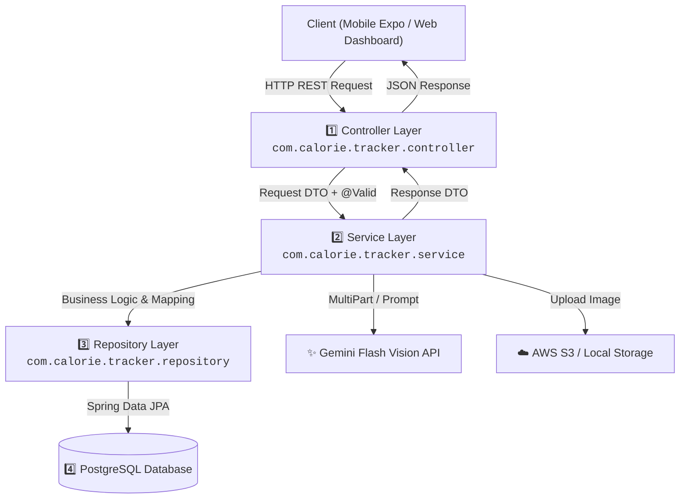
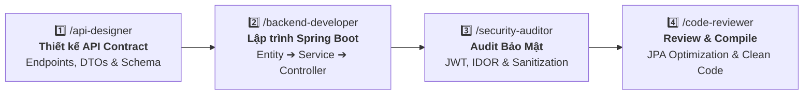

# ☕ HƯỚNG DẪN PHÁT TRIỂN BACKEND (SPRING BOOT 3 & JAVA 17)
## DÀNH CHO THÀNH VIÊN NHÓM DỰ ÁN & AI CODING AGENTS (BACKEND ONBOARDING & EXECUTION GUIDE)

> **Dự án:** NutriAI – AI Calorie & Meal Tracker  
> **Thư mục mã nguồn:** [`backend/`](file:///d:/AI-Calorie-Meal-Tracker/backend)  
> **Nhánh Git làm việc:** `develop`  
> **Áp dụng cho:** Backend Developers, API Engineers, DevOps, Reviewers & AI Agents  
> **Cập nhật lần cuối:** 2026-10-01  

---

## 📌 1. Tổng Quan Kiến Trúc & Công Nghệ (Tech Stack & Architecture)

Hệ thống Backend của **NutriAI** được xây dựng trên nền tảng **Spring Boot 3.2.5** với ngôn ngữ **Java 17**, tuân thủ nghiêm ngặt mô hình kiến trúc phân lớp (Layered Architecture) chuẩn doanh nghiệp.

### 🛠️ Ngăn Xếp Công Nghệ (Technology Stack)

| Thành phần | Công nghệ / Thư viện | Phiên bản | Mục đích sử dụng |
| :--- | :--- | :--- | :--- |
| **Runtime & Core** | Java JDK & Spring Boot | Java 17 / Boot 3.2.5 | Nền tảng thực thi ứng dụng backend |
| **Security & Auth** | Spring Security 6 & JJWT | JJWT 0.12.5 | Xác thực JWT stateless, bảo vệ endpoint, phân quyền |
| **Database & ORM** | PostgreSQL & Spring Data JPA | Hibernate 6.x | Quản trị CSDL quan hệ, quản lý entities & transactions |
| **Dev Database** | H2 In-Memory Database | 2.x | Môi trường test local / mock độc lập |
| **AI Vision API** | Google Gemini Flash Vision | `gemini-1.5-flash` | Nhận diện món ăn, ước tính khối lượng, tính Calories/Macros |
| **Object Storage** | AWS S3 SDK v2 / Local Storage | AWS SDK 2.25.35 | Lưu trữ ảnh món ăn của người dùng |
| **API Documentation**| SpringDoc OpenAPI 3 | Swagger UI 2.5.0 | Tài liệu hóa RESTful API tương tác trực quan |
| **Export Service** | Apache Commons CSV & OpenPDF | 1.10.0 / 1.3.39 | Xuất báo cáo dinh dưỡng định dạng CSV & PDF |
| **Boilerplate** | Project Lombok | - | Tự động sinh Getter, Setter, Builder, Slf4j logs |

---

## 🏗️ 2. Mô Hình Phân Lớp (Layered Architecture Standard)

Mọi luồng dữ liệu trong backend **NutriAI** bắt buộc phải tuân theo sơ đồ phân tầng một chiều dưới đây:



### 📋 Quy Tắc Bất Di Bất Dịch Giữa Các Tầng:
1. **Controller Layer:**
   * Chỉ nhận `@RequestBody` dạng **DTO**, luôn kiểm tra tính hợp lệ bằng `@Valid`.
   * **Tuyệt đối KHÔNG trả trực tiếp JPA Entity ra ngoài.** Luôn map sang `ResponseDTO` hoặc `ApiResponse<T>`.
   * Không chứa logic tính toán nghiệp vụ hoặc truy vấn DB trực tiếp.
2. **Service Layer:**
   * Mặc định gắn `@Service` và `@Transactional(readOnly = true)`.
   * Các hàm thêm/sửa/xóa gắn `@Transactional`.
   * Toàn bộ ngoại lệ nghiệp vụ phải ném ra `CustomException` (ví dụ `ResourceNotFoundException`, `UnauthorizedException`).
3. **Repository Layer:**
   * Kế thừa `JpaRepository<Entity, UUID/Long>`.
   * Ưu tiên truy vấn derived methods (`findByUserIdAndDateBetween`).
   * Tránh viết Native Query trừ khi cần tổng hợp Analytics đa chiều phức tạp.
4. **Exception Handling:**
   * Được đón tập trung tại [`GlobalExceptionHandler`](file:///d:/AI-Calorie-Meal-Tracker/backend/src/main/java/com/calorie/tracker/exception) với `@RestControllerAdvice`.
   * Đảm bảo trả về cấu trúc lỗi chuẩn: `status`, `message`, `timestamp`, `errors` (nếu có lỗi validation).

---

## ⚡ 3. Hướng Dẫn Cài Đặt & Khởi Chạy Local (Quick Start)

### 1️⃣ Yêu cầu tiên quyết:
* **Java 17 JDK** (Khuyên dùng Temurin 17 hoặc Oracle JDK 17).
* **PostgreSQL 14+** (đã tạo database `calorie_tracker_db`) hoặc sử dụng profile H2 in-memory.
* **Maven 3.8+** (hoặc dùng trực tiếp `./mvnw` / `mvn.cmd`).

### 2️⃣ Cấu hình biến môi trường (`application.yml`):
Vị trí file: [`backend/src/main/resources/application.yml`](file:///d:/AI-Calorie-Meal-Tracker/backend/src/main/resources/application.yml). Bạn có thể cấu hình thông qua biến môi trường hệ thống hoặc file `.env`:

```bash
# Database PostgreSQL
SPRING_DATASOURCE_URL=jdbc:postgresql://localhost:5432/calorie_tracker_db
SPRING_DATASOURCE_USERNAME=postgres
SPRING_DATASOURCE_PASSWORD=postgres

# Bảo mật JWT
JWT_SECRET=404E635266556A586E3272357538782F413F4428472B4B6250645367566B5970

# Google Gemini Flash Vision API
GEMINI_API_KEY=your_gemini_api_key_here
GEMINI_MODEL=gemini-1.5-flash

# Lưu trữ ảnh (AWS S3 hoặc fallback Local Storage)
AWS_S3_ENABLED=false
LOCAL_STORAGE_DIR=./uploads
```

### 3️⃣ Các lệnh thao tác thường dùng:

> ⚠️ **LƯU Ý:** Luôn đứng tại thư mục `backend/` trước khi chạy các lệnh Maven.

```powershell
# Chuyển vào thư mục backend
cd backend

# Chạy server ở chế độ Development (Hot Reloading / Spring Boot DevTools)
./mvnw spring-boot:run
# (Trên Windows PowerShell nếu ./mvnw bị chặn chính sách script, dùng: mvn.cmd spring-boot:run)

# Kiểm tra biên dịch mã nguồn (Không chạy test tốn thời gian)
./mvnw clean compile -DskipTests

# Chạy toàn bộ Unit / Integration Tests
./mvnw test
```

### 4️⃣ Địa chỉ kiểm tra ứng dụng:
* **API Base URL:** `http://localhost:8080/api/v1`
* **Swagger UI Docs:** [http://localhost:8080/swagger-ui.html](http://localhost:8080/swagger-ui.html)
* **OpenAPI JSON:** `http://localhost:8080/v3/api-docs`

---

## 🧠 4. Bộ 4 AI Skills Chuyên Dụng Cho Backend & Quy Trình Phối Hợp

Để phát triển một tính năng backend nhanh, chuẩn và không xảy ra xung đột với Mobile/Web, hãy sử dụng **Bộ tứ Skills** trong [`.agents/skills/`](file:///d:/AI-Calorie-Meal-Tracker/.agents/skills/) theo chuỗi:



---

### 🟢 Bước 1: `/api-designer` — Thiết kế hợp đồng API chuẩn mực
* **Khi nào dùng:** Bắt đầu tính năng mới, cần thống nhất Request/Response format trước khi code.
* **Mục tiêu:** Tránh việc Mobile hoặc Web bị gãy interface khi tích hợp dữ liệu.
* **Prompt mẫu:**
  ```text
  /api-designer
  Hãy thiết kế tài liệu API contract và các DTOs cho chức năng: Quản lý danh sách thực phẩm yêu thích (Favorite Meals).
  Bao gồm: URL RESTful (/api/v1/meals/favorites), Request DTO, Response DTO, HTTP Status và mã lỗi.
  ```

---

### 🟢 Bước 2: `/backend-developer` — Triển khai mã nguồn Spring Boot
* **Khi nào dùng:** Viết Entity JPA, Repository, Service logic, xử lý gọi Gemini Vision, Controller endpoint.
* **Mục tiêu:** Sinh mã nguồn Java 17 sạch, đúng layer, đầy đủ validation annotations.
* **Prompt mẫu:**
  ```text
  /backend-developer
  Hãy tạo lớp FavoriteMealEntity, FavoriteMealRepository, FavoriteMealService và FavoriteMealController 
  theo contract đã thiết kế ở bước trên. Đảm bảo hỗ trợ phân trang Pageable và lọc theo userId.
  ```

---

### 🟢 Bước 3: `/security-auditor` — Kiểm tra an toàn thông tin & Chống IDOR
* **Khi nào dùng:** Rà soát controller và service vừa tạo để đảm bảo quyền riêng tư người dùng.
* **Các lỗ hổng phải ngăn chặn:**
  - **Lỗi IDOR (Insecure Direct Object References):** User A không được phép đọc/sửa/xóa bữa ăn của User B bằng cách đổi `mealId` trên URL.
  - **Token Injection / Missing Auth:** Endpoint riêng tư phải có `@AuthenticationPrincipal UserPrincipal user`.
* **Prompt mẫu:**
  ```text
  /security-auditor
  Hãy audit lại lớp MealController và MealService để đảm bảo người dùng chỉ có thể xem và chỉnh sửa 
  bữa ăn thuộc sở hữu của chính họ (tránh lỗ hổng IDOR).
  ```

---

### 🟢 Bước 4: `/code-reviewer` — Kiểm tra kiến trúc, tối ưu JPA & Biên dịch
* **Khi nào dùng:** Trước khi tạo commit Git và push lên nhánh `develop`.
* **Nội dung kiểm tra:**
  - Không bị lỗi **N+1 Query** trong JPA (sử dụng `@EntityGraph` hoặc `join fetch`).
  - Dọn dẹp imports thừa, không dùng hardcoded string/magic numbers.
  - Chạy `./mvnw clean compile -DskipTests` đảm bảo mã nguồn build thành công 100%.
* **Prompt mẫu:**
  ```text
  /code-reviewer
  Hãy review toàn bộ các file mới viết trong backend/src/main/java/com/calorie/tracker/... 
  Kiểm tra cú pháp, lỗi tiềm ẩn N+1 query và biên dịch thử bằng Maven.
  ```

---

## 🤖 5. Quy Chuẩn Xử Lý AI Vision & Meal Data Pipeline

Module xử lý ảnh với **Google Gemini Flash Vision** là trái tim của hệ thống **NutriAI**. Mọi developer cần nắm rõ pipeline sau:

```text
[Mobile / Web Client]
       │ (1) Ảnh đã nén client-side <= 2MB
       ▼
POST /api/v1/meals/analyze
       │
       ├─► (2) StorageService: Lưu ảnh vào S3 hoặc Local Storage (lấy URL công khai)
       │
       ├─► (3) GeminiVisionService: Gửi Multipart + System Prompt ép cấu trúc JSON
       │
       ├─► (4) JSON Parser: Parse kết quả thành MealAnalysisResponse DTO
       │
       ▼ (5) Trả kết quả Draft cho Client xem trước (Review Screen / Modal)
[Người Dùng Chỉnh Sửa Khối Lượng / Món Ăn]
       │
       ▼ (6) Xác nhận lưu
POST /api/v1/meals (Persist vào PostgreSQL)
```

### ⚠️ 3 Nguyên Tắc Cốt Lõi Khi Làm AI Vision:
1. **Tuyệt đối không lưu trực tiếp vào DB khi vừa scan xong (Draft & Review Flow):** Endpoint `/analyze` chỉ trả về bản nháp. Chỉ khi người dùng bấm "Lưu vào nhật ký" thì mới gọi `POST /api/v1/meals` để lưu vào DB.
2. **Ép Gemini trả về JSON có cấu trúc chính xác:** Trong prompt, định nghĩa rõ ràng cấu trúc JSON mong muốn:
   ```json
   {
     "detectedFoods": [
       {
         "name": "Tên món ăn (Tiếng Việt)",
         "estimatedGrams": 150,
         "calories": 250,
         "carbs": 30.5,
         "protein": 12.0,
         "fat": 8.0,
         "confidence": 0.95
       }
     ],
     "healthTips": "Lời khuyên dinh dưỡng từ chuyên gia AI"
   }
   ```
3. **Cơ chế Fallback & Timeout:** Luôn có `try/catch` bọc ngoài cuộc gọi Gemini. Nếu API timeout (>15s) hoặc gặp sự cố quota, ném ngoại lệ rõ ràng để client hiển thị form nhập thủ công cho người dùng.

---

## 📊 6. Danh Mục Endpoints Hiện Tại (API Directory)

| Nhóm chức năng | Phương thức | Endpoint | Mô tả | Yêu cầu Auth |
| :--- | :--- | :--- | :--- | :--- |
| **Authentication** | `POST` | `/api/v1/auth/register` | Đăng ký tài khoản mới | ❌ Public |
| | `POST` | `/api/v1/auth/login` | Đăng nhập lấy cặp Access & Refresh Token | ❌ Public |
| | `POST` | `/api/v1/auth/refresh` | Làm mới Access Token khi hết hạn | ❌ Public |
| **Health Profile** | `GET` | `/api/v1/health-profile/me` | Lấy hồ sơ chỉ số cơ thể, BMR, TDEE | 🔒 Bearer JWT |
| | `PUT` | `/api/v1/health-profile/me` | Cập nhật cân nặng, chiều cao, mục tiêu | 🔒 Bearer JWT |
| **Meal Tracking** | `POST` | `/api/v1/meals/analyze` | Gửi ảnh phân tích calo qua Gemini Vision | 🔒 Bearer JWT |
| | `POST` | `/api/v1/meals` | Lưu bữa ăn vào nhật ký | 🔒 Bearer JWT |
| | `GET` | `/api/v1/meals/daily` | Lấy danh sách bữa ăn theo ngày (`?date=yyyy-MM-dd`) | 🔒 Bearer JWT |
| | `DELETE` | `/api/v1/meals/{id}` | Xóa một bữa ăn | 🔒 Bearer JWT |
| **Analytics & Export** | `GET` | `/api/v1/analytics/summary` | Tổng kết calo, macros tiêu thụ trong ngày | 🔒 Bearer JWT |
| | `GET` | `/api/v1/analytics/weekly` | Biểu đồ xu hướng dinh dưỡng 7 ngày qua | 🔒 Bearer JWT |
| | `GET` | `/api/v1/analytics/export/csv` | Xuất dữ liệu nhật ký dinh dưỡng dạng CSV | 🔒 Bearer JWT |
| | `GET` | `/api/v1/analytics/export/pdf` | Xuất báo cáo dinh dưỡng tổng hợp dạng PDF | 🔒 Bearer JWT |

---

## ✅ 7. Checklist Kiểm Thử Trước Khi Commit & Tạo PR

Trước khi tạo commit và gửi PR lên nhánh `develop`, hãy tự kiểm tra theo checklist sau:

- [ ] **Mã nguồn biên dịch thành công:** Chạy `./mvnw clean compile -DskipTests` không có lỗi.
- [ ] **Không hardcode thông tin nhạy cảm:** Không commit API Keys, Password DB, JWT Secret vào Git.
- [ ] **Validation đầu vào:** Mọi trường bắt buộc trong Request DTO đều có `@NotNull`, `@NotBlank`, `@Positive`.
- [ ] **Bảo vệ IDOR:** Mọi thao tác tìm kiếm/cập nhật `Meal` đều có điều kiện `AND user.id = :currentUserId`.
- [ ] **Cập nhật Swagger / OpenAPI:** Các Controller và DTO có chú thích `@Operation`, `@Schema` rõ ràng.
- [ ] **Đặt tên commit chuẩn Conventional Commits:**
  * `feat(backend): implement gemini vision meal analysis endpoint`
  * `fix(auth): handle expired refresh token gracefully`
  * `refactor(meal): optimize daily meal fetch query with join fetch`

---
*Tài liệu được quản lý bởi NutriAI Development Team. Mọi đóng góp và thắc mắc vui lòng trao đổi trực tiếp trên nhánh `develop`.*
