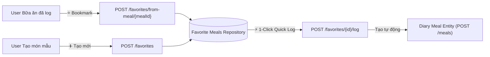

# 📐 TÀI LIỆU THIẾT KẾ API CONTRACT: QUẢN LÝ MÓN ĂN YÊU THÍCH (FAVORITE MEALS)

> **Dự án:** NutriAI – AI Calorie & Meal Tracker  
> **Module:** Meal Tracking & Personalization  
> **Base Path:** `/api/v1/meals/favorites`  
> **Phiên bản:** `v1.0.0`  
> **Áp dụng cho:** Spring Boot 3 Backend, React Native Mobile App, React Web Dashboard  
> **Tiêu chuẩn:** RESTful, OpenAPI 3 (SpringDoc), Jakarta Validation, Zero-Trust IDOR Protection  

---

## 📌 1. Tổng quan nghiệp vụ (Business Requirements)

Tính năng **Món ăn yêu thích (Favorite Meals)** giải quyết bài toán: người dùng thường xuyên ăn lặp lại một số món ăn quen thuộc (ví dụ: *Phở bò tái nạm buổi sáng*, *Ức gà áp chảo + Khoai lang trưa*, *Salad cá ngừ tối*). Thay vì phải chụp ảnh phân tích AI lại từ đầu hoặc gõ lại từng món con, tính năng này cho phép:

1. **Lưu nhanh (Bookmark)** từ một bữa ăn đã log trước đó trong nhật ký thành món yêu thích.
2. **Tạo mới thủ công** món ăn yêu thích với định lượng gram, Calo và Macros chuẩn.
3. **Ghi nhận nhanh (Quick Log)** 1-click vào nhật ký bữa ăn của ngày hôm nay (hoặc ngày chỉ định).
4. **Tìm kiếm, lọc & sắp xếp** danh sách món yêu thích theo danh mục (`BREAKFAST`, `LUNCH`, `DINNER`, `SNACK`) hoặc số lần sử dụng (`usageCount`).



---

## 🏛️ 2. Danh mục Endpoints (RESTful API Directory)

Tất cả các endpoint đều yêu cầu xác thực người dùng qua **JWT Bearer Token** (`Authorization: Bearer <access_token>`).

| HTTP Method | Endpoint URL | Mục đích / Hành động | Request Body | Response Body (Data) | HTTP Status |
| :--- | :--- | :--- | :--- | :--- | :--- |
| `GET` | `/api/v1/meals/favorites` | Lấy danh sách món ăn yêu thích (tìm kiếm, lọc, phân trang) | Không có | `PageResponse<FavoriteMealDto>` | `200 OK` |
| `GET` | `/api/v1/meals/favorites/{id}` | Lấy thông tin chi tiết một món ăn yêu thích | Không có | `FavoriteMealDto` | `200 OK` |
| `POST` | `/api/v1/meals/favorites` | Tạo mới một món ăn yêu thích thủ công | `CreateFavoriteMealRequest` | `FavoriteMealDto` | `201 Created` |
| `POST` | `/api/v1/meals/favorites/from-meal/{mealId}` | Lưu nhanh một bữa ăn trong nhật ký thành món yêu thích | Không có (hoặc params) | `FavoriteMealDto` | `201 Created` |
| `PUT` | `/api/v1/meals/favorites/{id}` | Cập nhật thông tin món ăn yêu thích | `UpdateFavoriteMealRequest` | `FavoriteMealDto` | `200 OK` |
| `DELETE` | `/api/v1/meals/favorites/{id}` | Xóa một món khỏi danh sách yêu thích | Không có | `null` | `200 OK` / `204 No Content` |
| `POST` | `/api/v1/meals/favorites/{id}/log` | Ghi nhận nhanh (Quick Log) vào nhật ký bữa ăn hôm nay | `QuickLogMealRequest` (Optional) | `MealDto` | `201 Created` |

---

## 🔍 3. Chi tiết đặc tả kỹ thuật từng Endpoint

### 3.1. `GET /api/v1/meals/favorites` — Lấy danh sách món ăn yêu thích

* **Mô tả:** Trả về danh sách món yêu thích của chính người dùng đăng nhập. Hỗ trợ tìm kiếm theo từ khóa tên món, lọc theo loại bữa ăn và phân trang.
* **Headers:** `Authorization: Bearer <token>`
* **Query Parameters:**
  * `keyword` *(string, optional)*: Từ khóa tìm kiếm theo tên món (ví dụ: `ức gà`, `phở`).
  * `mealType` *(string, optional, enum)*: `BREAKFAST`, `LUNCH`, `DINNER`, `SNACK`.
  * `page` *(int, optional, default: 0)*: Số trang (0-indexed).
  * `size` *(int, optional, default: 10)*: Kích thước trang.
  * `sort` *(string, optional, default: `usageCount,desc` hoặc `createdAt,desc`)*.

#### Phản hồi thành công (`200 OK`):
```json
{
  "success": true,
  "message": "Lấy danh sách món ăn yêu thích thành công",
  "data": {
    "content": [
      {
        "id": 1,
        "name": "Combo Ức gà nướng & Khoai lang hấp",
        "mealType": "LUNCH",
        "mealTypeDisplayName": "Bữa trưa",
        "imageUrl": "https://s3.ap-southeast-1.amazonaws.com/meals/sample-lunch.jpg",
        "notes": "Thực đơn siết cơ giảm mỡ trưa",
        "totalCalories": 442.5,
        "totalProtein": 48.3,
        "totalCarbs": 50.0,
        "totalFat": 5.8,
        "usageCount": 12,
        "itemsCount": 2,
        "createdAt": "2026-10-01T11:30:00"
      }
    ],
    "pageNumber": 0,
    "pageSize": 10,
    "totalElements": 1,
    "totalPages": 1,
    "last": true
  },
  "timestamp": "2026-10-04T15:00:00"
}
```

---

### 3.2. `GET /api/v1/meals/favorites/{id}` — Lấy chi tiết món ăn yêu thích

* **Mô tả:** Trả về toàn bộ thông tin chi tiết bao gồm danh sách từng món con (`items`), số gram, calo, đạm, đường, béo của từng món.
* **Headers:** `Authorization: Bearer <token>`
* **Path Variables:** `id` *(Long, required)*: ID món ăn yêu thích.

#### Phản hồi thành công (`200 OK`):
```json
{
  "success": true,
  "message": "Thao tác thành công",
  "data": {
    "id": 1,
    "name": "Combo Ức gà nướng & Khoai lang hấp",
    "mealType": "LUNCH",
    "mealTypeDisplayName": "Bữa trưa",
    "imageUrl": "https://s3.ap-southeast-1.amazonaws.com/meals/sample-lunch.jpg",
    "notes": "Thực đơn siết cơ giảm mỡ trưa",
    "totalCalories": 442.5,
    "totalProtein": 48.3,
    "totalCarbs": 50.0,
    "totalFat": 5.8,
    "usageCount": 12,
    "items": [
      {
        "id": 101,
        "name": "Ức gà nướng thảo mộc",
        "estimatedWeightGrams": 150.0,
        "servingSize": "1 miếng lớn",
        "calories": 247.5,
        "protein": 46.5,
        "carbs": 0.0,
        "fat": 5.4,
        "fiber": 0.0,
        "confidenceScore": 0.95
      },
      {
        "id": 102,
        "name": "Khoai lang vàng hấp",
        "estimatedWeightGrams": 150.0,
        "servingSize": "1 củ vừa",
        "calories": 195.0,
        "protein": 1.8,
        "carbs": 50.0,
        "fat": 0.4,
        "fiber": 3.3,
        "confidenceScore": 0.92
      }
    ],
    "createdAt": "2026-10-01T11:30:00",
    "updatedAt": "2026-10-02T14:15:00"
  },
  "timestamp": "2026-10-04T15:00:00"
}
```

---

### 3.3. `POST /api/v1/meals/favorites` — Tạo món yêu thích thủ công

* **Mô tả:** Cho phép người dùng tự định nghĩa một món ăn yêu thích cùng các món thành phần.
* **Headers:** `Authorization: Bearer <token>`, `Content-Type: application/json`

#### Request Body (`CreateFavoriteMealRequest`):
```json
{
  "name": "Bánh mì đen trứng ốp la bơ",
  "mealType": "BREAKFAST",
  "imageUrl": "/uploads/avocado-toast.jpg",
  "notes": "Ăn kèm 1 ly cà phê đen không đường",
  "items": [
    {
      "name": "Bánh mì đen nguyên cám",
      "estimatedWeightGrams": 60.0,
      "servingSize": "2 lát",
      "calories": 150.0,
      "protein": 5.2,
      "carbs": 28.0,
      "fat": 1.8,
      "fiber": 3.5
    },
    {
      "name": "Trứng gà ốp la",
      "estimatedWeightGrams": 100.0,
      "servingSize": "2 quả",
      "calories": 180.0,
      "protein": 14.0,
      "carbs": 1.2,
      "fat": 13.0,
      "fiber": 0.0
    }
  ]
}
```

#### Phản hồi thành công (`201 Created`):
```json
{
  "success": true,
  "message": "Thêm món ăn vào danh sách yêu thích thành công",
  "data": {
    "id": 2,
    "name": "Bánh mì đen trứng ốp la bơ",
    "mealType": "BREAKFAST",
    "mealTypeDisplayName": "Bữa sáng",
    "imageUrl": "/uploads/avocado-toast.jpg",
    "notes": "Ăn kèm 1 ly cà phê đen không đường",
    "totalCalories": 330.0,
    "totalProtein": 19.2,
    "totalCarbs": 29.2,
    "totalFat": 14.8,
    "usageCount": 0,
    "items": [ ... ],
    "createdAt": "2026-10-04T15:05:00"
  },
  "timestamp": "2026-10-04T15:05:00"
}
```

---

### 3.4. `POST /api/v1/meals/favorites/from-meal/{mealId}` — Bookmark từ Bữa ăn có sẵn

* **Mô tả:** Shortcut nhanh: Clone toàn bộ dữ liệu từ 1 bữa ăn đã log (`Meal`) thành một `FavoriteMeal`. Rất tiện lợi khi người dùng vừa scan AI hoặc vừa ăn một bữa thấy ngon miệng và muốn bấm nút ⭐ **Lưu món này**.
* **Path Variables:** `mealId` *(Long, required)*: ID của bữa ăn gốc trong nhật ký.
* **Query Parameters (Tùy chọn):**
  * `customName` *(string, optional)*: Tên tùy biến cho món yêu thích nếu không muốn dùng tên bữa ăn gốc.

#### Phản hồi thành công (`201 Created`):
```json
{
  "success": true,
  "message": "Đã lưu bữa ăn vào danh sách món yêu thích",
  "data": {
    "id": 3,
    "name": "Phở bò tái nạm Hà Nội",
    "mealType": "BREAKFAST",
    "mealTypeDisplayName": "Bữa sáng",
    "imageUrl": "/uploads/pho-bo.jpg",
    "notes": "Lưu từ nhật ký ngày 2026-10-04",
    "totalCalories": 580.0,
    "totalProtein": 32.5,
    "totalCarbs": 72.0,
    "totalFat": 18.0,
    "usageCount": 1,
    "createdAt": "2026-10-04T15:06:00"
  },
  "timestamp": "2026-10-04T15:06:00"
}
```

---

### 3.5. `PUT /api/v1/meals/favorites/{id}` — Cập nhật món yêu thích

* **Mô tả:** Chỉnh sửa tên, danh mục bữa ăn, ghi chú hoặc thành phần các món con của món yêu thích.
* **Headers:** `Authorization: Bearer <token>`, `Content-Type: application/json`
* **Path Variables:** `id` *(Long, required)*

#### Request Body (`UpdateFavoriteMealRequest`):
```json
{
  "name": "Combo Ức gà nướng mật ong & Khoai lang",
  "mealType": "LUNCH",
  "imageUrl": "https://s3.ap-southeast-1.amazonaws.com/meals/sample-lunch.jpg",
  "notes": "Đổi sang ức gà sốt mật ong",
  "items": [ ... ]
}
```

#### Phản hồi thành công (`200 OK`):
```json
{
  "success": true,
  "message": "Cập nhật món ăn yêu thích thành công",
  "data": {
    "id": 1,
    "name": "Combo Ức gà nướng mật ong & Khoai lang",
    "updatedAt": "2026-10-04T15:10:00"
  },
  "timestamp": "2026-10-04T15:10:00"
}
```

---

### 3.6. `DELETE /api/v1/meals/favorites/{id}` — Xóa khỏi danh sách yêu thích

* **Mô tả:** Xóa món yêu thích ra khỏi danh sách của người dùng. Không làm ảnh hưởng đến các bữa ăn lịch sử đã log trước đây.
* **Headers:** `Authorization: Bearer <token>`
* **Path Variables:** `id` *(Long, required)*

#### Phản hồi thành công (`200 OK`):
```json
{
  "success": true,
  "message": "Đã xóa món ăn khỏi danh sách yêu thích",
  "data": null,
  "timestamp": "2026-10-04T15:12:00"
}
```

---

### 3.7. `POST /api/v1/meals/favorites/{id}/log` — Ghi nhận nhanh (Quick Log) vào Nhật ký

* **Mô tả:** **Tính năng cốt lõi tạo giá trị cho UX!** Khi người dùng bấm nút "Ăn món này hôm nay", hệ thống sẽ:
  1. Tự động clone các `FavoriteMealItem` thành `MealItem`.
  2. Tạo mới một bản ghi `Meal` trong DB vào ngày hôm nay (`mealDate = LocalDate.now()`).
  3. Tăng bộ đếm `usageCount += 1` cho món yêu thích này.
  4. Trả về `MealDto` để client cập nhật ngay vòng tròn Calo và thanh Macros.
* **Headers:** `Authorization: Bearer <token>`, `Content-Type: application/json`
* **Path Variables:** `id` *(Long, required)*: ID món yêu thích cần log.
* **Request Body (Optional, `QuickLogMealRequest`):** Cho phép đổi ngày ăn hoặc loại bữa ăn nếu muốn (nếu để rỗng body, mặc định lấy ngày hôm nay và loại bữa ăn của món yêu thích).

```json
{
  "mealDate": "2026-10-04",
  "mealType": "LUNCH",
  "notes": "Ăn trưa nhanh tại văn phòng"
}
```

#### Phản hồi thành công (`201 Created` - Trả về `MealDto` tiêu chuẩn):
```json
{
  "success": true,
  "message": "Đã ghi nhận món ăn yêu thích vào nhật ký bữa ăn",
  "data": {
    "id": 45,
    "mealDate": "2026-10-04",
    "mealType": "LUNCH",
    "mealTypeDisplayName": "Bữa trưa",
    "name": "Combo Ức gà nướng & Khoai lang hấp",
    "imageUrl": "https://s3.ap-southeast-1.amazonaws.com/meals/sample-lunch.jpg",
    "totalCalories": 442.5,
    "totalProtein": 48.3,
    "totalCarbs": 50.0,
    "totalFat": 5.8,
    "items": [ ... ],
    "createdAt": "2026-10-04T15:15:00"
  },
  "timestamp": "2026-10-04T15:15:00"
}
```

---

## ☕ 4. Đặc tả DTOs Java 17 (Spring Boot 3)

### 4.1. Request DTOs (`com.calorie.tracker.dto.request`)

#### `CreateFavoriteMealRequest.java`
```java
package com.calorie.tracker.dto.request;

import com.calorie.tracker.entity.MealType;
import io.swagger.v3.oas.annotations.media.Schema;
import jakarta.validation.Valid;
import jakarta.validation.constraints.NotBlank;
import jakarta.validation.constraints.NotEmpty;
import jakarta.validation.constraints.NotNull;
import jakarta.validation.constraints.Size;
import lombok.*;

import java.util.List;

@Data
@Builder
@NoArgsConstructor
@AllArgsConstructor
@Schema(description = "Yêu cầu tạo món ăn yêu thích mới")
public class CreateFavoriteMealRequest {

    @NotBlank(message = "Tên món ăn yêu thích không được để trống")
    @Size(max = 120, message = "Tên món không được vượt quá 120 ký tự")
    @Schema(description = "Tên hiển thị gợi nhớ của món yêu thích", example = "Combo Ức gà nướng & Khoai lang hấp")
    private String name;

    @NotNull(message = "Loại bữa ăn không được để trống")
    @Schema(description = "Phân loại bữa ăn mặc định", example = "LUNCH")
    private MealType mealType;

    @Schema(description = "Đường dẫn ảnh đại diện món ăn", example = "/uploads/chicken-sweet-potato.jpg")
    private String imageUrl;

    @Size(max = 255, message = "Ghi chú không được vượt quá 255 ký tự")
    @Schema(description = "Ghi chú dinh dưỡng cá nhân", example = "Dành cho ngày tập chân nặng")
    private String notes;

    @NotEmpty(message = "Món ăn yêu thích phải có ít nhất 1 thành phần món ăn")
    @Valid
    @Schema(description = "Danh sách các món con hoặc thành phần dinh dưỡng")
    private List<MealItemRequest> items;
}
```

#### `UpdateFavoriteMealRequest.java`
```java
package com.calorie.tracker.dto.request;

import com.calorie.tracker.entity.MealType;
import io.swagger.v3.oas.annotations.media.Schema;
import jakarta.validation.Valid;
import jakarta.validation.constraints.NotBlank;
import jakarta.validation.constraints.NotEmpty;
import jakarta.validation.constraints.NotNull;
import jakarta.validation.constraints.Size;
import lombok.*;

import java.util.List;

@Data
@Builder
@NoArgsConstructor
@AllArgsConstructor
@Schema(description = "Yêu cầu cập nhật món ăn yêu thích")
public class UpdateFavoriteMealRequest {

    @NotBlank(message = "Tên món ăn yêu thích không được để trống")
    @Size(max = 120, message = "Tên món không được vượt quá 120 ký tự")
    @Schema(description = "Tên món ăn cần cập nhật", example = "Combo Ức gà nướng sốt tiêu đen")
    private String name;

    @NotNull(message = "Loại bữa ăn không được để trống")
    private MealType mealType;

    private String imageUrl;

    private String notes;

    @NotEmpty(message = "Món ăn yêu thích phải có ít nhất 1 thành phần món ăn")
    @Valid
    private List<MealItemRequest> items;
}
```

#### `QuickLogMealRequest.java`
```java
package com.calorie.tracker.dto.request;

import com.calorie.tracker.entity.MealType;
import io.swagger.v3.oas.annotations.media.Schema;
import lombok.*;

import java.time.LocalDate;

@Data
@Builder
@NoArgsConstructor
@AllArgsConstructor
@Schema(description = "Tùy chọn khi ghi nhận nhanh món yêu thích vào nhật ký")
public class QuickLogMealRequest {

    @Schema(description = "Ngày muốn ghi nhận (mặc định hôm nay nếu null)", example = "2026-10-04")
    private LocalDate mealDate;

    @Schema(description = "Loại bữa ăn muốn ghi nhận (mặc định lấy theo món yêu thích nếu null)", example = "LUNCH")
    private MealType mealType;

    @Schema(description = "Ghi chú thêm cho bữa ăn này", example = "Ăn trưa muộn")
    private String notes;
}
```

---

### 4.2. Response DTOs (`com.calorie.tracker.dto.response`)

#### `FavoriteMealDto.java`
```java
package com.calorie.tracker.dto.response;

import com.calorie.tracker.entity.MealType;
import io.swagger.v3.oas.annotations.media.Schema;
import lombok.*;

import java.time.LocalDateTime;
import java.util.List;

@Data
@Builder
@NoArgsConstructor
@AllArgsConstructor
@Schema(description = "Thông tin chi tiết món ăn yêu thích")
public class FavoriteMealDto {

    @Schema(description = "ID định danh món yêu thích", example = "1")
    private Long id;

    @Schema(description = "Tên món yêu thích", example = "Combo Ức gà nướng & Khoai lang hấp")
    private String name;

    @Schema(description = "Loại bữa ăn", example = "LUNCH")
    private MealType mealType;

    @Schema(description = "Tên hiển thị tiếng Việt của bữa ăn", example = "Bữa trưa")
    private String mealTypeDisplayName;

    @Schema(description = "URL ảnh minh họa")
    private String imageUrl;

    @Schema(description = "Ghi chú cá nhân")
    private String notes;

    @Schema(description = "Tổng calories (kcal)", example = "442.5")
    private Double totalCalories;

    @Schema(description = "Tổng Protein (g)", example = "48.3")
    private Double totalProtein;

    @Schema(description = "Tổng Carbohydrates (g)", example = "50.0")
    private Double totalCarbs;

    @Schema(description = "Tổng Chất béo (g)", example = "5.8")
    private Double totalFat;

    @Schema(description = "Số lần người dùng đã chọn log món này", example = "12")
    private Integer usageCount;

    @Schema(description = "Số lượng món thành phần", example = "2")
    private Integer itemsCount;

    @Schema(description = "Danh sách các món con chi tiết")
    private List<MealItemDto> items;

    @Schema(description = "Thời gian tạo")
    private LocalDateTime createdAt;

    @Schema(description = "Thời gian cập nhật gần nhất")
    private LocalDateTime updatedAt;
}
```

#### `PageResponse.java` (Chuẩn hóa phân trang)
```java
package com.calorie.tracker.dto.response;

import io.swagger.v3.oas.annotations.media.Schema;
import lombok.*;
import org.springframework.data.domain.Page;

import java.util.List;

@Data
@Builder
@NoArgsConstructor
@AllArgsConstructor
@Schema(description = "Cấu trúc dữ liệu phân trang chuẩn")
public class PageResponse<T> {

    private List<T> content;
    private int pageNumber;
    private int pageSize;
    private long totalElements;
    private int totalPages;
    private boolean last;

    public static <T> PageResponse<T> of(Page<T> page) {
        return PageResponse.<T>builder()
                .content(page.getContent())
                .pageNumber(page.getNumber())
                .pageSize(page.getSize())
                .totalElements(page.getTotalElements())
                .totalPages(page.getTotalPages())
                .last(page.isLast())
                .build();
    }
}
```

---

## 📱 5. Đồng bộ TypeScript Interfaces (Dành cho Mobile & Web Dashboard)

```typescript
export type MealType = 'BREAKFAST' | 'LUNCH' | 'DINNER' | 'SNACK';

export interface FavoriteMealItem {
  id?: number;
  name: string;
  estimatedWeightGrams?: number;
  servingSize?: string;
  calories: number;
  protein?: number;
  carbs?: number;
  fat?: number;
  fiber?: number;
  confidenceScore?: number;
}

export interface FavoriteMeal {
  id: number;
  name: string;
  mealType: MealType;
  mealTypeDisplayName: string;
  imageUrl?: string;
  notes?: string;
  totalCalories: number;
  totalProtein: number;
  totalCarbs: number;
  totalFat: number;
  usageCount: number;
  itemsCount: number;
  items?: FavoriteMealItem[];
  createdAt: string;
  updatedAt?: string;
}

export interface CreateFavoriteMealPayload {
  name: string;
  mealType: MealType;
  imageUrl?: string;
  notes?: string;
  items: Omit<FavoriteMealItem, 'id'>[];
}

export interface UpdateFavoriteMealPayload extends CreateFavoriteMealPayload {}

export interface QuickLogFavoriteMealPayload {
  mealDate?: string; // Format: YYYY-MM-DD
  mealType?: MealType;
  notes?: string;
}

export interface PageResponse<T> {
  content: T[];
  pageNumber: number;
  pageSize: number;
  totalElements: number;
  totalPages: number;
  last: boolean;
}
```

---

## 🚨 6. Mã trạng thái HTTP (HTTP Status) & Danh mục mã lỗi

Tất cả các lỗi nghiệp vụ đều được trả về theo khuôn mẫu chuẩn của `GlobalExceptionHandler`:

```json
{
  "success": false,
  "message": "Chi tiết thông báo lỗi cho người dùng",
  "data": null,
  "timestamp": "2026-10-04T15:20:00"
}
```

### Bảng tra cứu mã lỗi chi tiết:

| HTTP Status | Trường hợp phát sinh | Ví dụ Message lỗi |
| :--- | :--- | :--- |
| `200 OK` | Lấy danh sách, xem chi tiết, cập nhật hoặc xóa thành công. | `"Thao tác thành công"` |
| `201 Created` | Tạo mới món yêu thích hoặc Quick Log thành công. | `"Thêm món ăn vào danh sách yêu thích thành công"` |
| `400 Bad Request` | Thiếu trường bắt buộc (`name`, `mealType`, `items`), số gram hoặc calories < 0, định dạng JSON sai. | `"Dữ liệu gửi lên không hợp lệ"` (kèm map field errors) |
| `401 Unauthorized` | Không có Header `Authorization` hoặc JWT token hết hạn/không hợp lệ. | `"Full authentication is required to access this resource"` |
| `403 Forbidden` | Người dùng cố tình truy cập/sửa/xóa món yêu thích của User khác (**Chống IDOR**). | `"Bạn không có quyền thực hiện thao tác này"` |
| `404 Not Found` | Không tìm thấy món yêu thích với `{id}` truyền vào, hoặc `{mealId}` gốc không tồn tại. | `"Không tìm thấy món ăn yêu thích với ID: 999"` |
| `409 Conflict` | Đã tồn tại món ăn yêu thích trùng tên chính xác trong hồ sơ của người dùng này. | `"Món ăn yêu thích với tên này đã tồn tại trong danh sách của bạn"` |
| `500 Internal Error` | Lỗi cơ sở dữ liệu hoặc sự cố ngoài tầm kiểm soát. | `"Đã xảy ra lỗi hệ thống: ..."` |

---

## 🛡️ 7. Quy tắc bảo mật & Tiêu chuẩn chống IDOR (Security Rules)

1. **Cô lập dữ liệu tuyệt đối (Data Isolation by User):**
   * Trong Repository: Mọi thao tác tìm kiếm hay xóa phải sử dụng phương thức:
     ```java
     Optional<FavoriteMeal> findByIdAndUserId(Long id, Long userId);
     Page<FavoriteMeal> findByUserId(Long userId, Pageable pageable);
     boolean existsByUserIdAndNameIgnoreCase(Long userId, String name);
     ```
   * Nghiêm cấm sử dụng `findById(id)` đơn thuần trong Service Layer vì sẽ dẫn đến lỗ hổng **IDOR** (Insecure Direct Object References).
2. **Quyền sở hữu bữa ăn gốc khi Bookmark:**
   * Tại endpoint `POST /api/v1/meals/favorites/from-meal/{mealId}`, Service bắt buộc phải kiểm tra `meal.getUser().getId().equals(currentUser.getId())` trước khi nhân bản dữ liệu.
3. **Atomic Transaction:**
   * Mọi hàm thêm/sửa/xóa và Quick Log đều phải được gắn nhãn `@Transactional` của Spring để đảm bảo tính toàn vẹn dữ liệu khi tạo bảng cha và các bảng con `FavoriteMealItem`.
