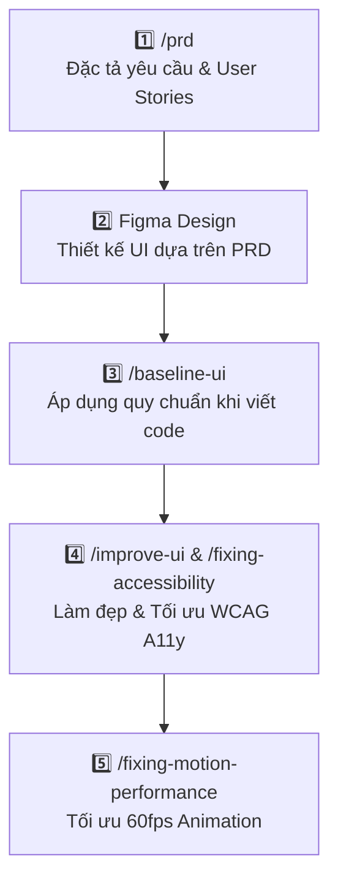

# 🧠 HƯỚNG DẪN SỬ DỤNG HỆ THỐNG SKILLS TRONG ANTIGRAVITY
## DỰ ÁN: NUTRIAI – AI CALORIE & MEAL TRACKER

> **Vị trí lưu trữ Skills:** [`.agents/skills/`](file:///d:/AI-Calorie-Meal-Tracker/.agents/skills/)  
> **Cập nhật lần cuối:** 2026-09-19  
> **Tác giả:** NutriAI Development Team

---

## 📌 1. Tổng quan về Antigravity Skills

**Skills** là các gói hướng dẫn nghiệp vụ chuyên biệt (kèm quy trình, checklist, quy chuẩn code và kịch bản thực thi) giúp trợ lý AI Antigravity trở thành một chuyên gia thực thụ trong từng lĩnh vực cụ thể (từ phân tích yêu cầu PRD, thiết kế Design System, cho đến tối ưu UI/UX, A11y và Performance).

### ⚡ Nguyên tắc hoạt động (Progressive Disclosure)
- Skills **không tốn token** vào context window khi chưa được kích hoạt.
- Khi bạn gọi một skill (qua lệnh `/skill-name` hoặc nhắc đến trong prompt), Antigravity sẽ nạp toàn bộ tri thức chuyên sâu của skill đó để phục vụ bạn với độ chính xác cao nhất.

---

## 📚 2. Bảng Danh Mục Skills Đang Khả Dụng

| Tên Skill | Lệnh kích hoạt | Mục đích & Tình huống sử dụng |
| :--- | :--- | :--- |
| **`prd`** | `/prd` | Lập tài liệu đặc tả yêu cầu sản phẩm (PRD), phỏng vấn làm rõ tính năng và tạo checklist User Stories. |
| **`baseline-ui`** | `/baseline-ui` | Áp dụng các quy chuẩn thiết kế giao diện khắt khe (chống "AI Slop"): spacing, typography, colors, animations. |
| **`improve-ui`** | `/improve-ui` | Audit và lập kế hoạch nâng cấp, làm đẹp và tối ưu trải nghiệm người dùng của một màn hình hoặc component. |
| **`fixing-accessibility`** | `/fixing-accessibility` | Kiểm tra và khắc phục lỗi tiếp cận (A11y), chuẩn WCAG 2.1 AA, phím Tab, ARIA labels, tỷ lệ tương phản. |
| **`fixing-motion-performance`**| `/fixing-motion-performance` | Tối ưu hiệu năng chuyển động CSS/JS, loại bỏ giật lag (compositor properties, `will-change`, `prefers-reduced-motion`). |
| **`fixing-metadata`** | `/fixing-metadata` | Tối ưu thẻ SEO, Open Graph (OG Images), Twitter Cards, JSON-LD Structured Data và Favicons. |
| **`create-design-md`** | `/create-design-md` | Tự động quét mã nguồn hoặc Figma specs để tạo tệp tài liệu `DESIGN.md` chuẩn cho dự án. |
| **`ui-skills-root`** | `/ui-skills-root` | Điều phối tổng quan kiến trúc thiết kế kỹ thuật (Design Engineering). |
| **`agy-customizations`** | `/agy-customizations` | Hướng dẫn mở rộng và cấu hình thêm Skills, Rules, Plugins, MCP Servers cho Antigravity. |
| **`antigravity-guide`** | `/antigravity-guide` | Cẩm nang tra cứu toàn diện về Antigravity CLI, IDE, Slash commands và Keybindings. |

---

## 🛠️ 3. Hướng dẫn Chi tiết & Ví dụ Từng Skill

---

### 🟢 1. Skill `prd` (Product Requirements Document Generator)
- **Đường dẫn file:** [`.agents/skills/prd/SKILL.md`](file:///d:/AI-Calorie-Meal-Tracker/.agents/skills/prd/SKILL.md)
- **Khi nào nên dùng:** Khi bắt đầu một tính năng mới, bắt đầu một sprint, hoặc cần đặc tả rõ ràng trước khi viết code hay vẽ Figma.
- **Quy trình hoạt động:**
  1. AI tiếp nhận mô tả sơ bộ từ bạn.
  2. AI đặt ra 3–5 câu hỏi làm rõ cốt lõi (kèm lựa chọn trắc nghiệm A, B, C, D để bạn chọn nhanh).
  3. AI tổng hợp và xuất ra file PRD hoàn chỉnh với User Stories, Functional Requirements (FR-x), Acceptance Criteria tại `tasks/prd-[tên-tính-năng].md`.

#### 💡 Câu lệnh mẫu (Prompt Examples):
```bash
/prd tạo prd cho tính năng quét mã vạch Barcode thực phẩm
```
```bash
/prd viết đặc tả yêu cầu cho màn hình Báo cáo & Xu hướng dinh dưỡng Web
```

---

### 🟢 2. Skill `baseline-ui` (Quy chuẩn Thiết kế Chống "AI Slop")
- **Đường dẫn file:** [`.agents/skills/baseline-ui/SKILL.md`](file:///d:/AI-Calorie-Meal-Tracker/.agents/skills/baseline-ui/SKILL.md)
- **Khi nào nên dùng:** Trước khi bắt đầu viết code frontend hoặc khi muốn AI rà soát lại giao diện để đảm bảo không bị lỗi spacing, gradient lòe loẹt, thiếu focus states.
- **Các quy tắc cốt lõi được thực thi:**
  - ❌ Không dùng gradient tím/đa sắc lòe loẹt, không lạm dụng hiệu ứng glow.
  - ❌ Không dùng `h-screen`, bắt buộc dùng `h-dvh` để chuẩn trên mobile web.
  - ✅ Bắt buộc dùng `aria-label` cho mọi nút chỉ có icon.
  - ✅ Bắt buộc dùng font `tabular-nums` cho các số liệu calo, gram để tránh giật số.
  - ✅ Giới hạn màu nhấn (accent color) tối đa 1 màu chủ đạo trên mỗi view.

#### 💡 Câu lệnh mẫu (Prompt Examples):
```bash
/baseline-ui áp dụng quy chuẩn này khi code trang Dashboard Overview
```
```bash
/baseline-ui web-dashboard/src/components/MealCard.tsx
# -> AI sẽ quét file, chỉ ra từng dòng vi phạm và đưa code sửa trực tiếp
```

---

### 🟢 3. Skill `improve-ui` (Nâng cấp & Làm đẹp Giao diện Hiện có)
- **Đường dẫn file:** [`.agents/skills/improve-ui/SKILL.md`](file:///d:/AI-Calorie-Meal-Tracker/.agents/skills/improve-ui/SKILL.md)
- **Khi nào nên dùng:** Khi bạn đã có sẵn 1 màn hình hoặc component nhưng nhìn còn đơn điệu, thiếu micro-interactions hoặc bố cục chưa chuyên nghiệp.
- **Quy trình hoạt động:** AI thực hiện chế độ chỉ đọc (Read-only audit), so sánh với Design System và xuất ra kế hoạch hành động cụ thể (`implementation plan`) để nâng cấp giao diện mà không làm hỏng logic cũ.

#### 💡 Câu lệnh mẫu (Prompt Examples):
```bash
/improve-ui kiểm tra và đề xuất cải thiện UI cho Modal phân tích ảnh AI
```
```bash
/improve-ui web-dashboard/src/pages/AnalyticsPage.tsx
```

---

### 🟢 4. Skill `fixing-accessibility` (Tối ưu Khả năng Tiếp cận A11y & WCAG)
- **Đường dẫn file:** [`.agents/skills/fixing-accessibility/SKILL.md`](file:///d:/AI-Calorie-Meal-Tracker/.agents/skills/fixing-accessibility/SKILL.md)
- **Khi nào nên dùng:** Khi xây dựng Form nhập liệu, Dialog/Modal, Menu điều hướng hoặc chuẩn bị bàn giao sản phẩm đạt tiêu chuẩn quốc tế.
- **Các hạng mục kiểm tra:**
  - Tỷ lệ tương phản màu chữ với nền (đạt chuẩn WCAG AA >= 4.5:1).
  - Khả năng điều hướng hoàn toàn bằng bàn phím (`Tab`, `Shift+Tab`, `Escape`, `Enter`).
  - Quản lý tiêu điểm (Focus Trap) trong Modal dialogs.
  - Thuộc tính `aria-expanded`, `aria-controls`, `role="dialog"`.

#### 💡 Câu lệnh mẫu (Prompt Examples):
```bash
/fixing-accessibility kiểm tra độ tương phản và phím điều hướng cho trang Đăng ký
```

---

### 🟢 5. Skill `fixing-motion-performance` (Tối ưu Hiệu năng Animation)
- **Đường dẫn file:** [`.agents/skills/fixing-motion-performance/SKILL.md`](file:///d:/AI-Calorie-Meal-Tracker/.agents/skills/fixing-motion-performance/SKILL.md)
- **Khi nào nên dùng:** Khi hiệu ứng mở modal, thanh progress calo hoặc dropdown bị giật (jank/stutter) trên các thiết bị cấu hình yếu.
- **Các quy tắc cốt lõi:**
  - Chỉ animate các thuộc tính GPU Compositor (`transform`, `opacity`).
  - Tuyệt đối không animate `width`, `height`, `top`, `margin`, `padding` trong quá trình render.
  - Tự động tôn trọng cấu hình `prefers-reduced-motion` của người dùng.

#### 💡 Câu lệnh mẫu (Prompt Examples):
```bash
/fixing-motion-performance tối ưu animation của biểu đồ tròn Donut calo
```

---

### 🟢 6. Skill `fixing-metadata` (Tối ưu SEO, Favicon & Social Share)
- **Đường dẫn file:** [`.agents/skills/fixing-metadata/SKILL.md`](file:///d:/AI-Calorie-Meal-Tracker/.agents/skills/fixing-metadata/SKILL.md)
- **Khi nào nên dùng:** Khi hoàn thiện trang web, chuẩn bị triển khai production để khi chia sẻ link lên Zalo, Facebook, Twitter hiển thị ảnh đại diện và tiêu đề đẹp mắt.

#### 💡 Câu lệnh mẫu (Prompt Examples):
```bash
/fixing-metadata tạo bộ thẻ Open Graph, Twitter Cards và JSON-LD cho NutriAI
```

---

### 🟢 7. Skill `create-design-md` (Tạo Tài liệu DESIGN.md Chuẩn)
- **Đường dẫn file:** [`.agents/skills/create-design-md/SKILL.md`](file:///d:/AI-Calorie-Meal-Tracker/.agents/skills/create-design-md/SKILL.md)
- **Khi nào nên dùng:** Khi muốn tạo một tệp `DESIGN.md` lưu trữ toàn bộ Design Tokens, Color Palette, Typography Hierarchy để toàn bộ team và AI ghi nhớ lâu dài.

#### 💡 Câu lệnh mẫu (Prompt Examples):
```bash
/create-design-md tạo file DESIGN.md tổng hợp từ tài liệu Figma figma-design.md
```

---

## 🔄 4. Quy trình Phối hợp Chuẩn (Recommended Workflow)

Để phát triển một tính năng mới trong **NutriAI** một cách bài bản nhất, bạn hãy kết hợp các skills theo chuỗi 5 bước sau:



1. **Bước 1 (Lập kế hoạch):** Chạy `/prd` để AI hỏi và tạo file đặc tả chi tiết.
2. **Bước 2 (Thiết kế):** Sử dụng PRD để thiết kế UI trên Figma (tham khảo [figma-design.md](file:///d:/AI-Calorie-Meal-Tracker/docs/designs/figma-design.md)).
3. **Bước 3 (Lập trình UI):** Kích hoạt `/baseline-ui` để AI sinh code sạch, không thừa thãi và tuân thủ design tokens.
4. **Bước 4 (Đánh giá & Tinh chỉnh):** Chạy `/improve-ui` và `/fixing-accessibility` để rà soát lỗi tương tác và tương phản màu sắc.
5. **Bước 5 (Tối ưu trải nghiệm):** Dùng `/fixing-motion-performance` để đảm bảo mượt mà 60fps trên mọi thiết bị.

---

## 💡 5. Mẹo & Thủ Thuật Sử Dụng (Tips & Tricks)

1. **Kết hợp linh hoạt với câu hỏi tự nhiên:** Bạn không bắt buộc phải gõ đúng cú pháp `/skill-name`, bạn có thể nói: *"Hãy áp dụng baseline-ui để audit lại file Dashboard.tsx"* - Antigravity sẽ tự động hiểu và kích hoạt skill tương ứng.
2. **Trả lời nhanh các câu hỏi trắc nghiệm của PRD:** Khi chạy `/prd`, AI sẽ đưa ra câu hỏi dạng `1. A/B/C`, bạn chỉ cần gõ nhanh `1A 2B 3C` để tiết kiệm thời gian.
3. **Thêm Skill mới:** Nếu bạn muốn bổ sung thêm skill mới vào dự án, chỉ cần tạo thư mục `.agents/skills/<tên-skill>/SKILL.md` và tuân theo định dạng YAML frontmatter chuẩn.

---
*Tài liệu được quản lý bởi Antigravity Agentic System.*
