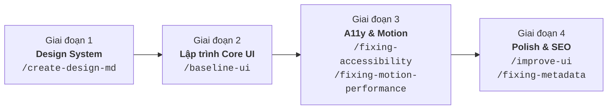

# 👥 HƯỚNG DẪN TRIỂN KHAI THIẾT KẾ & LẬP TRÌNH WEB UI TỪ FIGMA PRD
## DÀNH CHO THÀNH VIÊN NHÓM DỰ ÁN NUTRIAI (TEAM ONBOARDING & EXECUTION GUIDE)

> **Dự án:** NutriAI – AI Calorie & Meal Tracker  
> **Nhánh Git làm việc:** `develop`  
> **Áp dụng cho:** UI/UX Designer, Frontend Developer, QA & Reviewer  
> **Cập nhật lần cuối:** 2026-09-19

---

## 📌 1. Tài Nguyên & Tài Liệu Cốt Lõi (Essential Resources)

Trước khi bắt đầu, mọi thành viên cần nắm rõ vị trí các tài nguyên sau trong repository:

| Tài nguyên | Đường dẫn / Liên kết | Mục đích |
| :--- | :--- | :--- |
| 🎨 **Figma Design Canvas** | [Figma Canvas Link](https://www.figma.com/design/9EWSQ8wvef3FiUdsTeDv7P/AI-Calorie-Meal-Tracker?node-id=0-1) | Bản thiết kế giao diện, Component variants & Prototype |
| 📋 **Đặc tả Thiết kế Figma** | [`docs/designs/figma-design.md`](file:///d:/AI-Calorie-Meal-Tracker/docs/designs/figma-design.md) | Tài liệu mô tả layout, màu sắc, widgets của từng màn hình |
| 📄 **PRD Web Figma UI** | [`tasks/prd-web-figma-ui-design.md`](file:///d:/AI-Calorie-Meal-Tracker/tasks/prd-web-figma-ui-design.md) | Yêu cầu chi tiết, User Stories (US-001 -> US-007), Responsive specs |
| 🧠 **Kho Skills AI** | [`.agents/skills/`](file:///d:/AI-Calorie-Meal-Tracker/.agents/skills/) | 8 bộ kỹ năng tự động hóa kiểm tra UI/UX & Code |
| 📖 **Hướng dẫn Skills** | [`docs/SKILLS_GUIDE.md`](file:///d:/AI-Calorie-Meal-Tracker/docs/SKILLS_GUIDE.md) | Cẩm nang tra cứu cách gọi lệnh và quy tắc từng skill |

---

## 🗺️ 2. Lộ Trình 4 Giai Đoạn Triển Khai Chuẩn (Standard Workflow)



---

## 🚀 3. Hướng Dẫn Chi Tiết Từng Giai Đoạn & Prompt Mẫu Cho Đồng Nghiệp

---

### 🟢 Giai đoạn 1: Thiết lập Hệ thống Design System & Tokens
* **Mục tiêu:** Đồng nhất bảng màu Dual Theme (Light/Dark), kiểu chữ, khoảng cách, bo góc trước khi viết bất kỳ dòng CSS nào.
* **Người thực hiện chính:** UI/UX Designer / Frontend Lead.
* **Skill sử dụng:** `/create-design-md`

#### 📝 Prompt mẫu copy-paste vào Antigravity:
```text
/create-design-md
Dựa vào 2 tài liệu tasks/prd-web-figma-ui-design.md và docs/designs/figma-design.md, 
hãy tạo file DESIGN.md chuẩn hóa toàn bộ Design Tokens (màu Light/Dark HEX, Typography scale, Spacing, Radius, Shadow).
```

---

### 🟢 Giai đoạn 2: Lập trình Khung Giao diện & 6 Màn hình Core
* **Mục tiêu:** Xây dựng project React + Vite + TypeScript, cấu hình CSS Variables và code các màn hình chuẩn theo Figma.
* **Người thực hiện chính:** Frontend Developer.
* **Skill sử dụng:** `/baseline-ui` (chống sinh code bừa bãi, ép tuân thủ tokens, chuẩn `h-dvh`, `tabular-nums` cho số liệu calo).

#### 📋 Thứ tự các màn hình cần dựng:
1. **Layout Shell:** Sidebar responsive (260px desktop -> 80px tablet -> Bottom Nav mobile) + Top App Bar sticky.
2. **Tổng quan (Overview Dashboard):** Donut calo progress, 3 thanh Macro ngang (Carbs `#F59E0B`, Pro `#3B82F6`, Fat `#EC4899`), Dropzone quét ảnh AI, Danh sách bữa ăn hôm nay.
3. **AI Review Modal:** Modal bóc tách thành phần từ ảnh + ô chỉnh gram + checkbox cộng thêm dầu mỡ.
4. **Nhật ký bữa ăn (Meal Diary):** Datepicker tuần/tháng, Source badges (`AI Scan` vs `Thủ công`).
5. **Báo cáo & Xu hướng (Analytics):** Bar chart calo hàng ngày so với đường mục tiêu, Pie chart macro, AI Insights Box, nút xuất CSV/PDF.
6. **Mục tiêu & Cài đặt (Goals & Settings):** Thẻ chiến lược, Sliders điều chỉnh calo, Theme switcher.
7. **Xác thực (Auth):** Sign In & Sign Up chia 2 cột với Showcase card Forest Green.

#### 📝 Prompt mẫu copy-paste vào Antigravity:
```text
/baseline-ui
Hãy khởi tạo cấu trúc thư mục web-dashboard (React + Vite + TypeScript) 
và thiết lập file index.css chứa toàn bộ CSS Variables theo file DESIGN.md.
```
```text
/baseline-ui
Hãy code Component DailyCalorieDonut và 3 thanh ProgressBar cho Carbs, Protein, Fat theo đúng Figma specs.
```

---

### 🟢 Giai đoạn 3: Kiểm tra Khả năng Tiếp cận (A11y) & Hiệu năng Chuyển động
* **Mục tiêu:** Đảm bảo trang web thân thiện với người dùng dùng bàn phím, đạt chuẩn WCAG AA và chuyển động mượt mà 60fps.
* **Người thực hiện chính:** Frontend Developer / QA Tester.
* **Skills sử dụng:** `/fixing-accessibility` & `/fixing-motion-performance`

#### 📝 Prompt mẫu copy-paste vào Antigravity:
```text
/fixing-accessibility
Kiểm tra toàn bộ các form nhập liệu, Dropzone quét ảnh và AI Review Modal. 
Đảm bảo có đầy đủ aria-label, hỗ trợ phím Tab/Esc và tỷ lệ tương phản màu >= 4.5:1.
```
```text
/fixing-motion-performance
Tối ưu hiệu ứng animation cho Donut Chart tiến trình calo và hiệu ứng mở Modal, 
đảm bảo chỉ dùng compositor props (transform, opacity) và hỗ trợ prefers-reduced-motion.
```

---

### 🟢 Giai đoạn 4: Đánh giá Tinh chỉnh (Polish) & Cấu hình Metadata
* **Mục tiêu:** Hoàn thiện các chi tiết vi mô (micro-interactions, viền bóng, hover states) và SEO tags.
* **Người thực hiện chính:** Frontend Lead / Product Owner.
* **Skills sử dụng:** `/improve-ui` & `/fixing-metadata`

#### 📝 Prompt mẫu copy-paste vào Antigravity:
```text
/improve-ui
Audit lại toàn bộ màn hình Overview Dashboard và đề xuất các điểm cải thiện visual polish.
```
```text
/fixing-metadata
Tạo bộ thẻ Open Graph, Twitter Card, Favicon và JSON-LD Structured Data cho NutriAI Web.
```

---

## 📋 4. Checklist Nghiệm Thu Chất Lượng (Quality Assurance Checklist)

Mỗi màn hình trước khi tạo Pull Request cần đạt đầy đủ các tiêu chí sau:

- [ ] **Dual Theme:** Hiển thị sắc nét, không bị chói hoặc mất độ tương phản trên cả **Light Mode** và **Dark Mode**.
- [ ] **Responsive Breakpoints:**
  - [ ] Desktop (1440 × 900 px): Hiển thị đầy đủ Sidebar và lưới 12 cột.
  - [ ] Tablet (1024 × 768 px & 768 × 1024 px): Sidebar co gọn thành icon hoặc drawer.
  - [ ] Mobile Web (375 × 812 px): Chuyển thành Bottom Navigation Bar, cuộn dọc 1 cột.
- [ ] **Macro Colors Chuẩn:**
  - Carbs: `#F59E0B` (Amber)
  - Protein: `#3B82F6` (Blue)
  - Fat: `#EC4899` (Pink)
- [ ] **Accessibility (A11y):** Các nút icon-only có `aria-label`, phím `Tab` điều hướng đúng thứ tự.
- [ ] **Performance:** Không có console warning/error, animation không giật lag CPU.

---

## 🌿 5. Quy Trình Làm Việc Với Git (Git Workflow)

1. **Luôn bắt đầu từ nhánh `develop`:**
   ```bash
   git checkout develop
   git pull origin develop
   ```
2. **Tạo nhánh tính năng riêng:**
   ```bash
   git checkout -b feature/web-dashboard-overview
   ```
3. **Commit theo chuẩn Conventional Commits:**
   ```bash
   git commit -m "feat(web): implement daily calorie donut and macro progress bars"
   ```
4. **Đẩy lên GitHub và tạo Pull Request vào `develop`:**
   ```bash
   git push origin feature/web-dashboard-overview
   ```

---
*Mọi thắc mắc trong quá trình thực hiện, vui lòng tham khảo file [`docs/SKILLS_GUIDE.md`](file:///d:/AI-Calorie-Meal-Tracker/docs/SKILLS_GUIDE.md) hoặc trao đổi trực tiếp trên kênh dự án.*
