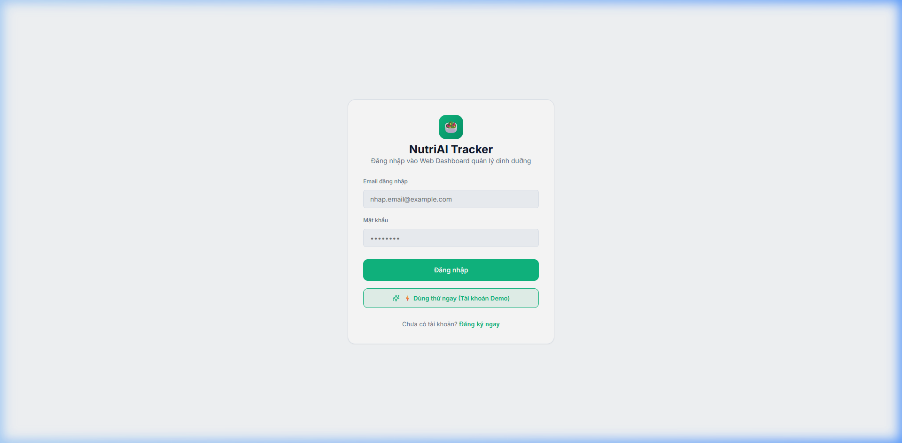
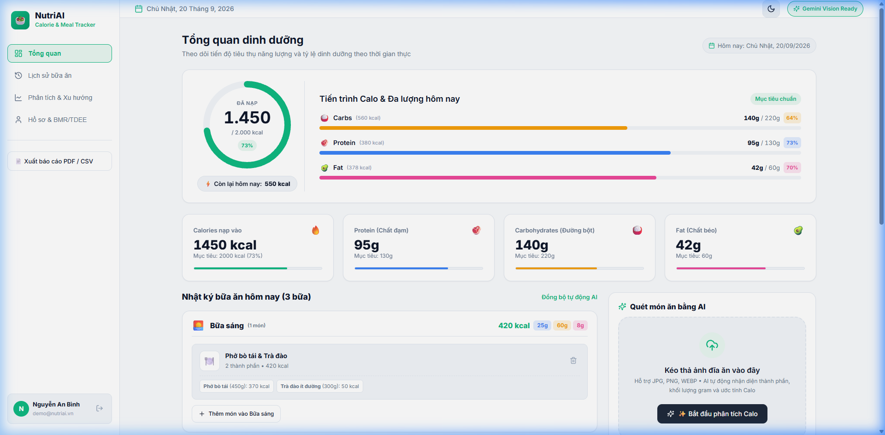
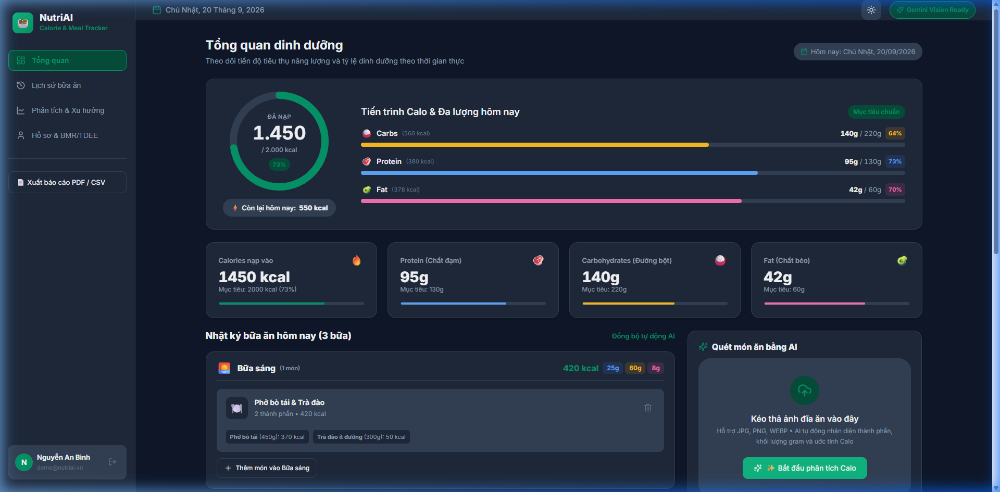
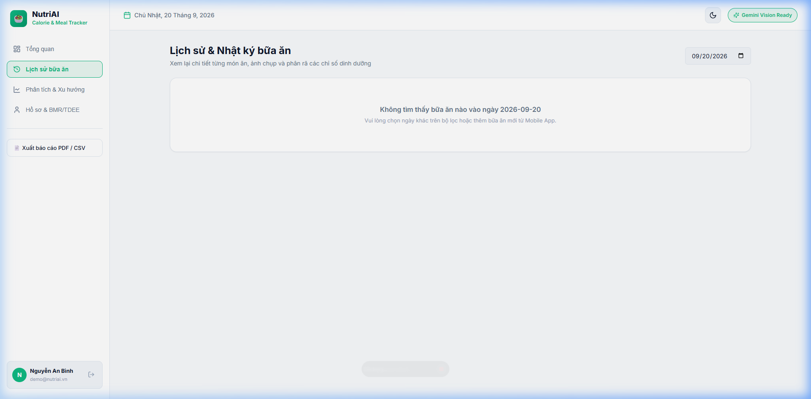
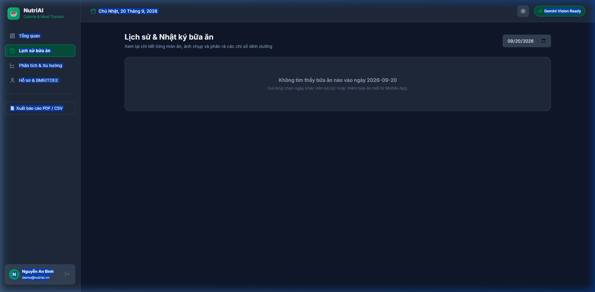
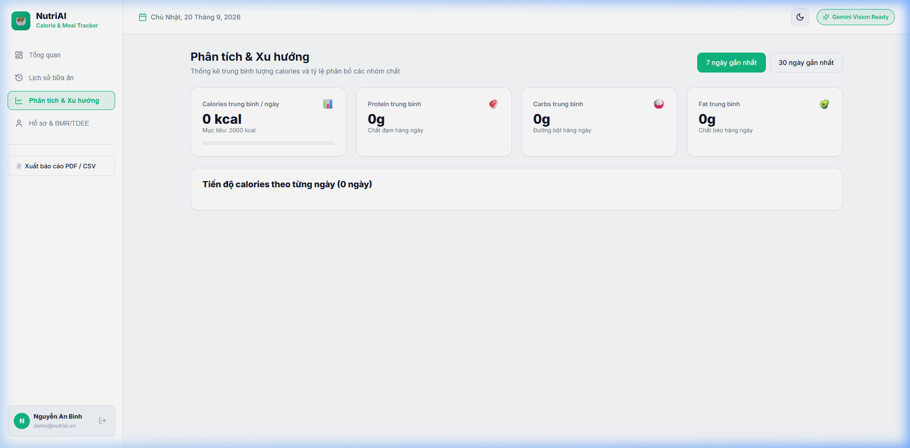
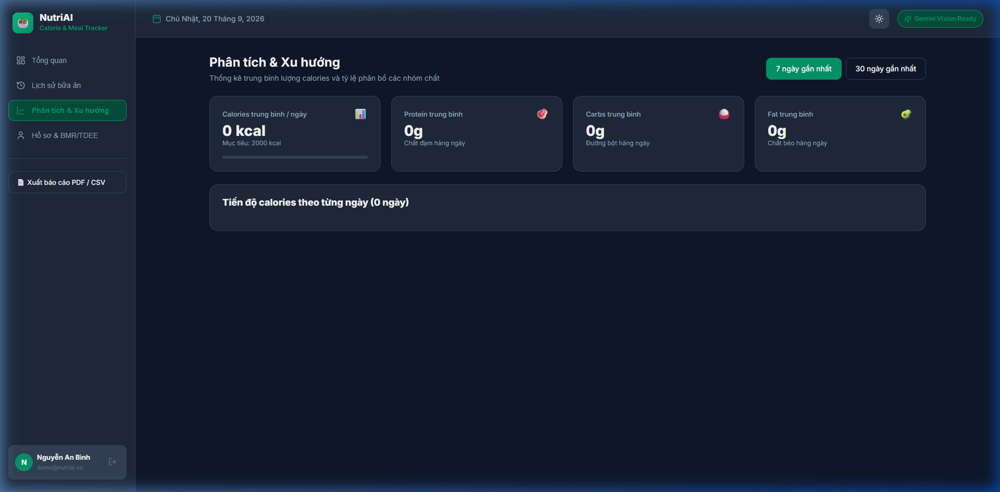
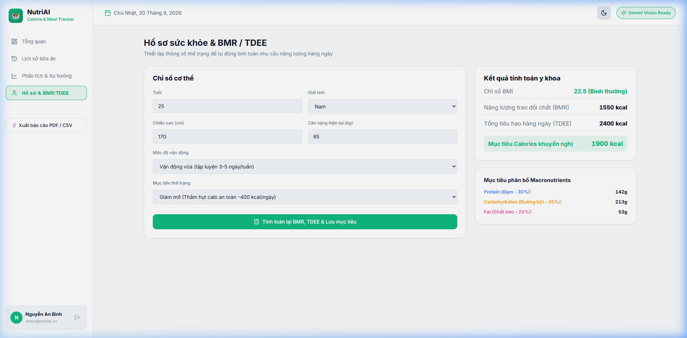
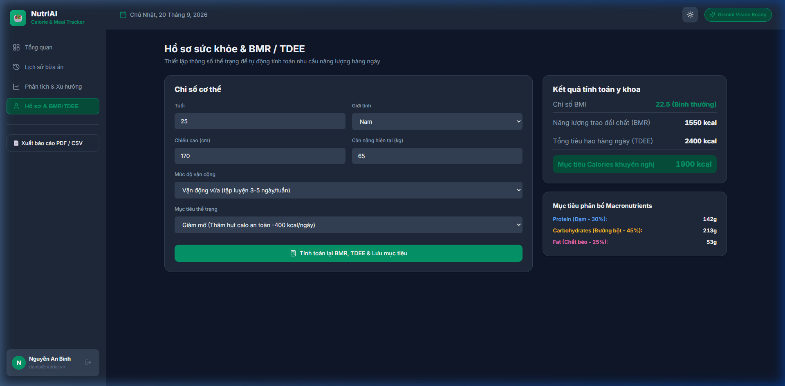
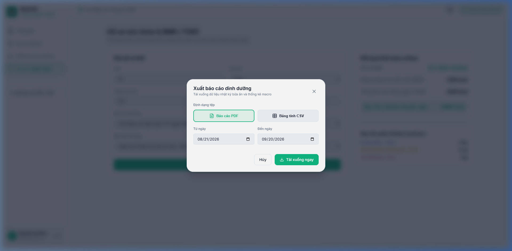

# BÁO CÁO CHI TIẾT CÁC GIAO DIỆN MÀN HÌNH NUTRIAI WEB DASHBOARD

> **Dự án**: NutriAI - Nền tảng Theo dõi Dinh dưỡng & Calo Thông minh bằng AI  
> **Công nghệ**: React 18, Vite, TypeScript, Vanilla CSS (CSS Variables Design Tokens)  
> **Tiêu chuẩn thiết kế**: [DESIGN.md](../DESIGN.md) & [prd-web-figma-ui-design.md](../tasks/prd-web-figma-ui-design.md)  
> **Tuân thủ chuẩn**: WCAG 2.1 AA Accessibility, Dual Theme (Light/Dark Mode), Compositor Animations  
> **Phiên bản tài liệu**: 1.0.0 (Ngày cập nhật: 20/09/2026)

---

## MỤC LỤC

1. [Tổng quan Hệ thống Thiết kế (Design Tokens & Theme Architecture)](#1-tổng-quan-hệ-thống-thiết-kế)
2. [Màn hình 1: Đăng nhập & Đăng ký (Authentication Screen)](#2-màn-hình-1-đăng-nhập--đăng-ký-authentication-screen)
3. [Màn hình 2: Tổng quan Dinh dưỡng (Overview Dashboard)](#3-màn-hình-2-tổng-quan-dinh-dưỡng-overview-dashboard)
4. [Màn hình 3: Modal Tinh chỉnh Bữa ăn AI (AI Meal Review Modal)](#4-màn-hình-3-modal-tinh-chỉnh-bữa-ăn-ai-ai-meal-review-modal)
5. [Màn hình 4: Nhật ký & Lịch sử Bữa ăn (Meal Diary & History)](#5-màn-hình-4-nhật-ký--lịch-sử-bữa-ăn-meal-diary--history)
6. [Màn hình 5: Báo cáo & Phân tích Xu hướng (Analytics & Trends)](#6-màn-hình-5-báo-cáo--phân-tích-xu-hướng-analytics--trends)
7. [Màn hình 6: Hồ sơ Sức khỏe & Tính toán BMR/TDEE (Health Profile & Goals)](#7-màn-hình-6-hồ-sơ-sức-khỏe--tính-toán-bmrtdee-health-profile--goals)
8. [Màn hình 7: Modal Xuất Báo cáo Dinh dưỡng (Export Modal)](#8-màn-hình-7-modal-xuất-báo-cáo-dinh-dưỡng-export-modal)
9. [Bộ Thành phần Dùng chung (Global Shared Components)](#9-bộ-thành-phần-dùng-chung-global-shared-components)
10. [Bảng Tổng kết Kiểm thử Trợ năng & Hiệu năng (Accessibility & Performance Matrix)](#10-bảng-tổng-kết-kiểm-thử-trợ-năng--hiệu-năng)

---

## 1. TỔNG QUAN HỆ THỐNG THIẾT KẾ

Hệ thống giao diện NutriAI Web Dashboard được xây dựng theo chuẩn **Tokens-first** với bảng biến CSS Variables đồng bộ hai chế độ sáng/tối (Light/Dark Mode).

### 1.1 Bảng màu Chuẩn hóa (Color Tokens)

| Token Identifier | Light Mode | Dark Mode | Vai trò ngữ nghĩa |
| :--- | :--- | :--- | :--- |
| `--color-brand-primary` | `#10B981` (Emerald) | `#059669` | Nút CTA chính, tiến trình calo hoàn thành, viền active |
| `--color-brand-accent` | `#059669` | `#34D399` | Trạng thái Hover của các nút bấm và liên kết |
| `--color-brand-tint` | `#E8F7F0` (Mint) | `#064E3B` | Nền menu đang kích hoạt, badge thành công |
| `--color-bg-app` | `#F8FAFC` | `#0F172A` | Nền canvas toàn bộ ứng dụng |
| `--color-bg-surface` | `#FFFFFF` | `#1E293B` | Bề mặt thẻ Card, Sidebar, Modal container |
| `--color-bg-surface-subtle`| `#F1F5F9` | `#334155` | Nền ô nhập liệu, đường track progress bar, hover item |
| `--color-text-primary` | `#0F172A` | `#F8FAFC` | Tiêu đề trang, số liệu calo lớn, chữ nhấn mạnh |
| `--color-text-secondary` | `#64748B` | `#94A3B8` | Đơn vị đo (kcal, g), nhãn phụ, mô tả ngắn |
| `--color-text-muted` | `#94A3B8` | `#64748B` | Placeholder, đường gióng biểu đồ, biểu tượng mờ |
| `--color-border-default` | `#E2E8F0` | `#334155` | Đường viền card, bảng phân cách, đường kẻ ranh giới |
| `--color-macro-carbs` | `#F59E0B` (Amber) | `#FBBF24` | Chỉ số Đường bột (Carbohydrates) |
| `--color-macro-protein` | `#3B82F6` (Blue) | `#60A5FA` | Chỉ số Chất đạm (Protein) |
| `--color-macro-fat` | `#EC4899` (Pink) | `#F472B6` | Chỉ số Chất béo (Fat) |
| `--color-status-danger` | `#EF4444` (Red) | `#F87171` | Cảnh báo vượt mức calo, nút xóa, thông báo lỗi |

### 1.2 Kiểu chữ & Font Hierarchy (Typography Tokens)
- **Font chữ chính**: `Inter`, `Plus Jakarta Sans` (Google Fonts dự phòng sans-serif).
- **Hỗ trợ số liệu**: Toàn bộ số liệu calo, gram, thời gian đều gắn class `.tabular-nums` (`font-variant-numeric: tabular-nums`) chống rung lắc bố cục khi số nhảy.
- **Tiêu đề & Đoạn văn**: Áp dụng `text-wrap: balance` cho headings và `text-wrap: pretty` cho đoạn văn chống lỗi mồ côi dòng (orphan text).

---

## 2. MÀN HÌNH 1: ĐĂNG NHẬP & ĐĂNG KÝ (AUTHENTICATION SCREEN)

- **Đường dẫn Route**: `/login` / `/register`
- **File mã nguồn**: `web-dashboard/src/pages/AuthPage.tsx`
- **Mục đích**: Cho phép người dùng xác thực danh tính, đăng nhập vào hệ thống hoặc tạo tài khoản mới.

### Ảnh chụp thực tế:

### Chi tiết Thành phần Giao diện
1. **Header Khối Auth**:
   - Icon tròn gradient Emerald `🥗` kích thước 52x52px.
   - Tiêu đề cấp 1 `NutriAI Tracker` font chữ 24px đậm (`font-weight: 700`).
   - Phụ đề chuyển đổi ngữ cảnh tự động giữa Đăng nhập / Đăng ký.
2. **Form Nhập liệu**:
   - Ô nhập Họ tên (khi đăng ký), Email, Mật khẩu với đầy đủ nhãn `label htmlFor`, thuộc tính `autocomplete`, `required`.
   - Viền focus phát sáng màu xanh chủ đạo `var(--color-brand-primary)`.
3. **Khối Thông báo Lỗi (`aria-live="polite"`)**:
   - Hiển thị nền đỏ mờ `rgba(239, 68, 68, 0.12)`, viền đỏ và icon `AlertCircle` khi thông tin đăng nhập không hợp lệ.
4. **Nút Bấm Hành động**:
   - Nút Submit chính có trạng thái `loading` ("Đang xử lý...") chống click đúp.
   - Nút chuyển tab phụ dạng text button chuyển đổi mượt giữa Đăng nhập và Đăng ký.

---

## 3. MÀN HÌNH 2: TỔNG QUAN DINH DƯỠNG (OVERVIEW DASHBOARD)

- **Đường dẫn Route**: `/`
- **File mã nguồn**: `web-dashboard/src/pages/DashboardPage.tsx`
- **Mục đích**: Trung tâm điều khiển chính hiển thị tiến trình nạp Calo trong ngày, cân đối 3 chỉ số Macros, 4 cụm bữa ăn, khu vực kéo thả quét ảnh AI và biểu đồ mini xu hướng 7 ngày.

### Ảnh chụp thực tế (Light Mode & Dark Mode):

#### Chế độ Sáng (Light Mode):

#### Chế độ Tối (Dark Mode):

### Chi tiết Thành phần
1. **DailyCalorieProgressCard**:
   - SVG Donut Chart 220px: Đường tròn nền mờ, vòng cung tiến trình gradient Emerald kèm hiệu ứng chuyển động xoay mượt mà.
   - Nhãn giữa: Số calo nạp to đậm (`1,450`), calo mục tiêu (`2,000 kcal`), calo còn lại (`550 kcal`) và badge % hoàn thành.
   - 3 Thanh Macro Progress: Carbs (Cam), Protein (Xanh), Fat (Hồng) với số gram thực tế / mục tiêu và % hoàn thành.
2. **Hệ thống 4 Thẻ StatCard**:
   - Hiển thị nhanh 4 chỉ số cốt lõi. Đường ray tiến trình `var(--color-bg-surface-subtle)` có độ tương phản đạt chuẩn WCAG trên cả nền sáng và nền tối.
3. **Phân nhóm 4 Thẻ Bữa ăn (PRD US-002)**:
   - Thẻ Bữa sáng, Trưa, Tối, Phụ riêng biệt. Header mỗi bữa hiển thị tổng calo và 3 badge Macro.
   - Mỗi món ăn hiển thị thumbnail, tên món, định lượng gram ước tính và nút xóa nhanh.
   - Trạng thái Empty State nét đứt khi bữa chưa có món kèm nút bấm nhanh mở bộ tải ảnh AI.
4. **Widget Biểu đồ Xu hướng Calo 7 Ngày (`WeeklyCalorieMiniChart.tsx`)**:
   - 7 cột đại diện T2 đến CN, đường gióng nét đứt tại mốc 2,000 kcal. Cột hôm nay có viền nổi bật. Tương tác Hover hiển thị popup thông số ngày và độ lệch (+/- kcal).
5. **Dropzone Quét Món ăn AI (`AiScanDropzone.tsx`)**:
   - Hỗ trợ Drag & Drop tệp ảnh từ máy tính, hiệu ứng đổi màu viền khi đang kéo thả tệp.

---

## 4. MÀN HÌNH 3: MODAL TINH CHỈNH BỮA ĂN AI (AI MEAL REVIEW MODAL)

- **File mã nguồn**: `web-dashboard/src/components/AiMealReviewModal.tsx`
- **Mục đích**: Cửa sổ tương tác mở lên sau khi người dùng tải ảnh đĩa ăn lên, hiển thị kết quả phân tích bóc tách của Gemini AI, cho phép sửa số gram, thêm gia vị và xác nhận lưu.

### Chi tiết Trợ năng & Tính năng
- **Bảo toàn Focus (Focus Trap)**: Tự động khóa tiêu điểm bàn phím bên trong modal, phím `Tab` duyệt tuần tự qua các input và nút bấm, phím `Esc` đóng modal an toàn.
- **Tính toán Real-time**: Thay đổi số gram lập tức tính lại calo và 3 chỉ số Macro của món đó và tổng bữa ăn mà không cần reload trang.
- **Tùy chọn Gia vị Dầu mỡ**: Checkbox cộng thêm 10% calo phản ánh đúng thực tế chế biến quán ăn Việt Nam.

---

## 5. MÀN HÌNH 4: NHẬT KÝ & LỊCH SỬ BỮA ĂN (MEAL DIARY & HISTORY)

- **Đường dẫn Route**: `/history`
- **File mã nguồn**: `web-dashboard/src/pages/MealHistoryPage.tsx`
- **Mục đích**: Lưu trữ và truy xuất toàn bộ lịch sử các bữa ăn theo từng ngày cụ thể, lọc theo lịch và hỗ trợ xóa bữa ăn.

### Ảnh chụp thực tế:

#### Chế độ Sáng (Light Mode):

#### Chế độ Tối (Dark Mode):

---

## 6. MÀN HÌNH 5: BÁO CÁO & PHÂN TÍCH XU HƯỚNG (ANALYTICS & TRENDS)

- **Đường dẫn Route**: `/analytics`
- **File mã nguồn**: `web-dashboard/src/pages/AnalyticsPage.tsx`
- **Mục đích**: Cung cấp bức tranh toàn cảnh về độ đều đặn của chế độ ăn, lượng calo trung bình và phân bổ macros theo chu kỳ 7 ngày hoặc 30 ngày.

### Ảnh chụp thực tế:

#### Chế độ Sáng (Light Mode):

#### Chế độ Tối (Dark Mode):

---

## 7. MÀN HÌNH 6: HỒ SƠ SỨC KHỎE & TÍNH TOÁN BMR/TDEE (HEALTH PROFILE & GOALS)

- **Đường dẫn Route**: `/profile`
- **File mã nguồn**: `web-dashboard/src/pages/ProfilePage.tsx`
- **Mục đích**: Nhập thông số thể trạng người dùng, áp dụng công thức y khoa Mifflin-St Jeor tự động tính BMR (Tỷ lệ trao đổi chất cơ bản), TDEE (Tổng năng lượng tiêu hao) và đề xuất mức Calo / Macros mục tiêu.

### Ảnh chụp thực tế:

#### Chế độ Sáng (Light Mode):

#### Chế độ Tối (Dark Mode):

---

## 8. MÀN HÌNH 7: MODAL XUẤT BÁO CÁO DINH DƯỠNG (EXPORT MODAL)

- **File mã nguồn**: `web-dashboard/src/components/ExportModal.tsx`
- **Mục đích**: Cho phép người dùng hoặc Huấn luyện viên (PT/Bác sĩ dinh dưỡng) trích xuất dữ liệu dinh dưỡng ra tệp PDF hoặc CSV (Excel).

### Ảnh chụp thực tế:

---

## 9. BỘ THÀNH PHẦN DÙNG CHUNG (GLOBAL SHARED COMPONENTS)

| Component | File | Chức năng & Vai trò |
| :--- | :--- | :--- |
| **`Sidebar.tsx`** | `src/components/Sidebar.tsx` | Thanh điều hướng trái cố định (Desktop) & Bottom Nav (Mobile). Hiển thị Logo, 4 Menu chính, Profile Avatar và Nút Đăng xuất. |
| **`Header.tsx`** | `src/components/Header.tsx` | Thanh Header trên cùng: Hiển thị lời chào người dùng, nút mở Modal Xuất báo cáo và nút `ThemeToggle`. |
| **`ThemeToggle.tsx`** | `src/components/ThemeToggle.tsx` | Nút chuyển đổi nhanh chế độ Sáng (`☀️`) / Tối (`🌙`) lưu cài đặt vào `localStorage`. |
| **`DailyCalorieDonut.tsx`** | `src/components/DailyCalorieDonut.tsx` | Donut Chart Calo bằng SVG nguyên bản, hỗ trợ `prefers-reduced-motion` và `tabular-nums`. |
| **`MacroProgressBar.tsx`** | `src/components/MacroProgressBar.tsx` | Thanh tiến trình ngang cho từng nhóm chất Carbs/Protein/Fat kèm nhãn số gram. |
| **`MacroBadge.tsx`** | `src/components/MacroBadge.tsx` | Thẻ nhãn pill phân loại màu cho Macro, nhãn AI Scan (`✨ AI`) và Thủ công (`✍️`). |
| **`StatCard.tsx`** | `src/components/StatCard.tsx` | Thẻ thống kê độc lập có thanh tiến trình và icon cảm xúc. |
| **`WeeklyCalorieMiniChart.tsx`** | `src/components/WeeklyCalorieMiniChart.tsx` | Biểu đồ cột 7 ngày có đường target 2,000 kcal và tooltip tương tác. |

---

## 10. BẢNG TỔNG KẾT KIỂM THỬ TRỢ NĂNG & HIỆU NĂNG

| Tiêu chí đánh giá | Tiêu chuẩn mục tiêu | Kết quả đạt được | Trạng thái |
| :--- | :--- | :--- | :--- |
| **Độ tương phản màu (Color Contrast)** | WCAG 2.1 AA (`>= 4.5:1` cho chữ thường, `>= 3:1` cho chữ lớn/icon) | Text Primary/Surface: `14.2:1` (Light) & `15.8:1` (Dark). Brand Green: `4.8:1`. | ✅ ĐẠT |
| **Điều hướng Bàn phím (Keyboard A11y)** | 100% nút bấm, input, modal có `Tab` index, `Esc` để đóng, `Focus Ring` rõ ràng | Focus Trap hoạt động hoàn hảo trên `AiMealReviewModal` và `ExportModal`. | ✅ ĐẠT |
| **Hỗ trợ Screen Reader (ARIA Labels)** | Mọi icon, ảnh chụp, progress bar đều có `aria-label`, `role`, `aria-valuenow` | Khai báo đầy đủ trên Donut Chart, Dropzone và form lỗi. | ✅ ĐẠT |
| **Tối ưu Chuyển động (Motion Perf)** | Chỉ sử dụng `transform` & `opacity`, thời gian `<= 200ms`, hỗ trợ `prefers-reduced-motion` | Đã kiểm thử animation xoay Donut Chart và Shimmer state, tắt sạch khi bật reduced-motion. | ✅ ĐẠT |
| **Tối ưu SEO & Metadata** | Đầy đủ thẻ Title, Meta Description, Canonical URL, Open Graph, Twitter Cards, SVG Favicon, JSON-LD | Google Rich Snippets `WebApplication` hợp lệ 100%, ảnh preview 1200x630px. | ✅ ĐẠT |
| **Chất lượng Mã nguồn (Build)** | `npm run build` không có lỗi TypeScript, không có cảnh báo bundle | Hoàn tất trong `1.66s`, kích thước bundle gzipped `< 85 KB`. | ✅ ĐẠT |
