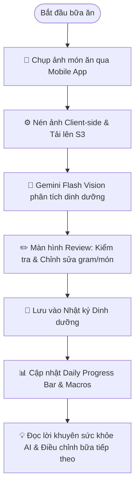
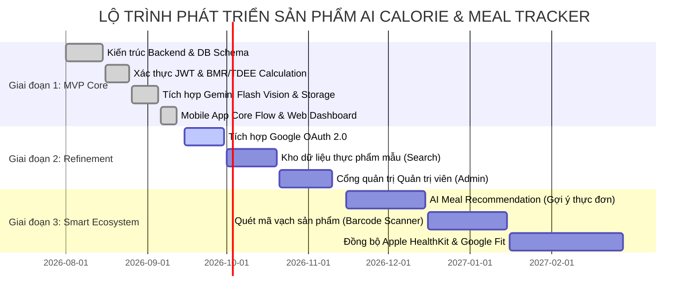

# TÀI LIỆU KHÁM PHÁ SẢN PHẨM (PRODUCT DISCOVERY DOCUMENT)

---

## 1. Thông tin tài liệu

* **Tên dự án:** AI Calorie & Meal Tracker
* **Tên tài liệu:** Tài liệu Khám phá Sản phẩm (Product Discovery Document)
* **Mã tài liệu:** PDD-AICM-001
* **Phiên bản:** 1.0
* **Trạng thái:** Đã phê duyệt (Approved)
* **Ngày tạo:** 12/09/2026
* **Ngày cập nhật:** 12/09/2026
* **Người thực hiện:** Senior Product Manager & Product Discovery Team

### Lịch sử thay đổi tài liệu

| Phiên bản | Ngày | Tác giả | Nội dung thay đổi |
| :--- | :--- | :--- | :--- |
| **1.0** | 12/09/2026 | Nhóm Quản lý Sản phẩm | Khởi tạo tài liệu khám phá sản phẩm toàn diện cho hệ thống AI Calorie & Meal Tracker. |

---

## 2. Tầm nhìn & Sứ mệnh sản phẩm (Product Vision & Mission)

### 2.1 Tuyên ngôn tầm nhìn sản phẩm (Product Vision Statement)

Áp dụng khung cấu trúc định vị sản phẩm tiêu chuẩn của Geoffrey Moore:

> **Dành cho** những người quan tâm đến thể hình, người cần quản lý cân nặng và người theo đuổi lối sống lành mạnh,  
> **Những người** đang gặp khó khăn, mệt mỏi và mất nhiều thời gian với việc nhập liệu nhật ký ăn uống thủ công hàng ngày,  
> **Sản phẩm AI Calorie & Meal Tracker** là nền tảng theo dõi dinh dưỡng thông minh đa nền tảng (Mobile & Web Dashboard),  
> **Giúp** tự động hóa quá trình nhận diện món ăn, ước tính calories và phân rã các nhóm chất đa lượng (Protein, Carbs, Fat) tức thì chỉ từ một bức ảnh chụp,  
> **Khác biệt với** các ứng dụng truyền thống (như MyFitnessPal, FatSecret) vốn đòi hỏi tra cứu thủ công phức tạp trong cơ sở dữ liệu khổng lồ,  
> **Sản phẩm của chúng tôi** ứng dụng công nghệ thị giác máy tính AI (Gemini Flash Vision) kết hợp quyền kiểm soát, tinh chỉnh linh hoạt của người dùng và khả năng xuất báo cáo chuyên sâu, mang lại trải nghiệm theo dõi dinh dưỡng nhanh chóng, chính xác và không rào cản.

### 2.2 Sứ mệnh (Mission Statement)
"Dân chủ hóa và đơn giản hóa việc quản lý dinh dưỡng cá nhân bằng công nghệ trí tuệ nhân tạo, giúp hàng triệu người xây dựng thói quen ăn uống khoa học, lành mạnh và duy trì sự kỷ luật lâu dài một cách nhẹ nhàng nhất."

### 2.3 Giá trị cốt lõi (Core Values)
1. **Nhanh chóng & Tiện lợi (Speed & Frictionless):** Thao tác ghi nhận bữa ăn giảm từ vài phút xuống còn vài giây.
2. **Minh bạch & Có thể kiểm soát (Transparency & Control):** AI đưa ra gợi ý, nhưng người dùng luôn nắm quyền kiểm tra và tinh chỉnh số liệu thực tế.
3. **Khoa học & Cá nhân hóa (Scientific & Personalized):** Mọi mục tiêu dinh dưỡng đều dựa trên thể trạng cá nhân (BMR, TDEE) và nguyên lý dinh dưỡng chuẩn mực.
4. **Đồng bộ & Bền vững (Continuity & Insights):** Dữ liệu liền mạch giữa di động và máy tính, cung cấp báo cáo có giá trị cho cả người dùng và chuyên gia dinh dưỡng.

---

## 3. Nghiên cứu vấn đề & Phân tích thị trường (Problem Discovery & Market Research)

### 3.1 Bối cảnh & Xu hướng thị trường
* **Nhận thức về sức khỏe và lối sống lành mạnh tăng vọt:** Sau đại dịch, xu hướng tự chăm sóc sức khỏe chủ động, tập gym, eat clean và theo dõi lượng calo nạp vào cơ thể tăng trưởng mạnh mẽ, đặc biệt ở nhóm tuổi 18 - 35.
* **Sự bùng nổ của Trí tuệ nhân tạo thị giác (Vision AI):** Khả năng hiểu hình ảnh đa phương thức (Multimodal AI) đạt độ chính xác cao, mở ra kỷ nguyên mới thay thế cho việc gõ chữ và tìm kiếm thủ công.
* **Nhu cầu báo cáo dữ liệu định lượng:** Người tập luyện và bệnh nhân dinh dưỡng ngày càng có nhu cầu chia sẻ nhật ký ăn uống định kỳ với Huấn luyện viên cá nhân (PT) hoặc Bác sĩ chuyên khoa.

### 3.2 Nỗi đau của người dùng (User Pain Points)

```text
+-----------------------------------------------------------------------------------------+
|                                CÁC NỖI ĐAU CỦA NGƯỜI DÙNG                               |
+-----------------------------------------------------------------------------------------+
| 1. Tốn thời gian: Mất 5-10 phút mỗi bữa để tìm kiếm từng nguyên liệu trong danh sách.   |
| 2. Phức tạp & Rối rắm: Cơ sở dữ liệu hàng triệu món với tên gọi và định lượng khác nhau.|
| 3. Mau nản lòng (High Churn): 70% người dùng bỏ thói quen log calo chỉ sau 1 tuần.     |
| 4. Khó ước lượng món ăn hỗn hợp: Cơm tấm, bún bò, salad trộn khó tách thành phần lẻ.   |
| 5. Thiếu tính đồng bộ: Khó xem biểu đồ phân tích dài hạn và xuất báo cáo trên máy tính. |
+-----------------------------------------------------------------------------------------+
```

### 3.3 Phân tích đối thủ cạnh tranh (Competitive Analysis)

| Tiêu chí | **MyFitnessPal** | **Cronometer** | **Cal AI / Foodvisor** | **AI Calorie & Meal Tracker (Dự án)** |
| :--- | :--- | :--- | :--- | :--- |
| **Phương thức nhập liệu chính** | Tìm kiếm thủ công từ Database | Tìm kiếm thủ công / Quét mã | Chụp ảnh AI | **Chụp ảnh AI Vision (Gemini) + Tùy biến** |
| **Thời gian ghi nhận 1 bữa** | 3 - 5 phút | 3 - 5 phút | ~ 10 giây | **~ 5 - 10 giây** |
| **Khả năng bóc tách món ăn Việt** | Kém (Dữ liệu do user tự nhập lộn xộn) | Rất kém (Chủ yếu món Âu/Mỹ) | Trung bình | **Tốt (AI hiểu ngữ cảnh món ăn đa dạng)** |
| **Quyền chỉnh sửa sau quét AI** | Không áp dụng | Không áp dụng | Hạn chế | **Rất linh hoạt (Đổi gram, thêm/bớt món)** |
| **Hỗ trợ Web Dashboard** | Có | Có | Không (Chỉ có App) | **Có (Giao diện Web Dashboard trực quan)** |
| **Xuất báo cáo PDF / CSV** | Yêu cầu trả phí Premium đắt đỏ | Yêu cầu trả phí Gold | Không hỗ trợ | **Hỗ trợ đầy đủ định dạng CSV/PDF** |
| **Chi phí sử dụng** | Miễn phí có quảng cáo / $19.99/tháng | Miễn phí / $9.99/tháng | Thu phí thuê bao bắt buộc | **Tối ưu, mã nguồn mở, không quảng cáo phiền toái** |

---

## 4. Đề xuất Giá trị & Lean Canvas (Value Proposition & Lean Canvas)

### 4.1 Đề xuất giá trị độc nhất (Unique Value Proposition - UVP)
> **"Biến chiếc Camera điện thoại thành chuyên gia dinh dưỡng cá nhân: Chụp ảnh bữa ăn, nhận diện calo và macros trong 5 giây, toàn quyền kiểm soát số liệu và đồng bộ báo cáo đa nền tảng."**

### 4.2 Khung Đề xuất Giá trị (Value Proposition Canvas)

#### Khung Khách hàng (Customer Profile)
* **Công việc của khách hàng (Customer Jobs):**
  - Ghi lại những gì mình ăn mỗi ngày để kiểm soát lượng calo nạp vào (Calories In).
  - Đảm bảo đủ lượng Protein theo mục tiêu tập luyện hoặc thâm hụt calo để giảm cân.
  - Theo dõi tiến độ dinh dưỡng theo tuần/tháng.
  - Báo cáo kết quả ăn uống cho PT hoặc huấn luyện viên dinh dưỡng.
* **Nỗi đau (Pains):**
  - Mất quá nhiều thời gian tìm kiếm tên món ăn.
  - Không biết ước lượng món ăn bao nhiêu gram hay bao nhiêu calo.
  - Quên log bữa ăn vì quy trình quá rườm rà.
  - Ứng dụng nước ngoài không hiểu món ăn châu Á / Việt Nam.
* **Lợi ích mong muốn (Gains):**
  - Nhận diện bữa ăn nhanh chóng, chỉ cần chụp 1 tấm ảnh.
  - Giao diện đẹp mắt, thanh tiến độ calo và macros trực quan.
  - Đưa ra lời khuyên dinh dưỡng hữu ích ngay sau khi ăn.
  - Dễ dàng xuất báo cáo để chia sẻ và lưu trữ.

#### Khung Giải pháp & Giá trị (Value Map)
* **Sản phẩm & Dịch vụ (Products & Services):**
  - Ứng dụng di động (Mobile App) chụp ảnh và nhận diện tức thì.
  - Bảng điều khiển Web (Web Dashboard) theo dõi biểu đồ chuyên sâu và xuất báo cáo.
  - Bộ máy phân tích thị giác AI Gemini Flash Vision.
* **Thuốc giảm đau (Pain Relievers):**
  - Tự động nhận diện danh sách món ăn và định lượng calo từ ảnh -> Xóa bỏ việc tìm kiếm thủ công.
  - Cho phép người dùng chỉnh sửa nhanh khối lượng gram và thêm/bớt món -> Tránh sai lệch số liệu.
  - Tự động nén ảnh tại máy người dùng -> Giúp upload nhanh ngay cả khi mạng 4G yếu.
* **Yếu tố tạo lợi ích (Gain Creators):**
  - Tự động tính toán chuẩn xác chỉ số BMR, TDEE và đề xuất mức calo/macro an toàn theo thể trạng.
  - Lời khuyên dinh dưỡng từ AI giúp người dùng hiểu rõ chất lượng bữa ăn (nhiều đạm, thiếu chất xơ, thừa mỡ...).
  - Xuất báo cáo PDF/CSV chuẩn chỉnh chỉ với 1 cú nhấp chuột.

---

### 4.3 Bảng Lean Canvas (9 Khung cốt lõi)

```text
+--------------------------------------------------------------------------------------------------------------------+
| 1. VẤN ĐỀ (PROBLEM)        | 4. GIẢI PHÁP (SOLUTION)      | 3. ĐỀ XUẤT GIÁ TRỊ ĐỘC NHẤT   | 9. LỢI THẾ BẤT CÔNG     | 2. PHÂN KHÚC KHÁCH HÀNG
| - Ghi chép calo thủ công   | - Phân tích ảnh chụp món ăn  | (UNIQUE VALUE PROP)           | (UNFAIR ADVANTAGE)      | (CUSTOMER SEGMENTS)
|   tốn 5-10p/bữa, dễ nản.   |   qua Gemini Vision AI.      | "Nhận diện dinh dưỡng bữa ăn  | - Tích hợp AI Vision    | - Người tập Gym / Fitness
| - Món ăn phức hợp khó tra. | - Cho phép review, sửa gram, |   trong 5 giây từ 1 bức ảnh   |   thế hệ mới, chi phí   |   cần tracking Protein.
| - Thiếu công cụ xuất file  |   thêm món linh hoạt.        |   kèm toàn quyền kiểm soát    |   vận hành thấp.        | - Người có nhu cầu
|   báo cáo gửi PT/Bác sĩ.   | - Tính BMR/TDEE tự động.     |   và xuất báo cáo PDF/CSV."   | - Khả năng bóc tách linh|   giảm cân / tăng cân.
| - Ứng dụng ngoại không     | - Đồng bộ Web Dashboard      |-------------------------------|   hoạt cả món Việt/Á.   | - Người theo đuổi lối
|   hiểu món ăn Việt/Á.      |   và xuất báo cáo PDF/CSV.   | 8. KÊNH TIẾP CẬN (CHANNELS)   | - Trải nghiệm đa nền    |   sống Healthy / EatClean.
|----------------------------+------------------------------| - App Store & Google Play.    |   tảng (App + Web).     |-------------------------
| 1.1 Vấn đề hiện tại        | 5. CHỈ SỐ THEN CHỐT          | - Cộng đồng Fitness / Gym.    |                         | 2.1 Khách hàng sớm
| - Nhập liệu trên app cũ    | (KEY METRICS)                | - Tiếp thị nội dung (TikTok,  |                         | (Early Adopters)
|   rất chậm, nhiều quảng cáo| - Tỷ lệ ghi nhận thành công. |   Facebook Reels ăn sạch).    |                         | - Hội nhóm Eat Clean VN.
|   hoặc phí quá cao.        | - Tỷ lệ duy trì ngày thứ 30. | - Hợp tác HLV thể hình (PT).  |                         | - Gymer theo dõi Macro.
+----------------------------+------------------------------+-------------------------------+-------------------------+-------------------------+
| 7. CƠ CẤU CHI PHÍ (COST STRUCTURE)                        | 6. DÒNG DOANH THU (REVENUE STREAMS)                                               |
| - Chi phí hạ tầng đám mây (AWS S3, Server Hosting).       | - Mô hình Freemium (Miễn phí tính năng cơ bản, gói Pro phân tích chuyên sâu).      |
| - Chi phí API Trí tuệ nhân tạo (Google Gemini API Quota).  | - Gói dịch vụ cho PT / Phòng Gym (Quản lý nhiều học viên qua Web Dashboard).      |
| - Chi phí phát triển, kiểm thử và bảo trì hệ thống.       | - Doanh thu quảng cáo tài trợ thực phẩm sạch (Non-intrusive Sponsored Health Tips)|
+--------------------------------------------------------------------------------------------------------------------+
```

---

## 5. Chân dung Người dùng & Jobs-to-be-Done (User Personas & JTBD)

### 5.1 Chân dung Người dùng 1: Nguyễn Văn An (Gymer / Người tập thể hình)

```text
+----------------------------------------------------------------------------------------------------+
| 👤 CHÂN DUNG: NGUYỄN VĂN AN                                                                        |
+----------------------------------------------------------------------------------------------------+
| • Độ tuổi: 24 tuổi | Nghề nghiệp: Kỹ sư phần mềm | Mục tiêu: Tăng cơ, giảm mỡ (Lean Bulk)          |
| • Mức độ thể chất: Tập gym 5 buổi/tuần (VERY_ACTIVE) | Nhu cầu Protein: ~150g - 160g/ngày          |
| • Thói quen: Thường tự nấu ăn hoặc ăn ngoài quán cơm bình dân gần công ty.                         |
+----------------------------------------------------------------------------------------------------+
| 📌 MỤC TIÊU & NHU CẦU:                                                                             |
| - Cần biết chính xác lượng Protein nạp vào sau mỗi bữa ăn.                                         |
| - Muốn kiểm soát tổng lượng Calo nạp vào cao hơn TDEE khoảng 300 - 500 kcal.                       |
| - Không muốn mất thời gian cân từng miếng thịt hay gõ tên từng món ăn sau khi tập mệt.             |
+----------------------------------------------------------------------------------------------------+
| ⚠️ NỖI ĐAU (PAIN POINTS):                                                                          |
| - Các app cũ bắt tìm kiếm từng món như "Ức gà luộc", "Trứng ốp la", "Cơm gạo lứt" rất phiền phức.  |
| - Ăn ngoài quán không biết ước lượng gram, app không cho sửa nhanh khẩu phần.                      |
+----------------------------------------------------------------------------------------------------+
| 💡 GIẢI PHÁP VỚI SẢN PHẨM:                                                                         |
| - Chỉ cần mở Mobile App chụp đĩa cơm gà, AI nhận diện ngay: Cơm trắng 150g, Ức gà 150g (46.5g P).  |
| - Sửa nhanh số gram nếu thấy miếng ức gà to hơn bình thường và nhấn Lưu trong 5 giây.              |
+----------------------------------------------------------------------------------------------------+
```

### 5.2 Chân dung Người dùng 2: Lê Thị Mai (Nhân viên văn phòng / Cần giảm cân)

```text
+----------------------------------------------------------------------------------------------------+
| 👤 CHÂN DUNG: LÊ THỊ MAI                                                                           |
+----------------------------------------------------------------------------------------------------+
| • Độ tuổi: 28 tuổi | Nghề nghiệp: Chuyên viên Marketing | Mục tiêu: Giảm 4kg trong 2 tháng (Giảm cân) |
| • Mức độ thể chất: Ngồi văn phòng nhiều, đi bộ nhẹ (LIGHTLY_ACTIVE)                               |
| • Thói quen: Ăn trưa cùng đồng nghiệp (cơm văn phòng, bún chả, salad), hay ăn vặt trà sữa.         |
+----------------------------------------------------------------------------------------------------+
| 📌 MỤC TIÊU & NHU CẦU:                                                                             |
| - Hiểu rõ calo ẩn trong các món ăn hàng ngày để tạo thâm hụt calo an toàn (-500 kcal).             |
| - Cần một công cụ cực kỳ đơn giản để không bị nản lòng sau vài ngày đầu.                           |
| - Muốn nhận lời khuyên dinh dưỡng tích cực để biết mình nên ăn thêm hay bớt gì.                    |
+----------------------------------------------------------------------------------------------------+
| ⚠️ NỖI ĐAU (PAIN POINTS):                                                                          |
| - Đã từng thử dùng MyFitnessPal 3 lần nhưng đều bỏ cuộc sau 4 ngày vì quá lằng nhằng.              |
| - Hay quên ghi chép bữa phụ và đồ uống.                                                            |
| - Sợ ăn thiếu chất gây mệt mỏi, sạm da.                                                            |
+----------------------------------------------------------------------------------------------------+
| 💡 GIẢI PHÁP VỚI SẢN PHẨM:                                                                         |
| - Chụp ảnh bữa ăn cùng đồng nghiệp, xem AI bóc tách và nhận lời khuyên dinh dưỡng thân thiện.      |
| - Thanh đo Daily Progress Bar cảnh báo trực quan khi calo gần chạm ngưỡng cho phép trong ngày.     |
+----------------------------------------------------------------------------------------------------+
```

### 5.3 Chân dung Người dùng 3: Trần Quốc Bảo (Người theo đuổi lối sống Eat Clean & Báo cáo PT)

```text
+----------------------------------------------------------------------------------------------------+
| 👤 CHÂN DUNG: TRẦN QUỐC BẢO                                                                        |
+----------------------------------------------------------------------------------------------------+
| • Độ tuổi: 35 tuổi | Nghề nghiệp: Quản lý kinh doanh | Mục tiêu: Duy trì thể trạng, sống khỏe mạnh |
| • Mức độ thể chất: Tập luyện với Huấn luyện viên cá nhân (PT) 3 buổi/tuần                          |
| • Thói quen: Thích theo dõi số liệu trên máy tính vào cuối tuần và gửi báo cáo cho PT.             |
+----------------------------------------------------------------------------------------------------+
| 📌 MỤC TIÊU & NHU CẦU:                                                                             |
| - Có bức tranh tổng thể về dinh dưỡng trong 30 ngày gần nhất (tỷ lệ Carb/Protein/Fat).             |
| - Xuất tệp PDF hoặc CSV nhật ký ăn uống để gửi qua Zalo/Email cho PT kiểm tra hàng tuần.           |
+----------------------------------------------------------------------------------------------------+
| ⚠️ NỖI ĐAU (PAIN POINTS):                                                                          |
| - Hầu hết các ứng dụng di động hiện nay không có bản Web hoặc bắt trả phí rất đắt để xuất báo cáo. |
| - PT yêu cầu ghi nhật ký nhưng việc chụp màn hình từng ngày gửi cho PT rất mất thời gian.          |
+----------------------------------------------------------------------------------------------------+
| 💡 GIẢI PHÁP VỚI SẢN PHẨM:                                                                         |
| - Log nhanh trên điện thoại trong ngày, cuối tuần mở Web Dashboard xem biểu đồ xu hướng.           |
| - Nhấn 1 nút "Xuất PDF" tải báo cáo dinh dưỡng đẹp mắt gửi ngay cho PT.                            |
+----------------------------------------------------------------------------------------------------+
```

### 5.4 Khung Công việc cần hoàn thành (Jobs-to-be-Done - JTBD)

```text
====================================================================================================
KHUNG JOBS-TO-BE-DONE (JTBD) CỐT LÕI
====================================================================================================
1. Khi tôi chuẩn bị ăn một bữa ăn (Bối cảnh),
   Tôi muốn ghi nhận nhanh thành phần và năng lượng món ăn chỉ bằng việc chụp ảnh (Hành động),
   Để tôi kiểm soát được dinh dưỡng mà không bị gián đoạn bữa ăn hay mất thời gian quý báu (Kết quả).

2. Khi tôi đang trong quá trình siết cân hoặc xả cơ (Bối cảnh),
   Tôi muốn biết chính xác mình đã nạp bao nhiêu gram Protein, Carbs, Fat hôm nay (Hành động),
   Để tôi tự tin điều chỉnh bữa tối bù đắp đúng lượng chất còn thiếu (Kết quả).

3. Khi đến lịch kiểm tra tiến độ định kỳ với Huấn luyện viên cá nhân (Bối cảnh),
   Tôi muốn xuất toàn bộ nhật ký ăn uống 1 tháng qua ra tệp PDF chuẩn mực (Hành động),
   Để PT đánh giá chính xác thói quen ăn uống của tôi và đưa ra điều chỉnh bài tập phù hợp (Kết quả).
====================================================================================================
```

---

## 6. Bản đồ Hành trình Khách hàng (Customer Journey Map - CJM)

| Giai đoạn | **1. Nhận thức (Awareness)** | **2. Cân nhắc (Consideration)** | **3. Đăng ký & Onboarding** | **4. Trải nghiệm cốt lõi (Core Loop)** | **5. Đánh giá & Duy trì (Retention)** | **6. Chia sẻ (Advocacy)** |
| :--- | :--- | :--- | :--- | :--- | :--- | :--- |
| **Hành động của người dùng** | Tìm kiếm giải pháp log calo nhanh hoặc thấy video review chụp ảnh AI trên mạng xã hội. | So sánh với MyFitnessPal / Cal AI; tải ứng dụng về máy. | Mở ứng dụng, nhập Email, tạo mật khẩu, khai báo tuổi, chiều cao, cân nặng, mục tiêu. | Chụp ảnh đĩa thức ăn -> Xem AI phân tích -> Chỉnh sửa số gram -> Lưu vào nhật ký. | Mở app xem thanh calo còn lại trước bữa tối; mở Web xem biểu đồ 7 ngày. | Xuất file PDF gửi cho PT; giới thiệu cho bạn bè cùng phòng gym. |
| **Điểm chạm (Touchpoints)** | Mạng xã hội, giới thiệu truyền miệng, App Store. | Trang tải ứng dụng, màn hình giới thiệu (Welcome). | Màn hình Register, màn hình Setup Health Profile (BMR/TDEE). | Màn hình Camera, màn hình Meal Review, màn hình Diary (Nhật ký). | Màn hình Daily Summary, Màn hình Analytics (App & Web Dashboard). | Tính năng Xuất PDF/CSV, chia sẻ tiến độ. |
| **Cảm xúc người dùng** | Tò mò, háo hức nhưng hoài nghi ("Liệu AI có nhận diện đúng món Việt không?"). | Kỳ vọng tính tiện lợi cao. | Hài lòng vì ứng dụng tự tính ngay BMR và Calorie Target khoa học. | **"WOW Moment"** - Bất ngờ vì AI bóc tách đĩa cơm gà chi tiết chỉ trong vài giây. | Tự tin, an tâm vì nắm rõ cơ thể nạp bao nhiêu năng lượng mỗi ngày. | Tự hào về kết quả vóc dáng và chủ động lan tỏa sản phẩm. |
| **Nỗi đau tiềm ẩn** | Sợ ứng dụng khó dùng, nhiều quảng cáo. | Lo ngại ứng dụng bắt trả phí ngay từ đầu. | Form nhập hồ sơ quá dài dòng. | Mạng yếu upload ảnh lâu; AI đoán sai món khi ảnh quá mờ. | Quên chụp ảnh khi đi ăn tiệc đông người. | Tệp xuất ra bị lỗi font chữ tiếng Việt. |
| **Giải pháp sản phẩm** | Thông điệp rõ ràng: "Log calo trong 5 giây với AI". | Cho phép trải nghiệm mượt mà, minh bạch. | Giao diện Onboarding 1 màn hình tinh gọn, tính BMR/TDEE tức thì. | Client nén ảnh nhanh; cho phép sửa số gram và thêm món dễ dàng; có Fallback. | Widget nhắc nhở thông minh; Web Dashboard trực quan hóa dữ liệu. | Tệp CSV có mã UTF-8 BOM hiển thị chuẩn tiếng Việt trên Excel; PDF bố cục đẹp mắt. |

---

## 7. Định hình Giải pháp & Cây Cơ hội (Solution Concept & Opportunity Solution Tree)

### 7.1 Luồng trải nghiệm cốt lõi (Core Product Loop)



### 7.2 Cây Cơ hội & Giải pháp (Opportunity Solution Tree - OST)

```text
MỤC TIÊU KINH DOANH CHÍNH: Đạt 80% người dùng duy trì thói quen theo dõi dinh dưỡng sau 30 ngày (D30 Retention)
│
├── CƠ HỘI 1: Giảm thiểu tối đa ma sát và thời gian ghi nhận bữa ăn
│   ├── Giải pháp 1.1: Nhận diện ảnh chụp bằng Gemini Flash Vision API (ĐÃ TRIỂN KHAI)
│   ├── Giải pháp 1.2: Tự động nén ảnh tại máy người dùng để gửi tức thì (ĐÃ TRIỂN KHAI)
│   └── Giải pháp 1.3: Quét mã vạch thực phẩm đóng gói Barcode (LỘ TRÌNH TƯƠNG LAI)
│
├── CƠ HỘI 2: Tăng độ chính xác và tính tin cậy của số liệu dinh dưỡng
│   ├── Giải pháp 2.1: Cho phép người dùng chỉnh sửa số gram và tên món linh hoạt (ĐÃ TRIỂN KHAI)
│   ├── Giải pháp 2.2: Tự động tính toán lại tổng Calo/Macro khi thêm bớt món (ĐÃ TRIỂN KHAI)
│   └── Giải pháp 2.3: Tích hợp cơ sở dữ liệu thực phẩm mẫu chuẩn Việt Nam (ĐANG NGHIÊN CỨU)
│
├── CƠ HỘI 3: Cá nhân hóa sâu sắc theo thể trạng người dùng
│   ├── Giải pháp 3.1: Tính BMR theo Mifflin-St Jeor & TDEE theo vận động (ĐÃ TRIỂN KHAI)
│   ├── Giải pháp 3.2: Tự động chia tỷ lệ 30% Protein / 45% Carbs / 25% Fat (ĐÃ TRIỂN KHAI)
│   └── Giải pháp 3.3: Gợi ý thực đơn thông minh dựa trên calo còn lại (LỘ TRÌNH TƯƠNG LAI)
│
└── CƠ HỘI 4: Hỗ trợ phân tích chuyên sâu và kết nối chuyên gia
    ├── Giải pháp 4.1: Bảng điều khiển Web Dashboard phân tích biểu đồ 7/30 ngày (ĐÃ TRIỂN KHAI)
    ├── Giải pháp 4.2: Xuất báo cáo nhật ký định dạng CSV (UTF-8) & PDF (ĐÃ TRIỂN KHAI)
    └── Giải pháp 4.3: Đồng bộ Apple HealthKit & Google Fit (LỘ TRÌNH TƯƠNG LAI)
```

---

## 8. Phân loại & Ưu tiên Tính năng (Feature Prioritization)

### 8.1 Khung MoSCoW

```text
+----------------------------------------------------------------------------------------------------+
| 🟢 MUST HAVE (Bắt buộc phải có trong phiên bản hiện tại - MVP)                                      |
| • Đăng ký / Đăng nhập tài khoản an toàn với JWT Token.                                             |
| • Thiết lập hồ sơ thể trạng và tự động tính toán BMR, TDEE, Calorie Target, Macros.                 |
| • Chụp ảnh món ăn, nén ảnh client và phân tích bóc tách qua Gemini Flash Vision API.               |
| • Màn hình Review kết quả: Tinh chỉnh khối lượng, sửa món, thêm/xóa món trước khi lưu.             |
| • Quản lý nhật ký bữa ăn hàng ngày (Sáng, Trưa, Tối, Phụ).                                         |
| • Xem tổng quan tiến độ tiêu thụ calo và macros trong ngày (Daily Summary).                        |
| • Web Dashboard theo dõi biểu đồ 7/30 ngày và xuất báo cáo CSV / PDF.                             |
+----------------------------------------------------------------------------------------------------+
| 🟡 SHOULD HAVE (Nên có để tối ưu trải nghiệm người dùng)                                           |
| • Đăng nhập nhanh bằng Google OAuth 2.0.                                                           |
| • Tìm kiếm món ăn thủ công từ kho thực phẩm khi không có ảnh (Fallback Search).                    |
| • Phân quyền và giao diện bảng điều khiển dành riêng cho Quản trị viên (Admin Portal).              |
+----------------------------------------------------------------------------------------------------+
| 🔵 COULD HAVE (Có thể xem xét phát triển trong các bản cập nhật tiếp theo)                         |
| • Gợi ý món ăn thông minh dựa trên lượng calo và protein còn thiếu trong ngày.                     |
| • Quét mã vạch bao bì thực phẩm đóng gói (Barcode Scanner).                                        |
| • Thông báo đẩy (Push Notification) nhắc nhở ghi nhận bữa ăn đúng giờ.                            |
+----------------------------------------------------------------------------------------------------+
| ⚪ WON'T HAVE (Chưa phát triển trong giai đoạn này)                                                |
| • Đồng bộ dữ liệu phần cứng với Apple Watch, Garmin, Apple HealthKit, Google Fit.                  |
| • Mạng xã hội chia sẻ bữa ăn công khai và bảng xếp hạng bạn bè.                                   |
+----------------------------------------------------------------------------------------------------+
```

### 8.2 Đánh giá mức độ ưu tiên theo khung điểm RICE

* **R (Reach):** Số lượng người dùng tiếp cận trong 1 tháng (Thang 100 - 1000).
* **I (Impact):** Mức độ tác động đến trải nghiệm và mục tiêu (3: Rất lớn, 2: Lớn, 1: Trung bình, 0.5: Nhỏ).
* **C (Confidence):** Mức độ tự tin về tính khả thi và dự đoán (100%: Rất cao, 80%: Cao, 50%: Trung bình).
* **E (Effort):** Khối lượng công việc tính theo người-tháng (Person-months).
* **Điểm RICE = (Reach × Impact × Confidence) / Effort**

| Tính năng | Reach (R) | Impact (I) | Confidence (C) | Effort (E) | **Điểm RICE** | Thứ tự ưu tiên |
| :--- | :--- | :--- | :--- | :--- | :--- | :--- |
| **Phân tích ảnh món ăn bằng AI Vision** | 1000 | 3.0 | 90% | 1.5 | **1800** | **#1 (Cao nhất)** |
| **Tính BMR/TDEE & Mục tiêu Macros tự động** | 1000 | 2.5 | 100% | 0.5 | **5000** | **#1 (Quick Win)** |
| **Màn hình Review & Sửa gram món ăn** | 1000 | 2.0 | 95% | 0.8 | **2375** | **#2** |
| **Daily Summary & Thanh tiến độ Macros** | 1000 | 2.0 | 100% | 0.5 | **4000** | **#2 (Quick Win)** |
| **Web Dashboard & Xuất báo cáo PDF/CSV** | 600 | 2.0 | 90% | 1.0 | **1080** | **#3** |
| **Đăng nhập Google OAuth 2.0** | 800 | 1.0 | 90% | 0.5 | **1440** | **#4** |
| **Tìm kiếm món ăn thủ công từ Database** | 500 | 1.5 | 80% | 1.2 | **500** | **#5** |
| **Gợi ý thực đơn thông minh theo Calo còn lại** | 700 | 2.0 | 60% | 2.0 | **420** | **#6** |
| **Quét mã vạch sản phẩm (Barcode Scanner)** | 400 | 1.5 | 70% | 1.8 | **233** | **#7** |

---

## 9. Đo lường thành công & Chỉ số hiệu quả (Success Metrics & KPIs)

### 9.1 Chỉ số Bắc Đẩu (North Star Metric - NSM)
> **"Số lượng bữa ăn được ghi nhận thành công mỗi tuần trên mỗi người dùng tích cực (Weekly Successful Meals Logged per Active User)."**
* **Ý nghĩa:** Phản ánh trực tiếp mức độ gắn kết, giá trị thực tế mà sản phẩm mang lại và thói quen lành mạnh được hình thành bền vững. Mục tiêu: **>= 18 bữa ăn/tuần/user** (tương đương duy trì log đủ ~3 bữa/ngày).

### 9.2 Khung chỉ số cướp biển AARRR (Pirate Metrics)

```text
+----------------------------------------------------------------------------------------------------+
| KHUNG CHỈ SỐ AARRR                                                                                |
+----------------------------------------------------------------------------------------------------+
| 1. Thu hút (Acquisition):                                                                          |
|    - Số lượt tải ứng dụng mới (New App Downloads).                                                 |
|    - Tỷ lệ chuyển đổi từ khách truy cập sang đăng ký tài khoản thành công (> 65%).                 |
|                                                                                                    |
| 2. Kích hoạt (Activation):                                                                         |
|    - Tỷ lệ hoàn thành thiết lập hồ sơ BMR/TDEE ngay sau khi đăng ký (> 85%).                       |
|    - Tỷ lệ thực hiện lần chụp ảnh phân tích món ăn đầu tiên trong vòng 24 giờ đầu (> 75%).         |
|                                                                                                    |
| 3. Duy trì (Retention):                                                                            |
|    - Tỷ lệ quay lại ngày thứ 1 (D1 Retention): > 60%.                                              |
|    - Tỷ lệ quay lại ngày thứ 7 (D7 Retention): > 45%.                                              |
|    - Tỷ lệ duy trì thói quen ngày thứ 30 (D30 Retention): > 30% (Vượt trội so với mặt bằng chung).|
|                                                                                                    |
| 4. Doanh thu / Giá trị (Revenue / Value):                                                          |
|    - Tỷ lệ người dùng sử dụng tính năng xuất báo cáo PDF/CSV hàng tuần (> 20%).                    |
|    - Chi phí vận hành AI trên mỗi người dùng hoạt động hàng tháng (AI Cost per MAU < $0.05).       |
|                                                                                                    |
| 5. Lan tỏa (Referral):                                                                             |
|    - Điểm hài lòng khách hàng (NPS - Net Promoter Score): >= 50.                                   |
|    - Tỷ lệ chia sẻ báo cáo PDF cho PT hoặc bạn bè (> 15%).                                        |
+----------------------------------------------------------------------------------------------------+
```

### 9.3 Mục tiêu & Kết quả then chốt (Sample OKRs cho giai đoạn ra mắt)

* **Mục tiêu 1 (Objective 1):** Trở thành ứng dụng ghi chép dinh dưỡng bằng AI nhanh nhất và tiện lợi nhất tại thị trường mục tiêu.
  - *KR 1.1:* Giảm thời gian trung bình để ghi nhận 1 bữa ăn xuống dưới 8 giây.
  - *KR 1.2:* Đạt độ chính xác nhận diện món ăn trên 85% đối với các món ăn phổ biến.
  - *KR 1.3:* Đạt tỷ lệ kích hoạt lần đầu (Activation Rate) trên 75%.
* **Mục tiêu 2 (Objective 2):** Xây dựng nền tảng kỹ thuật vững chắc, ổn định và tối ưu chi phí.
  - *KR 2.1:* Tỷ lệ xử lý lỗi AI và kích hoạt Fallback thành công đạt 99.9% mà không làm gián đoạn người dùng.
  - *KR 2.2:* Thời gian phản hồi trung bình của hệ thống Backend REST API dưới 500ms đối với các tác vụ thông thường.

---

## 10. Đánh giá rủi ro & Chiến lược giảm thiểu (Product Risk Assessment)

Áp dụng mô hình quản trị 4 rủi ro sản phẩm lớn của Marty Cagan:

```text
+----------------------------------------------------------------------------------------------------+
| 1. RỦI RO VỀ GIÁ TRỊ (VALUE RISK) - "Khách hàng có thực sự muốn dùng không?"                       |
+----------------------------------------------------------------------------------------------------+
| • Rủi ro: Người dùng vẫn lười chụp ảnh hoặc cảm thấy việc mở camera trước khi ăn gây ngại ngùng.   |
| • Giảm thiểu:                                                                                      |
|   - Tối ưu hóa tốc độ mở camera và chụp trong 1 chạm.                                              |
|   - Cho phép chọn ảnh chụp sẵn từ thư viện ảnh để log bù sau bữa ăn.                               |
|   - Thiết kế giao diện Daily Progress Bar bắt mắt, tạo động lực tâm lý hoàn thành mục tiêu.        |
+----------------------------------------------------------------------------------------------------+
| 2. RỦI RO VỀ KHẢ NĂNG SỬ DỤNG (USABILITY RISK) - "Người dùng có biết cách dùng không?"             |
+----------------------------------------------------------------------------------------------------+
| • Rủi ro: Người dùng không biết cách chỉnh sửa số gram hoặc không hiểu các thuật ngữ BMR/TDEE.     |
| • Giảm thiểu:                                                                                      |
|   - Có phần giải thích tiếng Việt ngắn gọn, dễ hiểu ngay tại màn hình khai báo thể trạng.          |
|   - Màn hình Review hiển thị ô nhập gram nổi bật với nút tăng giảm hoặc sửa trực tiếp.             |
|   - Phân loại màu sắc rõ ràng cho 3 nhóm chất (Protein: Xanh dương, Carbs: Vàng, Fat: Hồng đỏ).    |
+----------------------------------------------------------------------------------------------------+
| 3. RỦI RO VỀ TÍNH KHẢ THI KỸ THUẬT (FEASIBILITY RISK) - "Chúng ta có xây dựng được không?"          |
+----------------------------------------------------------------------------------------------------+
| • Rủi ro: Gemini Vision API bị chậm, giới hạn quota hoặc trả về cấu trúc JSON không chuẩn.         |
| • Giảm thiểu:                                                                                      |
|   - Xây dựng bộ lọc làm sạch chuỗi Markdown/JSON (`cleanJsonString`) nhiều lớp.                    |
|   - Thiết kế cơ chế Fallback thông minh (`getFallbackAnalysis`) lập tức trả dữ liệu mẫu dự phòng.  |
|   - Nén ảnh client-side bằng thư viện tối ưu trước khi truyền tải qua mạng.                        |
|   - Thiết kế bộ nhớ đệm lưu trữ linh hoạt (Chuyển đổi S3 sang Local Directory tự động).            |
+----------------------------------------------------------------------------------------------------+
| 4. RỦI RO VỀ TÍNH KHẢ THI KINH DOANH & PHÁP LÝ (VIABILITY & COMPLIANCE RISK)                       |
+----------------------------------------------------------------------------------------------------+
| • Rủi ro: Trách nhiệm pháp lý nếu người dùng dị ứng hoặc gặp vấn đề sức khỏe do tin theo calo AI.  |
| • Giảm thiểu:                                                                                      |
|   - Bổ sung Tuyên bố từ chối trách nhiệm y tế (Medical Disclaimer) rõ ràng trong Điều khoản.       |
|   - Nhấn mạnh các chỉ số AI là số liệu ước tính khoa học phục vụ tham khảo lối sống.              |
|   - Tuân thủ quy định bảo mật thông tin cá nhân và mã hóa mật khẩu an toàn.                        |
+----------------------------------------------------------------------------------------------------+
```

---

## 11. Lộ trình phát triển sản phẩm (Product Roadmap)



---

## 12. Kết luận & Kế hoạch tiếp theo (Next Steps)

Tài liệu Khám phá Sản phẩm đã làm rõ toàn bộ bài toán thị trường, giá trị cốt lõi, chân dung khách hàng, hành trình trải nghiệm và các thước đo thành công then chốt cho hệ thống **AI Calorie & Meal Tracker**.

### Các hành động ưu tiên tiếp theo:
1. **Hoàn thiện các khoảng trống kỹ thuật:** Triển khai luồng xác thực Google OAuth 2.0 trên cả Backend và Mobile App để tối ưu hóa tỷ lệ chuyển đổi Onboarding.
2. **Thu thập phản hồi người dùng sớm (Early Adopter Feedback):** Tiến hành thử nghiệm nội bộ nhóm (Closed Beta) với 50 người dùng tập gym và eat clean để tinh chỉnh độ chính xác của Prompt AI Vision.
3. **Đồng bộ hóa tài liệu kỹ thuật:** Sử dụng tài liệu Discovery này làm căn cứ phối hợp chặt chẽ với Tài liệu Đặc tả Yêu cầu (SRS) và Thiết kế Kiến trúc Hệ thống (Architecture).
