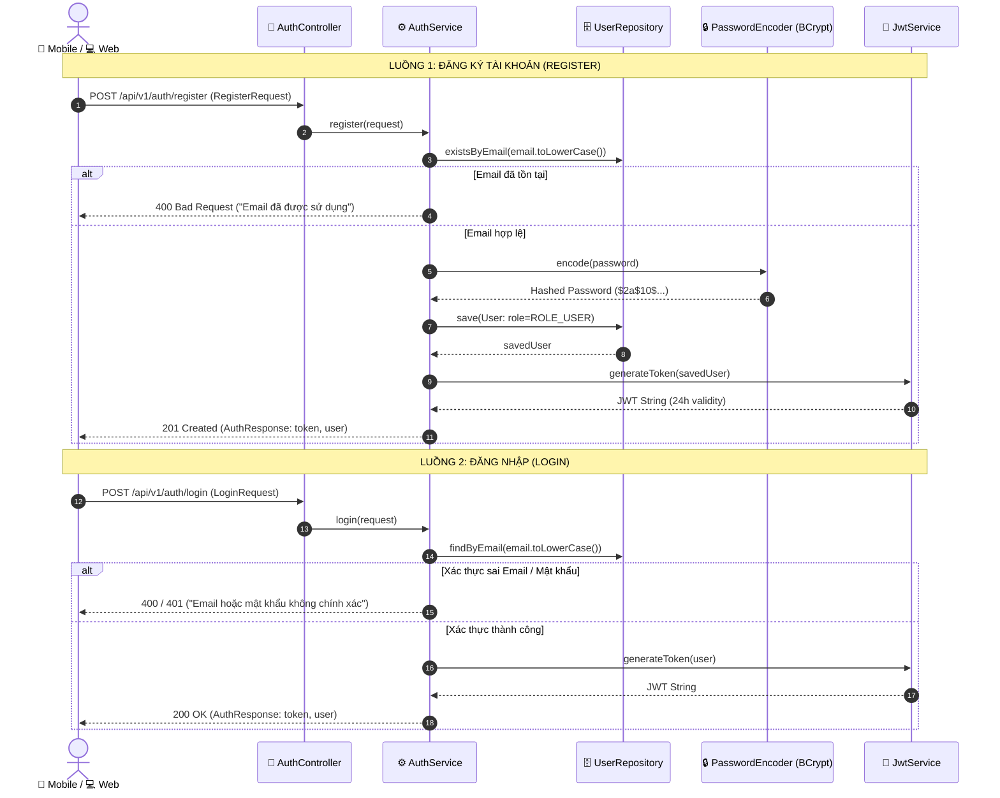
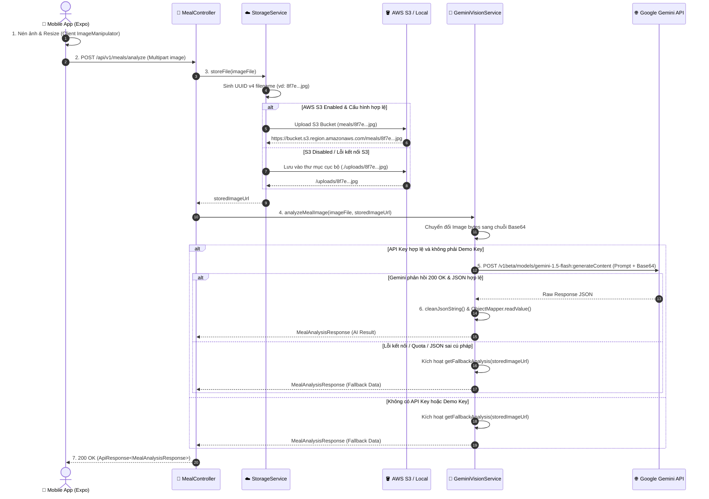

# TÀI LIỆU ĐẶC TẢ TÍNH NĂNG KỸ THUẬT (TECHNICAL FEATURE SPECIFICATIONS)

---

## 1. Thông tin tài liệu

* **Tên dự án:** AI Calorie & Meal Tracker
* **Tên tài liệu:** Tài liệu Đặc tả Tính năng Kỹ thuật (Technical Feature Specifications)
* **Mã tài liệu:** TFS-AICM-001
* **Phiên bản:** 1.0
* **Trạng thái:** Đã phê duyệt (Approved)
* **Ngày tạo:** 12/09/2026
* **Ngày cập nhật:** 12/09/2026
* **Người thực hiện:** Senior System Architect & Technical Lead

### Lịch sử sửa đổi

| Phiên bản | Ngày | Người thực hiện | Nội dung thay đổi |
| :--- | :--- | :--- | :--- |
| **1.0** | 12/09/2026 | Ban Kiến trúc Kỹ thuật | Khởi tạo tài liệu đặc tả kỹ thuật chi tiết cho toàn bộ 6 module cốt lõi của hệ thống. |

---

## 2. Tổng quan Kiến trúc & Nguyên tắc Thiết kế Kỹ thuật

Hệ thống **AI Calorie & Meal Tracker** được xây dựng theo kiến trúc hướng dịch vụ nhiều tầng (Layered Client-Server Architecture), đảm bảo tính module hóa cao, dễ bảo trì, mở rộng và khả năng kiểm thử độc lập.

```text
+----------------------------------------------------------------------------------------------------+
|                                      TẦNG TRÌNH DIỄN (CLIENTS)                                     |
|   • Mobile App: React Native (Expo SDK), Axios, React Navigation, Expo ImageManipulator.           |
|   • Web Dashboard: React 18, Vite, Lucide Icons, Modern CSS Design System.                         |
+----------------------------------------------------------------------------------------------------+
                                                  │  HTTP REST + JWT Bearer Token
                                                  ▼
+----------------------------------------------------------------------------------------------------+
|                              TẦNG ĐIỀU KHIỂN & BẢO MẬT (CONTROLLER & SECURITY)                      |
|   • Spring Security 6: JwtAuthenticationFilter (Stateless Session), CorsFilter.                    |
|   • REST Controllers: AuthController, HealthProfileController, MealController, AnalyticsController.|
|   • Global Exception Handler: Bắt lỗi tập trung (@RestControllerAdvice), chuẩn hóa ApiResponse<T>. |
+----------------------------------------------------------------------------------------------------+
                                                  │  DTO Transfer
                                                  ▼
+----------------------------------------------------------------------------------------------------+
|                                  TẦNG NGHIỆP VỤ (SERVICE LAYER)                                    |
|   • AuthService, UserService: Xác thực, đăng ký, mã hóa mật khẩu BCrypt.                          |
|   • HealthProfileService: Thuật toán BMR (Mifflin-St Jeor), TDEE, Calorie/Macro Engine.            |
|   • GeminiVisionService: Prompt Engineering, Base64 Multipart Payload, JSON Sanitizer & Fallback.  |
|   • StorageService: Phân nhánh lưu trữ AWS S3 Bucket / Local Storage với định danh UUID.           |
|   • MealService: Quản lý vòng đời bữa ăn, thuật toán tính lại tổng dinh dưỡng (Recalculate Totals).|
|   • AnalyticsService: Thống kê ngày, Moving Average 7/30 ngày, phân tích tỷ lệ Macros đóng góp.    |
|   • ExportService: Luồng xuất dữ liệu CSV UTF-8 BOM & Render báo cáo PDF (OpenPDF).                |
+----------------------------------------------------------------------------------------------------+
                                                  │  JPA Entity / Domain Model
                                                  ▼
+----------------------------------------------------------------------------------------------------+
|                             TẦNG TRUY XUẤT DỮ LIỆU & LƯU TRỮ (PERSISTENCE)                         |
|   • Spring Data JPA & Hibernate ORM: UserRepository, HealthProfileRepository, MealRepository.      |
|   • PostgreSQL Database: Ràng buộc quan hệ 1-1 (User-Profile), 1-N (User-Meal), 1-N (Meal-Item).    |
+----------------------------------------------------------------------------------------------------+
```

### Chuẩn hóa Vỏ bọc Phản hồi API (Standard Response Envelope)

Toàn bộ các phản hồi API thành công và thất bại từ hệ thống đều được chuẩn hóa qua cấu trúc `ApiResponse<T>`:

```json
{
  "success": true,
  "message": "Thông báo trạng thái nghiệp vụ bằng tiếng Việt",
  "data": { ... },
  "timestamp": "2026-09-12T10:15:30.123"
}
```

---

## 3. FS-01: Module Xác thực & Quản lý Phiên (Authentication & Security)

### 3.1 Mô tả chức năng
Module phụ trách đăng ký tài khoản mới, xác thực đăng nhập qua Email & Mật khẩu, mã hóa mật khẩu một chiều, cấp phát và xác thực mã thông báo JSON Web Token (JWT) theo cơ chế không lưu trạng thái (Stateless).

### 3.2 Sơ đồ Luồng Xác thực (Authentication Sequence Flow)



### 3.3 Quy chuẩn Kỹ thuật & Validation Chi tiết

#### 1. Đăng ký tài khoản (`POST /api/v1/auth/register`)
* **Endpoint:** `POST /api/v1/auth/register` (Public)
* **Request DTO (`RegisterRequest`):**
  - `fullName`: `@NotBlank(message = "Họ và tên không được để trống")`
  - `email`: `@NotBlank`, `@Email(message = "Email không đúng định dạng")`
  - `password`: `@NotBlank`, `@Size(min = 6, message = "Mật khẩu phải chứa ít nhất 6 ký tự")`
* **Xử lý kỹ thuật:**
  - Email được tự động chuẩn hóa: `email.toLowerCase().trim()`.
  - Mật khẩu được mã hóa an toàn qua `BCryptPasswordEncoder` (độ dài muối 10 rounds).
  - Vai trò mặc định: `Role.ROLE_USER`.
* **Response:** `201 Created` kèm `AuthResponse` (Token, TokenType `Bearer`, ExpiresInMs `86400000`, `UserDto`).

#### 2. Đăng nhập hệ thống (`POST /api/v1/auth/login`)
* **Endpoint:** `POST /api/v1/auth/login` (Public)
* **Request DTO (`LoginRequest`):**
  - `email`: `@NotBlank`, `@Email`
  - `password`: `@NotBlank`
* **Xử lý kỹ thuật:**
  - Sử dụng `AuthenticationManager.authenticate(new UsernamePasswordAuthenticationToken(email, password))`.
  - Nếu sai thông tin: Ném ngoại lệ `BadCredentialsException` / `BadRequestException`.
* **Response:** `200 OK` kèm `AuthResponse`.

#### 3. Cấu trúc & Cơ chế Xác thực JWT (`JwtService` & `JwtAuthenticationFilter`)
* **Thuật toán ký:** HMAC-SHA256 (`io.jsonwebtoken.security.Keys.hmacShaKeyFor`).
* **Thời hạn Token (Expiration):** 24 giờ (`86400000 ms`).
* **Cấu trúc Claims:**
  - `sub` (Subject): Email người dùng.
  - `iat` (Issued At): Thời điểm tạo mã.
  - `exp` (Expiration): Thời điểm hết hạn.
* **Bộ lọc `JwtAuthenticationFilter`:**
  1. Trích xuất Header `Authorization: Bearer <token>`.
  2. Phân giải `userEmail = jwtService.extractUsername(token)`.
  3. Kiểm tra tính hợp lệ và thời hạn: `jwtService.isTokenValid(token, userDetails)`.
  4. Nạp đối tượng `UsernamePasswordAuthenticationToken` vào `SecurityContextHolder.getContext()`.

#### 4. Lấy thông tin tài khoản hiện hành (`GET /api/v1/auth/me`)
* **Endpoint:** `GET /api/v1/auth/me` (Yêu cầu JWT)
* **Xử lý kỹ thuật:**
  - Trích xuất người dùng hiện hành qua `userService.getCurrentUserProfile()`.
  - Kiểm tra trạng thái: `hasHealthProfile = (user.getHealthProfile() != null)`.
* **Response Data (`UserDto`):** `id`, `email`, `fullName`, `avatarUrl`, `role`, `hasHealthProfile`, `createdAt`.

---

## 4. FS-02: Module Hồ sơ Sức khỏe & Thuật toán Dinh dưỡng (Health Profile & Nutrition Engine)

### 4.1 Mô tả chức năng
Module chịu trách nhiệm quản lý hồ sơ thể trạng người dùng, tính toán tự động các chỉ số chuyển hóa năng lượng (BMR, TDEE, BMI), phân loại thể trạng và thiết lập mục tiêu Calories cùng định lượng Macros theo mục tiêu thể hình.

### 4.2 Đặc tả Thuật toán Dinh dưỡng (Core Nutrition Algorithms)

```text
====================================================================================================
BỘ QUY TẮC THUẬT TOÁN TÍNH TOÁN THỂ TRẠNG VÀ DINH DƯỠNG
====================================================================================================

1. THUẬT TOÁN TÍNH TỶ LỆ TRAO ĐỔI CHẤT CƠ BẢN (BMR) - Phương trình Mifflin-St Jeor:
   Base_BMR = (10.0 * weightKg) + (6.25 * heightCm) - (5.0 * age)
   
   • Nếu gender == MALE:    BMR = Math.round(Base_BMR + 5)
   • Nếu gender == FEMALE:  BMR = Math.round(Base_BMR - 161)
   • Nếu gender == OTHER:   BMR = Math.round(Base_BMR - 78)

2. THUẬT TOÁN TÍNH TỔNG NĂNG LƯỢNG TIÊU THỤ HÀNG NGÀY (TDEE):
   TDEE = Math.round(BMR * activityLevel.getMultiplier())
   
   Bảng hệ số vận động:
   - SEDENTARY (Ít vận động):          Hệ số 1.200
   - LIGHTLY_ACTIVE (Vận động nhẹ):     Hệ số 1.375
   - MODERATELY_ACTIVE (Vận động vừa): Hệ số 1.550
   - VERY_ACTIVE (Vận động nhiều):     Hệ số 1.725
   - EXTRA_ACTIVE (Vận động cực nhiều):Hệ số 1.900

3. THUẬT TOÁN TÍNH MỤC TIÊU CALO HÀNG NGÀY (DAILY CALORIE TARGET):
   Nếu có customDailyCalorieTarget > 500:
       Calorie_Target = customDailyCalorieTarget
   Ngược lại:
       Calorie_Target = Math.max(TDEE + goal.getCalorieAdjustment(), 1200)
       
   Bảng điều chỉnh calo theo mục tiêu:
   - LOSE_WEIGHT (Giảm cân):          Điều chỉnh -500 kcal/ngày
   - MAINTAIN (Duy trì cân nặng):     Điều chỉnh    0 kcal/ngày
   - GAIN_WEIGHT (Tăng cân / Tăng cơ): Điều chỉnh +500 kcal/ngày
   * Ngưỡng sàn an toàn sinh học (Calorie Floor): Tối thiểu 1200 kcal/ngày.

4. THUẬT TOÁN PHÂN BỔ CÁC NHÓM CHẤT ĐA LƯỢNG (MACRONUTRIENT DISTRIBUTION):
   Tỷ lệ chuẩn hóa năng lượng: 30% Protein | 45% Carbohydrate | 25% Fat
   - Daily Protein Target (g) = Math.round((Calorie_Target * 0.30) / 4.0)
   - Daily Carbs Target (g)   = Math.round((Calorie_Target * 0.45) / 4.0)
   - Daily Fat Target (g)     = Math.round((Calorie_Target * 0.25) / 9.0)

5. THUẬT TOÁN TÍNH CHỈ SỐ KHỐI CƠ THỂ VÀ PHÂN LOẠI (BMI):
   Height_M = heightCm / 100.0
   BMI = Math.round((weightKg / (Height_M * Height_M)) * 10.0) / 10.0
   
   Phân loại BMI Category:
   - BMI < 18.5:            "Thiếu cân (Underweight)"
   - 18.5 <= BMI <= 24.9:   "Bình thường (Normal weight)"
   - 25.0 <= BMI <= 29.9:   "Thừa cân (Overweight)"
   - BMI >= 30.0:           "Béo phì (Obese)"
====================================================================================================
```

### 4.3 Quy chuẩn Kỹ thuật API Hồ sơ Sức khỏe

#### 1. Tạo mới hoặc Cập nhật Hồ sơ (`POST /api/v1/profile`)
* **Endpoint:** `POST /api/v1/profile` (Yêu cầu JWT)
* **Request DTO (`HealthProfileRequest`):**
  - `age`: `@NotNull`, `@Min(value = 10, message = "Tuổi phải từ 10 trở lên")`, `@Max(value = 120)`
  - `gender`: `@NotNull` (`Gender` enum)
  - `heightCm`: `@NotNull`, `@Min(50)`, `@Max(250)`
  - `weightKg`: `@NotNull`, `@Min(20)`, `@Max(300)`
  - `targetWeightKg`: `Double` (tùy chọn)
  - `activityLevel`: `@NotNull` (`ActivityLevel` enum)
  - `goal`: `@NotNull` (`Goal` enum)
  - `customDailyCalorieTarget`: `Integer` (tùy chọn, > 500)
* **Xử lý kỹ thuật:**
  - Tìm kiếm hồ sơ hiện tại theo `user_id`. Nếu chưa có -> tạo bản ghi mới; nếu đã có -> cập nhật đè (Upsert Pattern).
  - Tự động thực thi toàn bộ chuỗi tính toán BMR, TDEE, Calorie Target, Macros.
  - Lưu vào cơ sở dữ liệu qua `HealthProfileRepository.save(profile)`.
* **Response:** `200 OK` kèm `ApiResponse<HealthProfileDto>`.

#### 2. Lấy thông tin Hồ sơ (`GET /api/v1/profile`)
* **Endpoint:** `GET /api/v1/profile` (Yêu cầu JWT)
* **Xử lý kỹ thuật:**
  - Truy vấn `healthProfileRepository.findByUser(user)`.
  - Nếu không tồn tại: Ném lỗi `ResourceNotFoundException("Người dùng chưa thiết lập hồ sơ sức khỏe")` -> Trả về mã HTTP 404.
  - Nếu tồn tại: Tính toán động chỉ số BMI và phân loại thể trạng trước khi trả về.
* **Response Data (`HealthProfileDto`):** Chứa toàn bộ thông số thể trạng, BMR, TDEE, các mục tiêu dinh dưỡng và ngày cập nhật.

---

## 5. FS-03: Module Phân tích Thị giác AI (Gemini Flash Vision Integration & Storage)

### 5.1 Mô tả chức năng
Module chịu trách nhiệm xử lý tệp ảnh từ client, lưu trữ tệp lên đám mây (AWS S3) hoặc cục bộ, gửi dữ liệu ảnh đến Google Gemini Flash Vision API kèm prompt phân tích dinh dưỡng có cấu trúc, phân giải kết quả JSON trả về và cung cấp cơ chế dự phòng thông minh (Smart Fallback).

### 5.2 Sơ đồ Xử lý Ảnh & Phân tích AI (Vision Pipeline)



### 5.3 Chi tiết Kỹ thuật Xử lý Tệp (`StorageService`)
* **Kiểm tra hợp lệ:** Tệp không được rỗng (`!file.isEmpty()`), dung lượng tối đa 15MB.
* **Quy tắc đặt tên tệp:** `UUID.randomUUID().toString() + extension` (Tránh xung đột tên và ngăn chặn lỗ hổng Path Traversal).
* **Cơ chế chịu lỗi (Fault-Tolerance):** Nếu cấu hình `aws.s3.enabled: true` nhưng quá trình đẩy lên S3 bị lỗi, hệ thống ghi log cảnh báo và tự động chuyển nhánh sang lưu trữ cục bộ (`storeLocally`) tại thư mục cấu hình `LOCAL_STORAGE_DIR`.

### 5.4 Đặc tả Prompt Engineering & Phân giải AI (`GeminiVisionService`)

#### 1. Cấu hình Tham số Sinh (Generation Config)
* **Mô hình:** `gemini-1.5-flash`
* **Temperature:** `0.2` (Độ ngẫu nhiên thấp nhằm đảm bảo tính chính xác và nhất quán của dữ liệu dinh dưỡng định lượng).
* **TopK:** `32`, **TopP:** `1.0`
* **Max Output Tokens:** `2048`

#### 2. Cấu trúc Prompt gửi tới AI
```text
Bạn là một chuyên gia dinh dưỡng và thị giác máy tính AI. Hãy phân tích bức ảnh món ăn này một cách chi tiết và ước tính dinh dưỡng.
Trả về kết quả DUY NHẤT dưới dạng cấu trúc JSON hợp lệ (không kèm markdown thừa, không giải thích ngoài JSON) theo mẫu sau:
{
  "suggestedMealName": "Tên tổng quan bữa ăn",
  "estimatedTotalCalories": 650.0,
  "estimatedTotalProtein": 35.0,
  "estimatedTotalCarbs": 70.0,
  "estimatedTotalFat": 22.0,
  "healthTip": "Lời khuyên dinh dưỡng hữu ích và thân thiện cho bữa ăn này",
  "recognizedItems": [
    {
      "name": "Tên món / thành phần 1",
      "estimatedWeightGrams": 150.0,
      "servingSize": "1 bát nhỏ",
      "calories": 200.0,
      "protein": 5.0,
      "carbs": 40.0,
      "fat": 1.0,
      "fiber": 2.0,
      "confidenceScore": 0.95
    }
  ]
}
```

#### 3. Thuật toán Làm sạch JSON (`cleanJsonString`)
Nhằm loại bỏ các thẻ định dạng Markdown do mô hình LLM tự sinh ra (như ````json ... ````), hàm thực hiện:
```java
String trimmed = raw.trim();
if (trimmed.startsWith("```json")) {
    trimmed = trimmed.substring(7);
} else if (trimmed.startsWith("```")) {
    trimmed = trimmed.substring(3);
}
if (trimmed.endsWith("```")) {
    trimmed = trimmed.substring(0, trimmed.length() - 3);
}
return trimmed.trim();
```

#### 4. Cơ chế Dự phòng Thông minh (Smart Fallback Engine)
Khi không có API Key, gặp lỗi mạng hoặc phân giải JSON thất bại, hàm `getFallbackAnalysis` tự động trả về một bộ dữ liệu món ăn mẫu cân đối (Cơm trắng, Ức gà nướng thảo mộc, Salad rau củ kèm dầu ô liu) với đầy đủ thông số calo, protein, carbs, fat, fiber và healthTip để đảm bảo hệ thống không bị crash và người dùng có thể tiếp tục luồng trải nghiệm.

---

## 6. FS-04: Module Quản lý Nhật ký Bữa ăn & Món ăn (Meal & MealItem Management)

### 6.1 Mô tả chức năng
Module phụ trách lưu trữ, truy vấn, cập nhật và xóa các bữa ăn đã được người dùng xác nhận trong ngày; quản lý danh sách các món ăn thành phần (`MealItem`) và tự động kích hoạt thuật toán tính toán lại tổng năng lượng (Recalculate Totals).

### 6.2 Vòng đời & Máy trạng thái Bữa ăn (Meal State Machine)

```text
+---------------------+      Chụp ảnh món ăn       +--------------------------+
| 1. CAPTURED (Client)| -------------------------> | 2. ANALYZED DRAFT        |
| Ảnh chụp tại Mobile |                            | Kết quả phân tích từ AI  |
+---------------------+                            +--------------------------+
                                                                │
                                                                │ Người dùng review & sửa gram
                                                                ▼
+---------------------+     Lưu vào cơ sở dữ liệu  +--------------------------+
| 4. PERSISTED (DB)   | <------------------------- | 3. REVIEWED & CONFIRMED  |
| Đã lưu vào nhật ký  |   (POST /api/v1/meals)     | Bữa ăn đã xác nhận       |
+---------------------+                            +--------------------------+
         │
         ├───► PUT /api/v1/meals/{id}  ───► [Cập nhật & Recalculate Totals] ───► PERSISTED
         └───► DELETE /api/v1/meals/{id} ─► [Xóa Cascade toàn bộ MealItem]  ───► DELETED
```

### 6.3 Quy chuẩn Kỹ thuật API Bữa ăn

#### 1. Tạo mới Bữa ăn (`POST /api/v1/meals`)
* **Endpoint:** `POST /api/v1/meals` (Yêu cầu JWT)
* **Request DTO (`CreateMealRequest`):**
  - `mealDate`: `@NotNull` (Mặc định `LocalDate.now()` nếu không chỉ định).
  - `mealType`: `@NotNull` (`BREAKFAST`, `LUNCH`, `DINNER`, `SNACK`).
  - `name`: Tên bữa ăn (Tùy chọn, mặc định lấy `mealType.getDisplayName()`).
  - `imageUrl`, `healthTip`, `notes`: Chuỗi văn bản tùy chọn.
  - `items`: `@NotEmpty(message = "Bữa ăn phải có ít nhất 1 món")`, `@Valid List<MealItemRequest>`.
* **Xử lý kỹ thuật:**
  1. Khởi tạo thực thể `Meal` liên kết với `User` hiện tại.
  2. Lặp qua danh sách `items`, tạo thực thể `MealItem` và gọi `meal.addItem(item)`.
  3. Gọi hàm `meal.recalculateTotals()`:
     - `totalCalories = sum(item.calories)`
     - `totalProtein = sum(item.protein)`
     - `totalCarbs = sum(item.carbs)`
     - `totalFat = sum(item.fat)`
  4. Thực hiện lưu trữ trong phạm vi giao dịch `@Transactional`.
* **Response:** `201 Created` kèm `ApiResponse<MealDto>`.

#### 2. Lấy danh sách Bữa ăn theo ngày (`GET /api/v1/meals/daily`)
* **Endpoint:** `GET /api/v1/meals/daily?date=YYYY-MM-DD` (Yêu cầu JWT)
* **Xử lý kỹ thuật:**
  - Truy vấn `mealRepository.findByUserIdAndMealDateOrderByCreatedAtDesc(userId, date)`.
  - Nạp danh sách các món ăn con liên kết (`items`) và ánh xạ sang `List<MealDto>`.
* **Response:** `200 OK` kèm mảng các bữa ăn trong ngày.

#### 3. Cập nhật Bữa ăn (`PUT /api/v1/meals/{id}`)
* **Endpoint:** `PUT /api/v1/meals/{id}` (Yêu cầu JWT)
* **Xử lý kỹ thuật:**
  - Xác thực quyền sở hữu: `mealRepository.findByIdAndUserId(id, user.getId())`. Nếu không tìm thấy -> 404.
  - Cập nhật thông tin bữa ăn cơ bản.
  - Xóa danh sách món cũ: `meal.getItems().clear()`, thêm danh sách món mới từ payload.
  - Kích hoạt `meal.recalculateTotals()`.
  - Lưu cập nhật xuống DB.
* **Response:** `200 OK` kèm `MealDto` đã cập nhật.

#### 4. Xóa Bữa ăn (`DELETE /api/v1/meals/{id}`)
* **Endpoint:** `DELETE /api/v1/meals/{id}` (Yêu cầu JWT)
* **Xử lý kỹ thuật:**
  - Kiểm tra quyền sở hữu `findByIdAndUserId`.
  - Thực hiện `mealRepository.delete(meal)`. Cơ chế JPA `CascadeType.ALL` và `orphanRemoval = true` tự động xóa toàn bộ các bản ghi `meal_items` liên quan.
* **Response:** `200 OK` ("Xóa bữa ăn thành công").

---

## 7. FS-05: Module Thống kê & Phân tích Dinh dưỡng (Analytics & Progress Engine)

### 7.1 Mô tả chức năng
Module thực hiện tổng hợp dữ liệu dinh dưỡng theo ngày hoặc theo khoảng thời gian tùy chọn (7 ngày / 30 ngày), tính toán năng lượng tiêu thụ, phần calo thâm hụt/dư thừa so với mục tiêu thể trạng, tính giá trị trung bình ngày và phân rã tỷ lệ đóng góp calo từ các nhóm chất đa lượng.

### 7.2 Thuật toán Thống kê Chi tiết

```text
====================================================================================================
BỘ THUẬT TOÁN THỐNG KÊ & PHÂN TÍCH TIẾN ĐỘ
====================================================================================================

1. TỔNG HỢP TIẾN ĐỘ TRONG NGÀY (DAILY SUMMARY):
   - Total_Calories_Consumed = sum(meals.totalCalories)
   - Total_Protein_Consumed  = sum(meals.totalProtein)
   - Total_Carbs_Consumed    = sum(meals.totalCarbs)
   - Total_Fat_Consumed      = sum(meals.totalFat)
   - Calorie_Target          = profile.dailyCalorieTarget (hoặc 2000 nếu chưa có profile)
   - Remaining_Calories      = Calorie_Target - Total_Calories_Consumed
   - Meal_Count              = meals.size()

2. THỐNG KÊ KHOẢNG THỜI GIAN & TRUNG BÌNH NGÀY (DATE RANGE SUMMARY):
   - Mặc định: startDate = now - 6 days, endDate = now (7 ngày gần nhất).
   - Duyệt vòng lặp từ startDate đến endDate: Tạo mảng DailySummaryDto cho từng ngày.
   - Average_Daily_Calories = (Tổng Calo cả chu kỳ) / Tổng số ngày
   - Average_Daily_Protein  = (Tổng Protein cả chu kỳ) / Tổng số ngày
   - Average_Daily_Carbs    = (Tổng Carbs cả chu kỳ) / Tổng số ngày
   - Average_Daily_Fat      = (Tổng Fat cả chu kỳ) / Tổng số ngày

3. THUẬT TOÁN TÍNH TỶ LỆ PHÂN BỐ NĂNG LƯỢNG TỪ MACROS (% CALORIC CONTRIBUTION):
   Năng lượng chuyển hóa thực tế:
   - Calo từ Protein = Total_Range_Protein * 4 (kcal)
   - Calo từ Carbs   = Total_Range_Carbs * 4 (kcal)
   - Calo từ Fat     = Total_Range_Fat * 9 (kcal)
   - Tổng Calo từ Macros = Calo_Protein + Calo_Carbs + Calo_Fat
   
   Nếu Tổng Calo từ Macros > 0:
       • Protein_Percent = Math.round((Calo_Protein / Tổng Calo từ Macros) * 1000.0) / 10.0
       • Carbs_Percent   = Math.round((Calo_Carbs / Tổng Calo từ Macros) * 1000.0) / 10.0
       • Fat_Percent     = Math.round((Calo_Fat / Tổng Calo từ Macros) * 1000.0) / 10.0
   Ngược lại (chưa có dữ liệu bữa ăn):
       • Mặc định: Protein = 30.0%, Carbs = 45.0%, Fat = 25.0%
====================================================================================================
```

### 7.3 Quy chuẩn Kỹ thuật API Thống kê
* **`GET /api/v1/analytics/daily-summary?date=YYYY-MM-DD`:** Trả về `DailySummaryDto` gồm các thông số thực tế, mục tiêu, phần dư và danh sách bữa ăn trong ngày.
* **`GET /api/v1/analytics/range?startDate=...&endDate=...`:** Trả về `DateRangeSummaryDto` gồm ngày bắt đầu/kết thúc, các giá trị trung bình ngày, mảng chi tiết từng ngày và bản đồ `macroDistributionPercent`.

---

## 8. FS-06: Module Xuất Báo cáo Đa định dạng (PDF & CSV Export Engine)

### 8.1 Mô tả chức năng
Module hỗ trợ trích xuất toàn bộ dữ liệu nhật ký bữa ăn của người dùng trong khoảng thời gian xác định ra tệp bảng tính CSV (tương thích UTF-8 Microsoft Excel) hoặc tài liệu PDF có định dạng trang in ấn chuyên nghiệp.

### 8.2 Quy chuẩn Kỹ thuật Xuất CSV (`ExportService.exportToCsv`)
* **Endpoint:** `GET /api/v1/analytics/export/csv?startDate=...&endDate=...` (Yêu cầu JWT)
* **Thư viện sử dụng:** `org.apache.commons.csv` (Apache Commons CSV).
* **Xử lý tương thích Microsoft Excel:**
  - Ghi thủ công 3 bytes **UTF-8 Byte Order Mark (BOM)**: `0xEF, 0xBB, 0xBF` vào đầu luồng `ByteArrayOutputStream` trước khi in dữ liệu. Điều này đảm bảo Excel trên hệ điều hành Windows tự động nhận diện đúng bảng mã UTF-8 tiếng Việt có dấu.
* **Cấu trúc cột dữ liệu CSV:**
  `Ngay`, `Loai_Bua_An`, `Ten_Bua_An`, `Mon_An`, `Khoi_Luong_g`, `Calories`, `Protein_g`, `Carbs_g`, `Fat_g`, `Ghi_Chu`.
* **Tiêu đề phản hồi (Headers):**
  - `Content-Disposition: attachment; filename="meal_report_YYYY-MM-DD.csv"`
  - `Content-Type: text/csv; charset=UTF-8`

### 8.3 Quy chuẩn Kỹ thuật Xuất PDF (`ExportService.exportToPdf`)
* **Endpoint:** `GET /api/v1/analytics/export/pdf?startDate=...&endDate=...` (Yêu cầu JWT)
* **Thư viện sử dụng:** `com.lowagie.text` (OpenPDF).
* **Bố cục trang tài liệu:**
  - Khổ giấy: `PageSize.A4`, Lề trang: 36pt (0.5 inch).
  - Phần Header: Tiêu đề in hoa đậm `"BAO CAO DINH DUONG & NHAT KY BUA AN"` (Căn giữa, cỡ chữ 18pt), thông tin họ tên người dùng, email và phạm vi ngày báo cáo.
  - Bảng dữ liệu (`PdfPTable`): 6 cột với tỷ lệ chiều rộng `{2.5f, 2.0f, 3.5f, 2.0f, 2.0f, 2.0f}` gồm: `Ngay`, `Bua an`, `Ten mon`, `Calories`, `Protein(g)`, `Carbs(g)`.
  - Phần Footer tổng kết: Hiển thị tổng số lượng bữa ăn và tổng năng lượng nạp vào (kcal).
* **Tiêu đề phản hồi (Headers):**
  - `Content-Disposition: attachment; filename="meal_report_YYYY-MM-DD.pdf"`
  - `Content-Type: application/pdf`

---

## 9. FS-07: Đặc tả Kỹ thuật Tầng Trình diễn (Mobile App & Web Dashboard)

### 9.1 Đặc tả Ứng dụng Di động (Mobile App - React Native / Expo)

```text
+----------------------------------------------------------------------------------------------------+
| CẤU TRÚC ĐIỀU HƯỚNG & MÀN HÌNH MOBILE APP (RootNavigator.tsx)                                      |
+----------------------------------------------------------------------------------------------------+
| 1. Auth Stack (Chưa đăng nhập):                                                                     |
|    • LoginScreen: Form nhập Email/Password, tích hợp lưu trữ Token qua authStorage.                |
|    • RegisterScreen: Form đăng ký Họ tên, Email, Mật khẩu. Chuyển sang ProfileScreen Onboarding.   |
|                                                                                                    |
| 2. App Tabs (Đã đăng nhập - Bottom Tab Navigator):                                                 |
|    • DiaryTab (DiaryScreen): Thanh ngày (Date Strip), CalorieSummaryCard, danh sách MealCard.       |
|    • CameraTab (CameraScreen): Giao diện Camera Expo chụp ảnh / chọn thư viện, nén ảnh tự động.   |
|    • AnalyticsTab (AnalyticsScreen): Biểu đồ tiến độ calo 7 ngày, thanh tỷ lệ Macronutrients.     |
|    • ProfileTab (ProfileScreen): Form cập nhật BMR/TDEE, chiều cao, cân nặng, mục tiêu sức khỏe.  |
|                                                                                                    |
| 3. Modal / Stack Riêng:                                                                            |
|    • MealReviewScreen: Màn hình nhận kết quả AI -> Cho phép sửa số gram trực tiếp, tự động         |
|      nhân tỷ lệ calo/macro (ratio = newWeight / oldWeight) ngay trên Client trước khi nhấn Lưu.     |
+----------------------------------------------------------------------------------------------------+
```

### 9.2 Đặc tả Bảng điều khiển Web (Web Dashboard - React + Vite)

```text
+----------------------------------------------------------------------------------------------------+
| CẤU TRÚC TRANG & THÀNH PHẦN TRÊN WEB DASHBOARD                                                     |
+----------------------------------------------------------------------------------------------------+
| 1. DashboardPage:                                                                                  |
|    • Thẻ chỉ số tổng quan (StatCards): Tổng Calo hôm nay, Calo mục tiêu, Năng lượng còn lại.       |
|    • Thanh đo tiến độ tròn / thanh ngang cho Protein, Carbs, Fat.                                  |
|    • Danh sách bữa ăn gần nhất trong ngày kèm ảnh chụp trực quan.                                  |
|                                                                                                    |
| 2. MealHistoryPage:                                                                                |
|    • Bộ lọc lịch chọn ngày (Date Picker).                                                          |
|    • Lưới danh sách bữa ăn (Meal Cards Grid) hiển thị chi tiết từng món con và nút xóa bữa ăn.     |
|                                                                                                    |
| 3. AnalyticsPage:                                                                                  |
|    • Biểu đồ cột xu hướng calo theo ngày (7 ngày / 30 ngày).                                       |
|    • Biểu đồ phân bổ tỷ lệ phần trăm Macros (Protein / Carbs / Fat).                               |
|    • Nút mở ExportModal để xuất file báo cáo.                                                      |
|                                                                                                    |
| 4. ExportModal Component:                                                                          |
|    • Cho phép chọn định dạng (CSV / PDF) và chọn khoảng ngày (Start Date -> End Date).             |
|    • Tải tệp tin trực tiếp qua luồng Blob của trình duyệt (URL.createObjectURL).                   |
+----------------------------------------------------------------------------------------------------+
```

---

## 10. FS-08: Cơ chế Xử lý Ngoại lệ & Quản trị Lỗi Toàn cục (Global Exception Handling)

Hệ thống bắt và xử lý toàn bộ ngoại lệ tập trung qua lớp `@RestControllerAdvice` (`GlobalExceptionHandler.java`), đảm bảo mã lỗi HTTP phản ánh chính xác ngữ cảnh kỹ thuật:

| Ngoại lệ hệ thống (Java Exception) | Mã HTTP Status | Cấu trúc phản hồi lỗi (`ApiResponse`) | Mô tả nghiệp vụ |
| :--- | :--- | :--- | :--- |
| `ResourceNotFoundException` | **404 Not Found** | `ApiResponse.error(message)` | Không tìm thấy tài nguyên (Bữa ăn không tồn tại, chưa tạo hồ sơ sức khỏe). |
| `BadRequestException` | **400 Bad Request** | `ApiResponse.error(message)` | Dữ liệu không hợp lệ (Email đã tồn tại, mật khẩu sai cú pháp). |
| `BadCredentialsException` | **401 Unauthorized** | `ApiResponse.error("Email hoặc mật khẩu không chính xác")` | Xác thực đăng nhập thất bại. |
| `AccessDeniedException` | **403 Forbidden** | `ApiResponse.error("Bạn không có quyền thực hiện thao tác này")` | Truy cập trái quyền hạn tài nguyên. |
| `MethodArgumentNotValidException` | **400 Bad Request** | `ApiResponse.builder().message("Dữ liệu gửi lên không hợp lệ").data(errorsMap)` | Vi phạm ràng buộc Validation của các trường trong Request DTO (`@Min`, `@Max`, `@NotBlank`...). |
| `Exception` (General) | **500 Internal Error** | `ApiResponse.error("Đã xảy ra lỗi hệ thống: " + msg)` | Lỗi máy chủ không xác định hoặc lỗi mạng ngoài ý muốn. |

---

## 11. FS-09: Ma trận Phụ thuộc Tính năng & Luồng Dữ liệu (Technical Dependency Matrix)

```text
+----------------------------------------------------------------------------------------------------+
| MA TRẬN PHỤ THUỘC KỸ THUẬT                                                                         |
+----------------------------------------------------------------------------------------------------+
| 1. FS-01 (Auth Module) ────────► Là tiền đề bắt buộc cho TẤT CẢ các module còn lại (Cung cấp JWT). |
| 2. FS-02 (Health Profile) ────► Cung cấp chỉ số Calorie/Macro Target cho FS-05 (Analytics).       |
| 3. FS-03 (Vision & Storage) ──► Cung cấp dữ liệu nhận diện món và Image URL cho FS-04 (Meal Log).  |
| 4. FS-04 (Meal Management) ───► Cung cấp dữ liệu nguồn thực phẩm cho FS-05 (Analytics) & FS-06.   |
| 5. FS-05 (Analytics Engine) ──► Cung cấp số liệu tổng hợp cho Web Dashboard & Mobile Analytics.    |
| 6. FS-06 (Export Engine) ─────► Đọc dữ liệu từ MealRepository theo phạm vi ngày để tạo PDF/CSV.    |
+----------------------------------------------------------------------------------------------------+
```

---

## 12. FS-10: Kế hoạch Kiểm thử Tính năng Kỹ thuật (Technical Verification Strategy)

### 12.1 Kiểm thử Đơn vị & Tích hợp (Unit & Integration Tests)
* **Auth Service Test:** Kiểm tra đăng ký trùng email ném ngoại lệ 400; kiểm tra mật khẩu đã được mã hóa BCrypt; kiểm tra JWT sinh ra có chứa đúng email subject.
* **Health Profile Calculation Test:** 
  - Kiểm thử BMR Nam (70kg, 175cm, 25 tuổi) = `(10*70) + (6.25*175) - (5*25) + 5 = 700 + 1093.75 - 125 + 5 = 1673.75 -> 1674 kcal`.
  - Kiểm thử ngưỡng sàn Calorie Floor: TDEE 1400 kcal giảm cân (-500) -> Calorie Target phải đạt 1200 kcal.
  - Kiểm thử tính tỷ lệ Macros: Target 2000 kcal -> Protein = 150g, Carbs = 225g, Fat = 56g.
* **Meal Recalculate Totals Test:** Tạo bữa ăn với 2 món (Món A: 200 kcal, 10g P; Món B: 300 kcal, 20g P) -> Tổng bữa ăn phải đạt đúng 500 kcal, 30g P.
* **Storage & Fallback Resilience Test:** Mock lỗi khi gọi Gemini API -> Kiểm tra hàm `analyzeMealImage` không ném lỗi mà trả về dữ liệu `MealAnalysisResponse` của bộ dữ liệu fallback mẫu.
* **Export CSV Test:** Kiểm tra mảng byte trả về bắt đầu bằng 3 byte UTF-8 BOM (`0xEF, 0xBB, 0xBF`).

### 12.2 Kiểm thử Đầu-Cuối (End-to-End Flow Verification)
* Thực hiện trọn vẹn luồng: `Đăng ký -> Tạo hồ sơ sức khỏe -> Tải ảnh phân tích AI -> Chỉnh sửa số gram -> Lưu bữa ăn -> Kiểm tra Daily Summary cập nhật chính xác calo còn lại -> Xuất tệp PDF báo cáo`.
