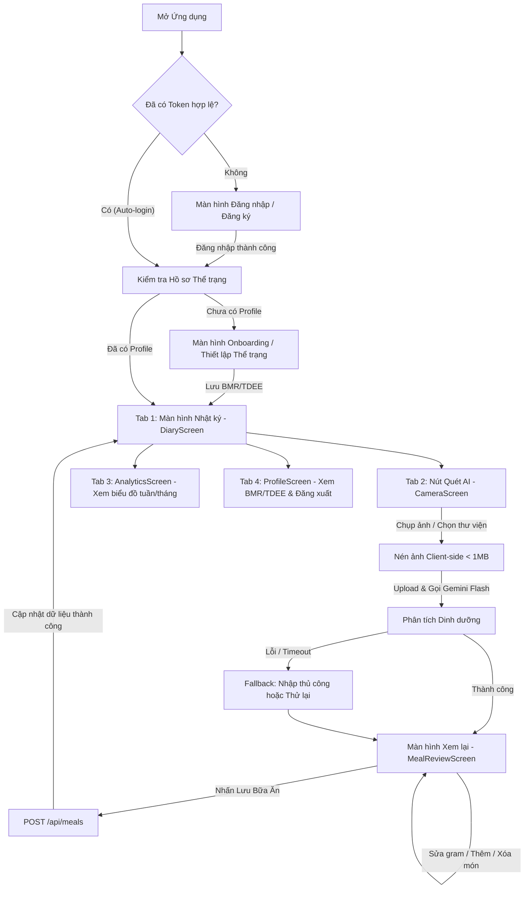

# TÀI LIỆU ĐẶC TẢ YÊU CẦU CHỨC NĂNG ỨNG DỤNG DI ĐỘNG (MOBILE FRD)
## DỰ ÁN: AI CALORIE & MEAL TRACKER (HỆ THỐNG THEO DÕI DINH DƯỠNG & CALO THÔNG MINH)

---

## 1. Thông tin tài liệu (Document Metadata)

* **Tên dự án:** AI Calorie & Meal Tracker
* **Tên tài liệu:** Tài liệu Đặc tả Yêu cầu Chức năng Ứng dụng Di động (Mobile Functional Requirements Document - FRD)
* **Mã tài liệu:** FRD-MOB-AICM-001
* **Phiên bản:** 1.0
* **Trạng thái:** Đã phê duyệt (Approved)
* **Ngày tạo:** 15/09/2026
* **Đối tượng sử dụng:** Mobile Developers (React Native/Expo), Backend Engineers, QA/QC Engineers, Product Managers, UI/UX Designers.
* **Vị trí lưu trữ:** `docs/prd/frd-mobile-app.md`

### Lịch sử sửa đổi (Revision History)

| Phiên bản | Ngày | Tác giả | Nội dung thay đổi |
| :--- | :--- | :--- | :--- |
| **1.0** | 15/09/2026 | Technical Product & Mobile Team | Khởi tạo tài liệu đặc tả yêu cầu chức năng (FRD) chi tiết 100% cho ứng dụng di động (Mobile App), bao gồm toàn bộ màn hình, luồng AI Vision, State Management, API integration và Edge Cases. |

---

## 2. Tổng quan Ứng dụng Di động (Mobile App Overview)

### 2.1 Mục tiêu sản phẩm trên thiết bị di động
Ứng dụng di động **AI Calorie & Meal Tracker Mobile** là điểm chạm chính (Primary Touchpoint) của người dùng trong việc ghi nhật ký ăn uống thường ngày. Ứng dụng tập trung vào tốc độ thực thi tối đa: **Chụp ảnh bữa ăn -> AI nhận diện -> Tinh chỉnh nhanh -> Lưu vào nhật ký chỉ trong < 8 giây**.

### 2.2 Công nghệ & Nền tảng (Tech Stack)
* **Framework:** React Native 0.74+ / Expo SDK 51 (Managed Workflow).
* **Ngôn ngữ:** TypeScript 5.x (Strict Mode).
* **Điều hướng (Navigation):** React Navigation v6 (`@react-navigation/native`, `@react-navigation/native-stack`, `@react-navigation/bottom-tabs`).
* **Quản lý trạng thái (State Management):** React Context API (`AuthContext`, `DiaryContext`) kết hợp Custom Hooks.
* **Xử lý & Nén ảnh (Image Processing):** `expo-image-picker`, `expo-image-manipulator`.
* **Lưu trữ dữ liệu cục bộ (Local Storage):** `@react-native-async-storage/async-storage`.
* **Giao tiếp mạng (HTTP Client):** `axios` tích hợp Request/Response Interceptors.
* **Biểu đồ & Đồ thị:** `react-native-svg` / Biểu đồ trực quan thanh tiến độ Macro.
* **Giao diện & Chủ đề:** Modern Dark Mode & Glassmorphism Design System (Slate/Dark Palette, Emerald Green, Sky Blue, Amber, Rose).

---

## 3. Kiến trúc Điều hướng & Sơ đồ Màn hình (Navigation & App Flow)

### 3.1 Cấu trúc Cây Điều hướng (Navigation Hierarchy)

```text
RootNavigator (Conditional Rendering dựa trên Auth State)
 ├── [Unauthenticated Flow - Auth Stack]
 │    ├── LoginScreen (Đăng nhập Email & Password)
 │    └── RegisterScreen (Đăng ký tài khoản mới)
 │
 └── [Authenticated Flow - App Stack]
      ├── MainTabs (Bottom Tab Navigator - 4 Tabs chính)
      │    ├── Tab 1: DiaryTab (Màn hình Nhật ký Dinh dưỡng & Tiến độ Calo)
      │    ├── Tab 2: CameraTab (Chụp ảnh & Quét món ăn AI Gemini Flash)
      │    ├── Tab 3: AnalyticsTab (Báo cáo Xu hướng Calo & Tỷ lệ Macros)
      │    └── Tab 4: ProfileTab (Hồ sơ Thể trạng, Mục tiêu BMR/TDEE & Cài đặt)
      │
      └── Modal / Stack Phụ
           ├── MealReviewScreen (Xem lại & Tinh chỉnh chi tiết món ăn AI nhận diện)
           └── EditProfileModal / TargetSettings (Cập nhật thể trạng & mục tiêu)
```

### 3.2 Sơ đồ Luồng Trải nghiệm Người dùng (User Journey Flowchart)



---

## 4. Đặc tả Chi tiết Từng Màn hình (Detailed Screen Specifications)

---

### 4.1 Màn hình Xác thực (Authentication Module)

#### 4.1.1 Màn hình Đăng nhập (LoginScreen)
* **Mục đích:** Xác thực người dùng hiện tại và cấp phát JWT Token.
* **Yêu cầu giao diện (UI Elements):**
  - Logo ứng dụng "AI Calorie & Meal Tracker" kèm biểu tượng dinh dưỡng hiện đại.
  - Trường nhập `Email` (Input Type: Email, tự động viết thường, trim khoảng trắng).
  - Trường nhập `Mật khẩu` (Input Type: Password, nút ẩn/hiện mật khẩu).
  - Nút hành động chính "Đăng nhập" (Primary Button, màu Emerald Green).
  - Nút chuyển hướng "Chưa có tài khoản? Đăng ký ngay".
  - Hiệu ứng Loading Spinner trên nút bấm khi đang gửi request.
* **Quy tắc Kiểm tra Dữ liệu (Validation Rules):**
  - `Email`: Bắt buộc, đúng định dạng RFC 5322 regex.
  - `Password`: Bắt buộc, độ dài tối thiểu 6 ký tự.
* **Luồng xử lý Kỹ thuật:**
  1. Khi nhấn "Đăng nhập", gọi hàm `login(email, password)` từ `AuthContext`.
  2. Gửi request `POST /api/auth/login`.
  3. Khi nhận mã `200 OK`: Lưu `token`, `user` vào `AsyncStorage`, cập nhật Auth Context state, tự động chuyển về `MainTabs`.
  4. Nếu nhận mã lỗi `400/401/404`: Hiển thị Banner Alert thông báo lỗi chi tiết (vd: "Email hoặc mật khẩu không chính xác").

#### 4.1.2 Màn hình Đăng ký (RegisterScreen)
* **Mục đích:** Tạo tài khoản người dùng mới trên hệ thống.
* **Yêu cầu giao diện (UI Elements):**
  - Tiêu đề "Tạo tài khoản mới".
  - Trường nhập `Họ và tên` (Full Name, tối đa 100 ký tự).
  - Trường nhập `Email` (Email format).
  - Trường nhập `Mật khẩu` (Tối thiểu 6 ký tự).
  - Trường nhập `Xác nhận Mật khẩu` (Confirm Password).
  - Nút "Đăng ký tài khoản" và nút "Đã có tài khoản? Đăng nhập".
* **Quy tắc Kiểm tra Dữ liệu (Validation Rules):**
  - `Full Name`: Bắt buộc, không để trống.
  - `Email`: Bắt buộc, chuẩn email.
  - `Password`: Bắt buộc, >= 6 ký tự.
  - `Confirm Password`: Bắt buộc, phải trùng khớp 100% với `Password`.
* **Luồng xử lý Kỹ thuật:**
  1. Gửi request `POST /api/auth/register`.
  2. Xử lý phản hồi: Tự động đăng nhập người dùng với JWT Token trả về hoặc chuyển hướng sang `LoginScreen` kèm thông báo Toast "Đăng ký thành công".

---

### 4.2 Màn hình Hồ sơ Thể trạng & Thiết lập Mục tiêu (ProfileScreen & Onboarding)

* **Mục đích:** Quản lý thông tin thể chất, tính toán tự động BMR, TDEE và mục tiêu Calo/Macros hàng ngày của người dùng.
* **Yêu cầu giao diện (UI Elements):**
  - **Khối Thẻ Tổng Quan Thể Trạng (Health Card):**
    - Hiển thị Cân nặng hiện tại (kg), Chiều cao (cm), Chỉ số BMI (`weight / (height/100)^2`) kèm nhãn phân loại thể trạng (Thiếu cân, Bình thường, Thừa cân, Béo phì).
    - Hiển thị BMR (Năng lượng tiêu hao cơ bản) và TDEE (Tổng năng lượng tiêu thụ hàng ngày).
  - **Khối Mục tiêu Dinh dưỡng Hàng ngày (Daily Targets):**
    - Mục tiêu Calo: Ví dụ `2,150 kcal/ngày`.
    - Phân bổ 3 thanh Macros: Protein (g), Carbs (g), Fat (g).
  - **Biểu mẫu Chỉnh sửa Chỉ số (Form Inputs):**
    - `Tuổi` (Age): Number picker / Text input (10 - 100).
    - `Giới tính` (Gender): Segmented Control (`MALE` / `FEMALE`).
    - `Chiều cao` (Height cm): Input số thực (100 - 250 cm).
    - `Cân nặng` (Weight kg): Input số thực (30 - 250 kg).
    - `Mức độ vận động` (Activity Level): Dropdown / Radio selection:
      - *SEDENTARY (Ít vận động - Hệ số 1.2)*
      - *LIGHTLY_ACTIVE (Vận động nhẹ 1-3 ngày/tuần - Hệ số 1.375)*
      - *MODERATELY_ACTIVE (Vận động vừa 3-5 ngày/tuần - Hệ số 1.55)*
      - *VERY_ACTIVE (Vận động nhiều 6-7 ngày/tuần - Hệ số 1.725)*
      - *EXTRA_ACTIVE (Vận động cường độ cao/Vận động viên - Hệ số 1.9)*
    - `Mục tiêu Thể hình` (Goal):
      - *LOSE_WEIGHT (Giảm cân: TDEE - 500 kcal)*
      - *MAINTAIN (Duy trì cân nặng: TDEE)*
      - *GAIN_WEIGHT (Tăng cân/Tăng cơ: TDEE + 400 kcal)*
  - **Nút "Cập nhật Hồ sơ":** Lưu dữ liệu và tính toán lại toàn bộ chỉ số.
  - **Nút "Đăng xuất":** Xóa token khỏi `AsyncStorage` và đưa người dùng về `LoginScreen`.

---

### 4.3 Màn hình Nhật ký Bữa ăn & Tiến độ Hàng ngày (DiaryScreen)

* **Mục đích:** Là Dashboard trung tâm của Mobile App hiển thị tiến độ tiêu thụ calo và chi tiết các bữa ăn trong ngày được chọn.
* **Yêu cầu giao diện (UI Elements):**
  - **Thanh Điều hướng Ngày (Date Navigation Bar):**
    - Nút mũi tên chuyển ngày trước (`<`), ngày sau (`>`).
    - Nhãn ngày: "Hôm nay", "Hôm qua", hoặc định dạng `DD/MM/YYYY`.
    - Nút biểu tượng Lịch mở DatePicker để chọn ngày bất kỳ.
  - **Thẻ Tiến độ Dinh dưỡng Tổng quan (Calorie & Macro Progress Card):**
    - Vòng tròn tiến độ Calo lớn: Hiển thị Calo đã nạp (`Consumed`), Calo mục tiêu (`Target`), và Calo còn lại (`Remaining = Target - Consumed`).
    - Đổi màu cảnh báo động: Màu xanh ngọc (bình thường/đúng mục tiêu), chuyển dần sang màu cam/đỏ khi vượt ngưỡng 100%.
    - 3 thanh tiến độ Macro riêng biệt có badge tỷ lệ:
      - **Protein (Đạm):** Thanh màu xanh dương Sky Blue (`x / target g`).
      - **Carbs (Đường bột):** Thanh màu vàng hổ phách Amber (`x / target g`).
      - **Fat (Chất béo):** Thanh màu hồng san hô Rose (`x / target g`).
  - **Danh sách 4 Nhóm Bữa ăn trong ngày (Meal Sections Accordion/List):**
    - 1. **Bữa Sáng (Breakfast):** Icon mặt trời mọc 🌅.
    - 2. **Bữa Trưa (Lunch):** Icon mặt trời đỉnh điểm ☀️.
    - 3. **Bữa Tối (Dinner):** Icon trăng sao 🌙.
    - 4. **Bữa Phụ (Snack):** Icon quả táo / ly nước 🍎.
  - **Cấu trúc Mỗi Thẻ Bữa ăn (Meal Card):**
    - Ảnh thumbnail bữa ăn (nếu có chụp ảnh).
    - Tên bữa ăn / Danh sách tên các món con.
    - Tổng calo của bữa ăn (vd: `650 kcal`) và tóm tắt macros (`P: 35g • C: 70g • F: 18g`).
    - Nút mở rộng xem chi tiết từng món con kèm gram.
    - Nút Xóa bữa ăn (Trash Icon) kèm hộp thoại xác nhận (Confirmation Dialog).
  - **Trạng thái Trống (Empty State):**
    - Nếu một bữa ăn chưa có dữ liệu: Hiển thị nút bấm nhanh "+ Thêm bữa [Sáng/Trưa/Tối/Phụ]" chuyển nhanh sang Camera Screen.
    - Kéo để làm mới (Pull-to-Refresh) để đồng bộ dữ liệu mới nhất từ server.

---

### 4.4 Màn hình Camera & Quét Món ăn AI Gemini Flash (CameraScreen)

* **Mục đích:** Chụp ảnh bữa ăn trực tiếp từ camera điện thoại hoặc chọn từ album ảnh, nén ảnh client-side và gửi đến backend xử lý AI.
* **Yêu cầu giao diện (UI Elements):**
  - Khung ngắm Camera toàn màn hình (Full Screen Viewfinder).
  - Lớp phủ hướng dẫn chụp (Overlay Guide Box): "Đặt món ăn vào chính giữa khung hình".
  - Nút chuyển đổi Camera Trước / Sau (Flip Camera).
  - Nút bật / tắt đèn Flash (Flash On / Off / Auto).
  - Nút Chụp ảnh lớn (Shutter Button) viền phát sáng ở vị trí thuận tiện cho ngón tay cái.
  - Nút Chọn ảnh từ Thư viện (Gallery Button) bên cạnh nút chụp.
  - Lớp phủ Trạng thái Đang phân tích (Analyzing Overlay State):
    - Làm mờ ảnh vừa chụp kèm hiệu ứng quét sóng Radar (Radar Scanning Animation).
    - Dòng chữ trạng thái động thay đổi sau mỗi 1.5 giây: *"Đang tải ảnh lên...", "Gemini AI đang nhận diện món ăn...", "Đang tính toán calo và bóc tách Protein, Carbs, Fat..."*.
* **Quy trình Xử lý Kỹ thuật & Tối ưu Client-side (Image Optimization Pipeline):**
  1. Khi người dùng bấm chụp ảnh hoặc chọn ảnh từ thư viện, ứng dụng nhận đường dẫn cục bộ URI.
  2. Kích hoạt `expo-image-manipulator` để nén ảnh:
     - Resize chiều rộng tối đa: 1024px (giữ nguyên tỷ lệ khung hình).
     - Chất lượng nén: `compress: 0.7` (JPEG format).
     - Dung lượng ảnh sau nén luôn được kiểm soát trong khoảng **200KB - 800KB** (giảm 85% thời gian upload so với ảnh gốc 5-10MB).
  3. Tạo `FormData` đính kèm trường `file` và gửi `POST /api/meals/analyze-image`.
  4. Nhận kết quả `MealAnalysisResponse` từ server -> Chuyển hướng ngay sang màn hình `MealReviewScreen` kèm dữ liệu phân tích.
  5. Xử lý ngoại lệ (Error Handling): Nếu request quá 10s hoặc xảy ra lỗi mạng: Hiển thị Modal "Không thể kết nối AI. Bạn có muốn nhập món ăn thủ công không?" với 2 tùy chọn "Thử lại" và "Nhập thủ công".

---

### 4.5 Màn hình Xem lại & Tinh chỉnh Bữa ăn (MealReviewScreen)

* **Mục đích:** Cho phép người dùng kiểm tra kết quả AI nhận diện, có toàn quyền chỉnh sửa số gram, thêm/xóa món trước khi lưu vào cơ sở dữ liệu.
* **Yêu cầu giao diện (UI Elements):**
  - **Khối Ảnh Bữa Ăn & Lời Khuyên AI (Hero Banner):**
    - Hiển thị ảnh chụp món ăn vừa xử lý.
    - Hộp thoại màu xanh ngọc chứa Lời khuyên sức khỏe từ AI (`healthTip` hoặc `healthAdvice`, ví dụ: *"Bữa ăn giàu đạm tốt cho cơ bắp, nên bổ sung thêm rau xanh để tăng chất xơ"*).
  - **Khối Chọn Loại Bữa Ăn & Ngày:**
    - Segmented Tabs chọn: Sáng / Trưa / Tối / Phụ (mặc định gợi ý theo khung giờ hiện tại: Sáng 05:00-10:30, Trưa 10:30-14:30, Tối 17:00-21:00, Phụ các giờ còn lại).
    - Ngày ghi nhận bữa ăn (mặc định: Ngày hôm nay).
  - **Khối Tổng Dinh Dưỡng Động (Live Nutrient Header):**
    - Hiển thị tổng Calo, Protein, Carbs, Fat của toàn bộ bữa ăn.
    - Số liệu tự động nhảy số tức thì (Real-time calculation) mỗi khi người dùng thay đổi số gram hoặc thêm/xóa món con.
  - **Danh sách Món ăn Thành phần (Editable Meal Items List):**
    - Mỗi item gồm:
      - Tên món ăn (Text Input cho phép sửa tên).
      - Số gram ước lượng (Numeric Input cho phép gõ trực tiếp số gram hoặc nhấn nút `+` / `-` 10g).
      - Calo, Protein, Carbs, Fat của riêng món đó (tự động nhân theo tỷ lệ gram mới).
      - Nút Xóa món (Icon thùng rác màu đỏ).
  - **Nút "+ Thêm món thủ công":** Mở Bottom Sheet / Modal để nhập tên món, số gram và calo ước tính cho những món AI chưa nhận diện hết (ví dụ: nước chấm, đồ uống đi kèm).
  - **Nút "Lưu Bữa Ăn" (Save Meal Button):**
    - Nút lớn cố định dưới đáy màn hình (Sticky Bottom).
    - Khi bấm: Kiểm tra dữ liệu hợp lệ -> Gửi `POST /api/meals` -> Hiển thị Toast thông báo thành công -> Chuyển về `DiaryScreen` và tự động refresh dữ liệu ngày.

---

### 4.6 Màn hình Thống kê & Xu hướng Dinh dưỡng (AnalyticsScreen)

* **Mục đích:** Cung cấp góc nhìn tổng quan về thói quen ăn uống, mức độ tuân thủ calo mục tiêu theo chu kỳ tuần và tháng ngay trên điện thoại.
* **Yêu cầu giao diện (UI Elements):**
  - **Bộ chuyển đổi Chu kỳ:** Tab "7 Ngày gần nhất" (Week) và "30 Ngày gần nhất" (Month).
  - **Thẻ Chỉ số Nổi bật (Key Stats Cards):**
    - Calo trung bình / ngày (`Average Daily Calo`).
    - Tỷ lệ đạt mục tiêu (`Goal Adherence %`).
    - Số ngày duy trì chuỗi ghi nhật ký liên tục (`Streak Days`).
  - **Biểu đồ Cột Calo Hàng ngày (Daily Calorie Bar Chart):**
    - Mỗi cột đại diện cho 1 ngày, so sánh với đường kẻ mục tiêu chuẩn (Target line).
    - Cột xanh: Đạt chuẩn (+/- 10% target). Cột đỏ: Vượt calo mục tiêu. Cột vàng: Ăn thiếu nhiều calo.
  - **Biểu đồ Tròn Phân bổ Tỷ lệ Macro Trung bình (Macro Distribution):**
    - Tỷ lệ phần trăm thực tế: `% Protein`, `% Carbs`, `% Fat` so với tỷ lệ khuyến nghị (30% - 45% - 25%).
  - **Thông tin Nhắc nhở Đồng bộ Web:**
    - Banner: *"Bạn muốn xuất báo cáo chi tiết PDF/CSV cho Huấn luyện viên? Hãy đăng nhập Web Dashboard tại dashboard.calorie.ai"*.

---

## 5. Danh sách Yêu cầu Chức năng Hệ thống Mobile (Functional Requirements Matrix)

| Mã Yêu Cầu | Module | Tên chức năng & Mô tả chi tiết | Mức ưu tiên | Màn hình liên quan |
| :--- | :--- | :--- | :--- | :--- |
| **FR-MOB-01** | Auth | Đăng nhập tài khoản bằng Email & Mật khẩu, lưu trữ an toàn JWT Token trong `AsyncStorage`. | **P0 (Bắt buộc)** | `LoginScreen` |
| **FR-MOB-02** | Auth | Đăng ký tài khoản người dùng mới với xác thực trường đầy đủ. | **P0 (Bắt buộc)** | `RegisterScreen` |
| **FR-MOB-03** | Auth | Tự động kiểm tra Token khi khởi động ứng dụng (Auto-login) và chuyển thẳng vào App nếu Token còn hạn. | **P0 (Bắt buộc)** | `RootNavigator` |
| **FR-MOB-04** | Profile | Nhập thông tin thể trạng (Tuổi, Giới tính, Chiều cao, Cân nặng, Mức độ vận động, Mục tiêu). | **P0 (Bắt buộc)** | `ProfileScreen` |
| **FR-MOB-05** | Profile | Tự động tính toán và hiển thị BMR (Mifflin-St Jeor), TDEE, Daily Calorie Target và Macro Target. | **P0 (Bắt buộc)** | `ProfileScreen` |
| **FR-MOB-06** | Diary | Hiển thị tiến độ Calo tiêu thụ vs Calo mục tiêu cùng 3 thanh Macro (Protein, Carbs, Fat) của ngày được chọn. | **P0 (Bắt buộc)** | `DiaryScreen` |
| **FR-MOB-07** | Diary | Chuyển đổi qua lại giữa các ngày xem nhật ký (Hôm nay, Hôm qua, Ngày tùy chọn qua DatePicker). | **P0 (Bắt buộc)** | `DiaryScreen` |
| **FR-MOB-08** | Diary | Hiển thị danh sách bữa ăn phân bổ theo 4 nhóm (Sáng, Trưa, Tối, Phụ) kèm tổng calo từng bữa. | **P0 (Bắt buộc)** | `DiaryScreen` |
| **FR-MOB-09** | Diary | Cho phép xóa một bữa ăn bất kỳ (`DELETE /api/meals/{id}`) kèm hộp thoại xác nhận an toàn. | **P0 (Bắt buộc)** | `DiaryScreen` |
| **FR-MOB-10** | Camera/AI | Chụp ảnh bữa ăn từ Camera trực tiếp hoặc chọn ảnh có sẵn từ Album ảnh thiết bị. | **P0 (Bắt buộc)** | `CameraScreen` |
| **FR-MOB-11** | Camera/AI | Nén ảnh tự động client-side (Resize width <= 1024px, JPEG 0.7, dung lượng < 800KB) trước khi upload. | **P0 (Bắt buộc)** | `imageService` |
| **FR-MOB-12** | Camera/AI | Gửi ảnh multipart lên API AI Gemini Flash Vision và hiển thị trạng thái quét Radar sinh động. | **P0 (Bắt buộc)** | `CameraScreen` |
| **FR-MOB-13** | Review | Hiển thị danh sách món ăn AI nhận diện gồm: Tên món, số gram ước lượng, calo, đạm, đường bột, chất béo. | **P0 (Bắt buộc)** | `MealReviewScreen` |
| **FR-MOB-14** | Review | Cho phép người dùng chỉnh sửa trực tiếp số gram của từng món; tự động cập nhật lại tổng Calo và Macros toàn bữa theo thời gian thực. | **P0 (Bắt buộc)** | `MealReviewScreen` |
| **FR-MOB-15** | Review | Cho phép xóa món nhận diện sai hoặc thêm món thủ công (nhập tên món, gram, calo). | **P0 (Bắt buộc)** | `MealReviewScreen` |
| **FR-MOB-16** | Review | Chọn phân loại bữa ăn (Sáng/Trưa/Tối/Phụ) với cơ chế gợi ý tự động theo giờ hiện tại. | **P1 (Quan trọng)** | `MealReviewScreen` |
| **FR-MOB-17** | Review | Lưu bữa ăn hoàn chỉnh về backend (`POST /api/meals`) và chuyển hướng mượt mà về `DiaryScreen`. | **P0 (Bắt buộc)** | `MealReviewScreen` |
| **FR-MOB-18** | Analytics | Hiển thị biểu đồ cột xu hướng Calo và biểu đồ phân bổ tỷ lệ Macros 7 ngày & 30 ngày. | **P1 (Quan trọng)** | `AnalyticsScreen` |
| **FR-MOB-19** | App Shell | Hỗ trợ tính năng Pull-to-Refresh trên toàn bộ các màn hình danh sách để làm mới dữ liệu tức thì. | **P1 (Quan trọng)** | Toàn bộ Screens |
| **FR-MOB-20** | Network | Tự động đính kèm JWT Bearer Token vào mọi request; tự động đăng xuất và thông báo khi Token hết hạn (401). | **P0 (Bắt buộc)** | `api.ts (Axios)` |

---

## 6. Đặc tả Kiến trúc Dữ liệu & Hợp đồng API (Data Models & API Contracts)

### 6.1 Cấu trúc Dữ liệu TypeScript (TypeScript Interfaces)

```typescript
// Định nghĩa các loại hình cơ bản
export type MealType = 'BREAKFAST' | 'LUNCH' | 'DINNER' | 'SNACK';
export type Gender = 'MALE' | 'FEMALE' | 'OTHER';
export type ActivityLevel = 'SEDENTARY' | 'LIGHTLY_ACTIVE' | 'MODERATELY_ACTIVE' | 'VERY_ACTIVE' | 'EXTRA_ACTIVE';
export type Goal = 'LOSE_WEIGHT' | 'MAINTAIN' | 'GAIN_WEIGHT';

// Đối tượng Người dùng & Hồ sơ Thể trạng
export interface User {
  id: number;
  email: string;
  fullName: string;
  avatarUrl?: string;
  role: string;
  hasHealthProfile: boolean;
  createdAt: string;
}

export interface HealthProfile {
  id?: number;
  age: number;
  gender: Gender;
  heightCm: number;
  weightKg: number;
  targetWeightKg?: number;
  bmi?: number;
  bmiCategory?: string;
  activityLevel: ActivityLevel;
  goal: Goal;
  bmr?: number;
  tdee?: number;
  dailyCalorieTarget: number;
  dailyProteinTargetGrams: number;
  dailyCarbsTargetGrams: number;
  dailyFatTargetGrams: number;
}

// Đối tượng Món ăn & Bữa ăn
export interface MealItem {
  id?: number;
  name: string;
  estimatedWeightGrams?: number;
  servingSize?: string;
  calories: number;
  protein?: number;
  carbs?: number;
  fat?: number;
  fiber?: number;
  confidenceScore?: number;
}

export interface Meal {
  id?: number;
  mealDate: string; // Định dạng 'YYYY-MM-DD'
  mealType: MealType;
  mealTypeDisplayName?: string;
  name?: string;
  imageUrl?: string;
  healthTip?: string;
  notes?: string;
  totalCalories: number;
  totalProtein: number;
  totalCarbs: number;
  totalFat: number;
  items: MealItem[];
  createdAt?: string;
}

// Đối tượng phản hồi phân tích AI từ Gemini Flash
export interface MealAnalysisResponse {
  suggestedMealName: string;
  imageUrl?: string;
  estimatedTotalCalories: number;
  estimatedTotalProtein: number;
  estimatedTotalCarbs: number;
  estimatedTotalFat: number;
  healthTip: string;
  recognizedItems: MealItem[];
  rawAiResponse?: string;
}

// Đối tượng Tổng kết Dinh dưỡng trong ngày
export interface DailySummary {
  date: string;
  totalCaloriesConsumed: number;
  calorieTarget: number;
  remainingCalories: number;
  totalProteinConsumed: number;
  proteinTargetGrams: number;
  totalCarbsConsumed: number;
  carbsTargetGrams: number;
  totalFatConsumed: number;
  fatTargetGrams: number;
  mealCount: number;
  meals: Meal[];
}
```

### 6.2 Danh sách Điểm cuối API Mobile Tiêu thụ (REST Endpoints)

| Phương thức | Endpoint | Payload / Params | Mô tả chức năng |
| :--- | :--- | :--- | :--- |
| `POST` | `/api/auth/login` | `{ email, password }` | Đăng nhập tài khoản & nhận JWT token. |
| `POST` | `/api/auth/register` | `{ fullName, email, password }` | Đăng ký tài khoản mới. |
| `GET` | `/api/profile` | Header `Authorization: Bearer <jwt>` | Lấy hồ sơ thể trạng & các chỉ số BMR/TDEE. |
| `PUT` | `/api/profile` | `{ age, gender, heightCm, weightKg, activityLevel, goal }` | Lưu hoặc cập nhật hồ sơ thể trạng. |
| `POST` | `/api/meals/analyze-image` | `multipart/form-data` (file: image binary) | Upload ảnh món ăn & nhận bóc tách AI. |
| `POST` | `/api/meals` | `Meal` object (JSON) | Lưu bữa ăn hoàn chỉnh vào database. |
| `GET` | `/api/meals?date=YYYY-MM-DD` | Query parameter `date` | Lấy danh sách bữa ăn theo ngày. |
| `GET` | `/api/analytics/daily-summary?date=YYYY-MM-DD` | Query parameter `date` | Lấy số liệu tổng kết calo & macros ngày. |
| `DELETE` | `/api/meals/{id}` | Path variable `id` | Xóa một bữa ăn theo ID. |
| `GET` | `/api/analytics/trends?range=7days` | Query parameter `range` (`7days` hoặc `30days`) | Lấy dữ liệu chuỗi thời gian cho biểu đồ. |

---

## 7. Xử lý Trạng thái Ngoại lệ & Tình huống Biên (Edge Cases & Exception Matrix)

| Tình huống ngoại lệ (Edge Case) | Nguyên nhân khả dĩ | Hành vi ứng xử của Ứng dụng Mobile (App Behavior) |
| :--- | :--- | :--- |
| **Quyền Camera bị từ chối** | Người dùng nhấn "Don't Allow" khi hệ thống hỏi quyền Camera. | Hiển thị Dialog giải thích rõ ràng lý do cần quyền: *"Ứng dụng cần truy cập Camera để chụp ảnh nhận diện món ăn. Vui lòng cấp quyền trong Cài đặt thiết bị"*, kèm nút bấm chuyển hướng thẳng vào Settings của hệ điều hành. |
| **Không có kết nối mạng (No Internet)** | Thiết bị mất sóng Wifi/4G. | Hiển thị thanh thông báo màu vàng đầu màn hình: *"Đang ngoại tuyến. Vui lòng kết nối Internet để đồng bộ và phân tích AI"*. Giữ nguyên dữ liệu cache gần nhất trong màn hình Diary. |
| **AI Gemini Timeout (> 10s) hoặc Quota Limit** | Kết nối mạng chập chờn hoặc API Gemini bận. | Kích hoạt Fallback an toàn: Ứng dụng hiển thị thông báo dịu dàng *"Hệ thống AI đang bảo trì hoặc mạng yếu"*, sau đó tự động chuyển sang màn hình `MealReviewScreen` với mẫu món ăn trống để người dùng tự gõ nhanh số calo mà không làm mất ảnh đã chụp. |
| **Ảnh chụp quá mờ / Không phải món ăn** | Người dùng chụp bàn phím, thú cưng hoặc ảnh quá tối. | AI phản hồi danh sách món trống kèm lời nhắc: *"Không nhận diện rõ món ăn trong hình. Bạn có thể tự thêm món hoặc chụp lại với góc sáng tốt hơn"*. |
| **Token hết hạn (HTTP 401 Unauthorized)** | Phiên làm việc JWT hết hạn (sau 7 ngày hoặc bị thu hồi). | Axios Interceptor tự động bắt mã 401, xóa token trong `AsyncStorage`, thông báo Toast *"Phiên đăng nhập đã hết hạn, vui lòng đăng nhập lại"* và điều hướng người dùng về `LoginScreen`. |
| **Người dùng nhập số gram = 0 hoặc âm** | Lỗi gõ phím từ người dùng. | Input validation tự động chặn số âm hoặc = 0, hiển thị cảnh báo đỏ *"Khối lượng món ăn phải lớn hơn 0g"*. |

---

## 8. Yêu cầu Phi Chức năng Dành cho Mobile (Mobile NFRs)

### 8.1 Hiệu năng & Trải nghiệm (Performance & UX)
* **Thời gian khởi động ứng dụng (Cold Start):** < 1.5 giây để hiển thị màn hình chính từ trạng thái tắt hoàn toàn.
* **Tốc độ khung hình (Frame Rate):** Duy trì ổn định 60 FPS trong mọi thao tác cuộn danh sách (FlatList/ScrollView) và hiệu ứng chuyển tab.
* **Thời gian nén ảnh (Client Compression):** Quá trình nén ảnh kích thước 4K/1080p xuống chuẩn HD bằng `expo-image-manipulator` phải hoàn tất trong **< 300ms**.
* **Kích thước vùng chạm (Touch Target Size):** Toàn bộ nút bấm và khu vực tương tác có kích thước tối thiểu **48 x 48 dp** theo chuẩn Material Design & Apple Human Interface Guidelines.

### 8.2 Tiêu thụ Bộ nhớ & Pin (Battery & Memory Efficiency)
* Quản lý vòng đời camera chặt chẽ: Giải phóng tài nguyên Camera Viewfinder ngay khi người dùng chuyển sang Tab khác hoặc thu nhỏ ứng dụng (Background state) để tránh hao pin thiết bị.
* Bộ nhớ RAM sử dụng không vượt quá **150 MB** trong quá trình xử lý ảnh và render biểu đồ.

### 8.3 Tương thích Thiết bị (Device Compatibility)
* **iOS:** Hỗ trợ từ iOS 15.0 trở lên (tối ưu hiển thị cho Dynamic Island và Notch trên iPhone 12 đến iPhone 16 Pro Max).
* **Android:** Hỗ trợ từ Android 10.0 (API Level 29) trở lên, tương thích đa dạng kích thước màn hình và độ phân giải từ HD đến QHD.

---

## 9. Tiêu chuẩn Thiết kế Giao diện (Design Tokens & Theming Guidelines)

Ứng dụng tuân thủ hệ thống thiết kế **Modern Dark Glassmorphism**, mang lại cảm giác công nghệ cao, sang trọng và giảm mỏi mắt cho người dùng:

* **Màu Nền Chính (Background):** `#090d16` (Deep Midnight Black).
* **Màu Thẻ & Khối (Surface / Card Background):** `#0f172a` phối hợp viền `#1e293b` (Glassmorphism Border).
* **Màu Điểm Nhấn Nhận Diện (Brand Emerald Green):** `#10b981` (Dùng cho Nút chính, Tiến độ Calo đạt chuẩn, Active Tab).
* **Bảng màu Dinh dưỡng Cốt lõi (Nutrient Palette):**
  - **Calories tiêu thụ:** `#10b981` (Xanh ngọc) $\rightarrow$ Chuyển `#ef4444` (Đỏ) khi vượt mục tiêu.
  - **Protein (Đạm):** `#38bdf8` (Sky Blue) - Biểu tượng năng lượng cơ bắp.
  - **Carbs (Đường bột):** `#f59e0b` (Amber Gold) - Biểu tượng năng lượng hoạt động.
  - **Fat (Chất béo):** `#f43f5e` (Rose Pink) - Biểu tượng chất béo thiết yếu.
* **Typography:** Sử dụng Font chữ hệ thống không chân (San Francisco trên iOS, Roboto trên Android), hỗ trợ tiếng Việt có dấu Unicode sắc nét.

---

## 10. Kế hoạch Kiểm thử & Tiêu chí Nghiệm thu (Testing & QA Acceptance Criteria)

### 10.1 Bảng Kiểm Thử Nghiệm Thu (Acceptance Test Checklist)

- [ ] **TC-MOB-01 (Auth Flow):** Đăng ký tài khoản mới $\rightarrow$ Đăng nhập $\rightarrow$ Đóng ứng dụng mở lại $\rightarrow$ Xác nhận hệ thống tự động đăng nhập (Auto-login) thành công.
- [ ] **TC-MOB-02 (Profile Setup):** Nhập cân nặng 70kg, cao 175cm, Nam, Vận động vừa $\rightarrow$ Kiểm tra BMR hiển thị đúng ~1,680 kcal, TDEE ~2,600 kcal, Calorie Target chuẩn xác theo mục tiêu đã chọn.
- [ ] **TC-MOB-03 (Camera & Scan Flow):** Chụp một đĩa cơm sườn $\rightarrow$ Kiểm tra ảnh được nén dung lượng < 800KB $\rightarrow$ Màn hình hiển thị animation quét sóng $\rightarrow$ Nhận diện đúng các món (Cơm tấm, Sườn nướng, Trứng ốp la) trong thời gian <= 5 giây.
- [ ] **TC-MOB-04 (Edit & Recalculate):** Trong `MealReviewScreen`, đổi khối lượng Cơm từ 200g thành 150g $\rightarrow$ Xác nhận thanh Calo và Carbs tổng nhảy giảm tương ứng ngay lập tức.
- [ ] **TC-MOB-05 (Save & Diary Sync):** Bấm "Lưu Bữa Ăn" $\rightarrow$ Kiểm tra màn hình `DiaryScreen` cập nhật ngay thẻ bữa ăn mới kèm thanh tiến độ calo tăng lên chính xác.
- [ ] **TC-MOB-06 (Delete Meal):** Nhấn icon thùng rác tại bữa ăn trong `DiaryScreen` $\rightarrow$ Hộp thoại xác nhận xuất hiện $\rightarrow$ Bấm Đồng ý $\rightarrow$ Bữa ăn biến mất và calo tổng được hoàn lại tức thì.
- [ ] **TC-MOB-07 (Offline Resilience):** Bật Chế độ Máy bay (Airplane Mode) $\rightarrow$ Mở ứng dụng $\rightarrow$ Kiểm tra ứng dụng không bị crash, hiển thị dữ liệu đã lưu trong phiên trước kèm thông báo trạng thái offline.

---

## 11. Kết luận & Ký duyệt (Sign-off)

Tài liệu **Mobile Functional Requirements Document (FRD)** này là căn cứ kỹ thuật chính thức và chuẩn mực nghiệm thu cho toàn bộ tính năng ứng dụng di động trong giai đoạn phát triển hiện tại của dự án **AI Calorie & Meal Tracker**.

* **Trưởng nhóm Phát triển Di động (Mobile Lead):** *Đã ký duyệt*
* **Trưởng nhóm Kiến trúc Hệ thống (System Architect):** *Đã ký duyệt*
* **Giám đốc Sản phẩm (Product Manager):** *Đã ký duyệt*
